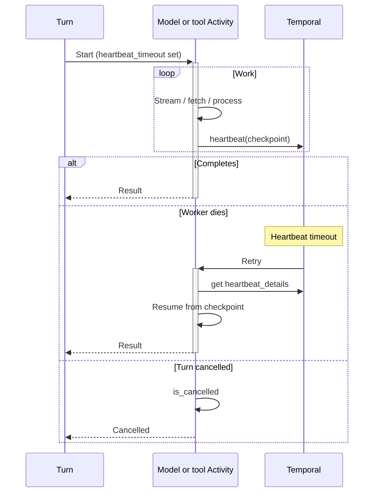

<h1>Heartbeat Long Steps </h1>

## Overview

The Heartbeat Long Steps pattern configures model and tool Activities with heartbeat timeouts, progress details, and cancellation checks so long agent Steps do not look dead, lose checkpointed work, or ignore user abort.
Primitives used: Activity heartbeats, heartbeat_timeout, Durable Model Call, Activity Tool, Turn cancel.

## Problem

Reasoning models, streaming generations, searches, and sandbox boots can run for minutes.
Without heartbeats, you must set huge `start_to_close` timeouts that delay failure detection, or Temporal kills a healthy Worker that was silent too long.
Without heartbeat details, a retry after Worker crash restarts an expensive model or tool call from scratch.
Without cancel checks during heartbeats, `/stop` leaves spend running until the full timeout.

## Solution

Set `heartbeat_timeout` on long Steps.
Heartbeat periodically with checkpoint details (token offset, page cursor, sandbox phase).
On retry, read `heartbeat_details` and resume when the provider or tool allows.
Honor `activity.is_cancelled()` between heartbeats when the Turn is aborted.



The following describes each step in the diagram:

1. The Turn starts a model or tool Activity with a heartbeat timeout shorter than `start_to_close`.
2. The Activity heartbeats progress while work continues.
3. On Worker failure, Temporal retries; the new attempt resumes from the last heartbeat details when possible.
4. On Turn cancel, the Activity sees cancellation at the next heartbeat/check and stops calling the provider.

```python
import asyncio
from datetime import timedelta

from temporalio import activity, workflow

@activity.defn
async def call_reasoning_model(prompt: str) -> str:
    details = activity.info().heartbeat_details
    cursor = details[0] if details else None
    chunks: list[str] = []
    async for event in provider_stream(prompt, resume=cursor):
        if activity.is_cancelled():
            raise asyncio.CancelledError()
        chunks.append(event.text)
        activity.heartbeat(event.cursor)
    return "".join(chunks)

# In the Turn Workflow
result = await workflow.execute_activity(
    call_reasoning_model,
    prompt,
    start_to_close_timeout=timedelta(minutes=10),
    heartbeat_timeout=timedelta(seconds=30),
)
```

## Implementation

<DaytonaRunner pattern="heartbeat-long-steps" />


### What to put in heartbeat details

Store resume cursors the Activity can apply on retry: stream offsets, search page tokens, sandbox job IDs.
Do not put full prompts or secrets in heartbeat details; they land in Temporal history.

### Streaming model calls

Heartbeat on batch boundaries (every N tokens or every few hundred milliseconds), not per character.
Publish UI token deltas via Progress Streaming separately from heartbeat checkpoints.

### Tools and sandboxes

Long Code Mode boots and host-tool chains should heartbeat phase names (`booting`, `running`, `uploading`) so operators see progress and cancel works.

### When resume is impossible

Some provider calls cannot resume mid-generation. Heartbeat still detects stuck Workers; on retry you may re-run the full call—pair with idempotency and Cost & Token Accounting so double spend is visible.

## When to use

Use for multi-minute model, search, sandbox, or document Steps.
Skip heartbeats for sub-second deterministic Workflow Tools and tiny Local Activities.

## Benefits and trade-offs

You get faster stuck detection, cancel responsiveness, and optional checkpoint resume.
You must design resume semantics and keep heartbeat payloads small and non-sensitive.

## Comparison with alternatives

| Approach | Stuck detection | Resume |
| :--- | :--- | :--- |
| Heartbeat Long Steps | Heartbeat timeout | Via details when possible |
| Huge start_to_close only | Slow | None |
| Local Activity | Workflow Task bound | Poor fit for long IO |

## Best practices

- **Set heartbeat_timeout well below start_to_close.** Catch dead Workers early.
- **Check cancellation when you heartbeat.** Cancel is not free without cooperation.
- **Document which Steps are resumable** vs full-retry-only.
- **Align with Model Timeout Profiles** so heartbeat and timeout classes stay consistent.

## Common pitfalls

- **Heartbeating secrets or full transcripts.** History and operator UIs should not store them.
- **Heartbeat without cancellation checks.** Turns keep burning tokens after `/stop`.
- **Assuming every provider supports resume.** Many do not; still heartbeat for liveness.
- **Using Local Activities for long streaming model calls.** They block Workflow Tasks and conflict with Progress Streaming hosting patterns.

## Related patterns

- [Durable Model Call](/durable-model-call)
- [Activity Tool](/activity-tool)
- [Model Timeout Profiles](/model-timeout-profiles)
- [Turn Workflow](/turn-workflow)
- [Progress Streaming](/progress-streaming)
- [Resumable Correction](/resumable-correction)
- [Local Activity Tools](/local-activity-tools)

## Sample code

- [`sandbox-runner/patterns/heartbeat-long-steps/python/`](https://github.com/temporal-sa/temporal-agentic-patterns/tree/main/sandbox-runner/patterns/heartbeat-long-steps/python)

## References

- [Temporal Docs: Activity heartbeats](https://docs.temporal.io/encyclopedia/detecting-activity-failures#activity-heartbeat)
- [Temporal Docs: Activity timeouts](https://docs.temporal.io/encyclopedia/detecting-activity-failures)
