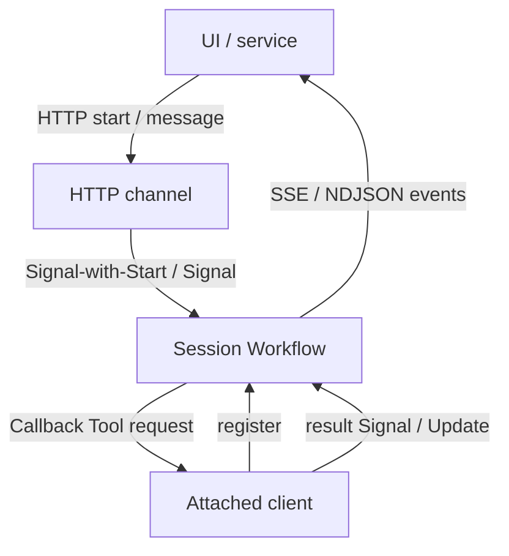

# HTTP and Client

## Overview

HTTP and Client describe how external callers attach to a Session: request/response and streaming over HTTP, plus clients that stay connected to run Callback Tools or deliver Signals.
These terms cover the channel edge, not the agent loop itself.

## Problem

Product UIs and services need a stable way to start Sessions, send Turns, and observe events.
If each client invents its own polling or writes directly to Workflow APIs without a channel contract, you get duplicated session creation, lost callbacks, and no shared auth story.
You need catalog terms for the HTTP channel and for an attached client.

## Solution

Expose a Session-oriented HTTP API and, when needed, keep a client attached for callbacks:

The following describes each step in the diagram:

1. The HTTP channel maps REST (or similar) routes to Session lifecycle: create or attach, post a Turn input, cancel, and query status.
2. The channel uses Temporal Signal-with-Start (or equivalent) so the first message creates the Session Workflow when needed.
3. Progress and lifecycle flow back as an app event stream over SSE or chunked responses—not as raw Temporal history.
4. An attached client registers with the Session to run Callback Tools locally (browser, IDE, or private network) and returns results via Signal or Update.

Messaging channels (chat, email) reuse the same Session terms; only the adapter differs.

## When to use

Use an HTTP channel when browsers or backend services drive agents over the public or private API edge.
Attach a client when Tools must run outside the worker (local files, user SSO cookies, device APIs).

## Benefits and trade-offs

A channel contract keeps Temporal details off product clients and supports streaming UX.
The trade-off is an API layer you must version, authenticate, and scale separately from workers.

## Comparison with alternatives

| Approach | Streaming UX | Local side effects |
| :--- | :--- | :--- |
| HTTP channel + event stream | Strong | Via Callback Tools |
| Clients calling Temporal SDK directly | Possible | Possible, couples clients |
| Sync request until Turn ends | Weak for long Turns | Limited |

## Best practices

- **Auth at the channel.** Map credentials to `user_id` / `actor_id` before Signals reach the Workflow.
- **Idempotent start.** Use deterministic Session IDs with Signal-with-Start to avoid duplicate Workflows.
- **Time out attached clients.** Callback Tools need heartbeat or lease semantics so Sessions do not wait forever.
- **Keep payloads bounded.** Large files belong in object storage referenced by ID, not in every Signal.

## Common pitfalls

- **Creating a new Workflow per HTTP request** without a stable Session ID.
- **Streaming Temporal history to browsers.** Use the app event stream instead.
- **Assuming the worker can reach the user's machine.** That is what Callback Tools and attached clients are for.

## Related patterns

- [HTTP Channel Agent](/http-channel-agent)
- [Messaging Channel Agent](/messaging-channel-agent)
- [Callback Tool](/callback-tool)
- [Session with Signal-and-Start](/session-signal-and-start)
- [Progress Streaming](/progress-streaming)

## Sample code

See [HTTP Channel Agent](/http-channel-agent) and [Callback Tool](/callback-tool).

## References

- [Temporal Docs: Signal-With-Start](https://docs.temporal.io/encyclopedia/workflow-message-passing#signal-with-start)
- [Temporal Docs: Signals](https://docs.temporal.io/encyclopedia/workflow-message-passing#sending-signals)
