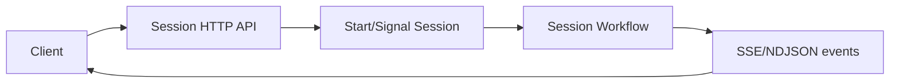

<h1>HTTP Channel Agent </h1>

## Overview

The HTTP Channel Agent pattern exposes an agent as an HTTP session API.
Clients create sessions, send messages, and stream events over NDJSON or SSE, while agent logic stays in Workflows and Activities.
Primitives used: SessionDescriptor, MessageRequest/Response, EventStream, Session Workflow.

## Problem

If HTTP handlers embed agent loops, you lose durability and duplicate protocol logic per service.

## Solution

HTTP only translates to Temporal signals/starts and streams the session event log.
The Session Workflow owns turns and tools.



The following describes each step in the diagram:

1. Client creates a session and receives session_id.
2. Client posts a message; API signal-with-starts the Session.
3. The Session runs Turns and appends events.
4. Client reads events until turn_ended.

```python
# API handler sketch
async def post_message(session_id: str, text: str):
    await client.start_workflow(
        AgentSessionWorkflow.run,
        args=[session_id],
        id=session_id,
        task_queue=TASK_QUEUE,
        start_signal="user_message",
        start_signal_args=[text],
    )
```

## Implementation

### AuthN/Z

Protect create/message/stream routes; authorize per session.

### Streaming

Support cursors so clients reconnect without losing events.

## When to use

Use as the default integration surface for web and service clients.
Pair with messaging channels for Slack/email frontends.

## Benefits and trade-offs

You keep HTTP thin and agents durable.
You must operate an API tier in front of Temporal.

## Comparison with alternatives

| Layer | Responsibility |
| :--- | :--- |
| HTTP API | Auth, session IO, SSE |
| Session Workflow | Agent logic |
| Activities | Model/tools |

## Best practices

- **Stable session_id in responses.**
- **Cursored event streams.**
- **Do not run model SDKs in the API process.**

## Common pitfalls

- **Embedding the agent loop in FastAPI handlers.**
- **Forgetting auth on stream endpoints.**
- **Streaming without a cursor after disconnect.** Clients miss or duplicate tokens on reconnect.
- **Running model SDKs in the API process.** Bypasses durable Activities and loses work on process crash.

## Related patterns

- [Session with Signal-and-Start](/session-signal-and-start)
- [HTTP and Client](/http-and-client)
- [Messaging Channel Agent](/messaging-channel-agent)

## Sample code

See related runnable samples under `sandbox-runner/patterns/` when this pattern builds on Session Workflow, Activity Tool, or Code Mode.

## References

- [Temporal Docs: Signal-With-Start](https://docs.temporal.io/encyclopedia/workflow-message-passing#signal-with-start)
