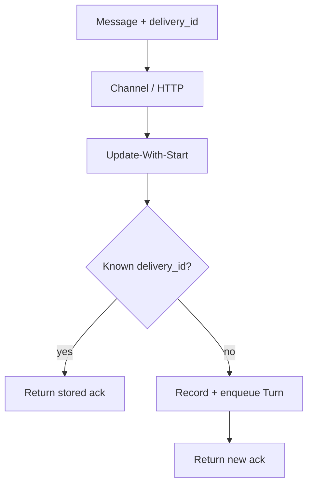

<h1>Idempotent Delivery </h1>

## Overview

The Idempotent Delivery pattern gives every channel message (or HTTP post) a unique `delivery_id` so Temporal accepts input once, queues it safely, and returns the original acknowledgement on retries—without double-running Turns.
Primitives used: Update-With-Start or Signal-with-Start, Session Workflow delivery ledger, stable `session_id`, optional Query for delivery status.

## Problem

Web clients, webhooks, and messaging platforms retry.
If each retry starts a new Turn, you bill twice, send two tool side effects, and confuse the user.
If you only dedupe in the HTTP layer's memory, a process crash loses the ack and the next retry may apply again.

## Solution

Require a client-generated `delivery_id` (UUID) on every inbound message.
The Session Workflow keeps a small ledger of recent delivery IDs → outcome (accepted, turn_id, error).
On Update (preferred) or Signal:

1. If `delivery_id` is known, return the stored ack without enqueueing again.
2. If new, durably record it, enqueue a Turn, return the ack.
3. Reject reuse of the same `delivery_id` with a different payload.

Prefer Update-With-Start so the channel gets a typed ack after Temporal has accepted the delivery.



The following describes each step in the diagram:

1. The client sends text plus a unique `delivery_id`.
2. The API calls Update-With-Start on the Session Workflow ID.
3. The Session looks up the delivery ledger.
4. Duplicates return the first acknowledgement; new IDs enqueue one Turn.

```python
from dataclasses import dataclass
from temporalio import workflow

@dataclass
class DeliveryAck:
    delivery_id: str
    status: str  # accepted | duplicate
    turn_id: str | None = None

@workflow.defn
class AgentSessionWorkflow:
    def __init__(self) -> None:
        self._deliveries: dict[str, DeliveryAck] = {}
        self._queue: list[tuple[str, str]] = []

    @workflow.update
    async def deliver(self, delivery_id: str, text: str) -> DeliveryAck:
        existing = self._deliveries.get(delivery_id)
        if existing:
            return existing
        turn_id = f"turn-{len(self._queue) + 1}"
        ack = DeliveryAck(delivery_id=delivery_id, status="accepted", turn_id=turn_id)
        self._deliveries[delivery_id] = ack
        self._queue.append((turn_id, text))
        return ack
```

## Implementation

<DaytonaRunner pattern="idempotent-delivery" />

### Ledger bounds

Keep only recent delivery IDs in Workflow state (for example last N or TTL by turn age).
Spill older acks to external store if channels need long-lived idempotency receipts ([Claim-Check Payloads](/claim-check-payloads) / external KV).

### Payload fingerprint

Store a hash of the message body with the delivery ID.
If the same ID arrives with a different hash, fail with a conflict error—do not silently ignore.

### Auth context

Record the principal that submitted the delivery.
Do not allow a different tenant to replay another user's `delivery_id`.

### Ordering

Decide whether deliveries apply in accept order or arrival order under concurrency.
Document that choice; Updates serialize in the Workflow, which makes accept-order natural.

### Continuation

When the API parks waiting for a Turn result, return a continuation token that includes `session_id` + `delivery_id` (or `turn_id`) so reconnects fetch the same outcome ([HTTP Channel Agent](/http-channel-agent)).

## When to use

Use for every production channel that can retry: HTTP, webhooks, messaging buses.
Skip only for local demos where duplicate Turns are acceptable.

## Benefits and trade-offs

You get exactly-once *application* of agent input at the Session layer (at-least-once transport underneath).
You must issue and store delivery IDs and bound the ledger.

## Comparison with alternatives

| Approach | Duplicate POST | Crash after accept |
| :--- | :--- | :--- |
| Idempotent Delivery | Same ack, one Turn | Ledger survives |
| Dedupe in API memory | Same process only | Lost on restart |
| New turn per retry | Double work | — |
| Signal without ID | Hard to dedupe | — |

## Best practices

- **Client generates delivery_id** before the first attempt; retries reuse it.
- Prefer **Update-With-Start** for typed acks ([Session with Signal-and-Start](/session-signal-and-start)).
- **Emit `delivery_accepted` / `delivery_duplicate` events** for support.
- **Pair with tool idempotency keys** so Activity retries stay safe even when a Turn runs once.

## Common pitfalls

- **Server-generated IDs on each retry.** Defeats dedupe.
- **Unbounded delivery maps** in Workflow state → history bloat.
- **Deduping only in Redis without Temporal ledger.** Race between ack and Session apply.
- **Ignoring payload conflicts** on ID reuse.
- **Using Signal-only delivery** when the client needs a durable ack body.

## Related patterns

- [Session with Signal-and-Start](/session-signal-and-start)
- [HTTP Channel Agent](/http-channel-agent)
- [Messaging Channel Agent](/messaging-channel-agent)
- [Turn Workflow](/turn-workflow)
- [Typed Agent Operations](/typed-agent-operations)
- [Tool Compensation](/tool-compensation)

## Sample code

- [`sandbox-runner/patterns/idempotent-delivery/python/`](https://github.com/temporal-sa/temporal-agentic-patterns/tree/main/sandbox-runner/patterns/idempotent-delivery/python)

## References

- [Temporal Docs: Update-With-Start](https://docs.temporal.io/sending-messages#update-with-start)
- [Temporal Docs: Message passing — Python](https://docs.temporal.io/develop/python/workflows/message-passing)
