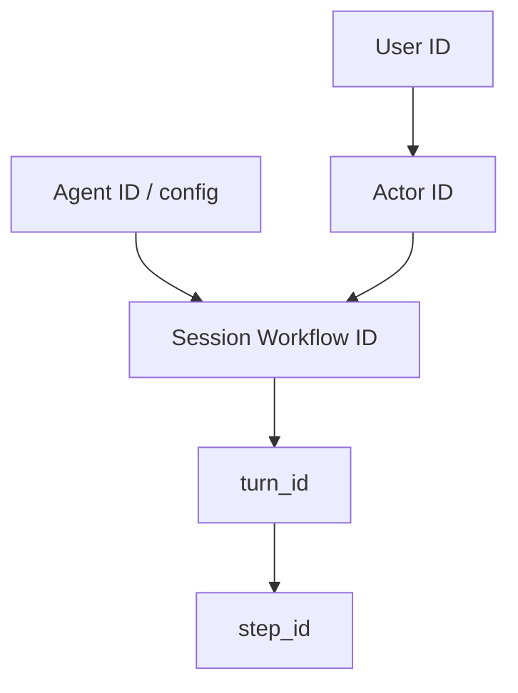

# Identity

## Overview

Identity names who or what owns durable agent work: Actor, Agent, User, and Session.
Pattern pages use these IDs when correlating Workflows, approvals, and event streams.

## Problem

Without stable IDs, you cannot tell which human, agent configuration, or session produced a tool call after a restart.
Teams then key off chat message IDs, process PIDs, or ephemeral tokens that do not survive Continue-As-New or worker failover.
You need a clear map from product identity to Temporal Workflow identity.

## Solution

Treat identity as layered IDs that you pass into the Session and emit on events:

The following describes each step in the diagram:

1. A User identifies the human (or service account) that owns the conversation.
2. An Actor is the authenticated principal for a decision—often the User, sometimes an operator approving on their behalf.
3. An Agent ID names the agent configuration (tools, prompts, safety profile), not a running process.
4. The Session Workflow ID is the durable address of the conversation; `turn_id` and `step_id` nest under it for correlation.

Map `session_id` to a Temporal Workflow ID (or a Search Attribute that resolves to one). Keep `actor_id` on approval and command events so audits show who decided, not only which session ran.

## When to use

Read this page when you choose Workflow ID schemes, wire auth into Signals/Updates, or correlate traces across Sessions and subagents.

## Benefits and trade-offs

Stable IDs make Continue-As-New, subagents, and approvals reconstructable.
The trade-off is that you must design ID formats and ownership rules up front instead of inventing keys per channel.

## Comparison with alternatives

| Approach | Durability | Auditability |
| :--- | :--- | :--- |
| Session Workflow ID + actor_id | High | High |
| Message ID as session key | Low across channels | Low |
| Process-local agent instance ID | Lost on restart | Poor |

## Best practices

- **Separate Agent ID from Session ID.** Many Sessions can share one Agent configuration.
- **Carry actor_id on human decisions.** Approvals and slash commands need a principal.
- **Keep Workflow IDs deterministic when you use Signal-with-Start.** Collisions should mean "same Session," not a new run.
- **Propagate IDs into Activities and events.** Traces and cost records need the same keys.

## Common pitfalls

- **Using the User ID as the Workflow ID.** One user may have many concurrent Sessions.
- **Dropping actor_id after Continue-As-New.** Carry identity in continue-as-new arguments.
- **Equating Agent ID with a worker process.** Workers are interchangeable; Agent config is not.

## Related patterns

- [Session Workflow](/session-workflow)
- [Session with Signal-and-Start](/session-signal-and-start)
- [Entity Agent](/entity-agent)
- [Continue-As-New Session](/continue-as-new-session)
- [Agent Tracing](/agent-tracing)

## Sample code

See [Session Workflow](/session-workflow) and [Entity Agent](/entity-agent) for Workflow ID and session identity examples.

## References

- [Temporal Docs: Workflows](https://docs.temporal.io/workflows)
- [Temporal Docs: Workflow IDs](https://docs.temporal.io/workflow-execution/workflowid-runid)
- [Temporal Docs: Search Attributes](https://docs.temporal.io/search-attribute)
