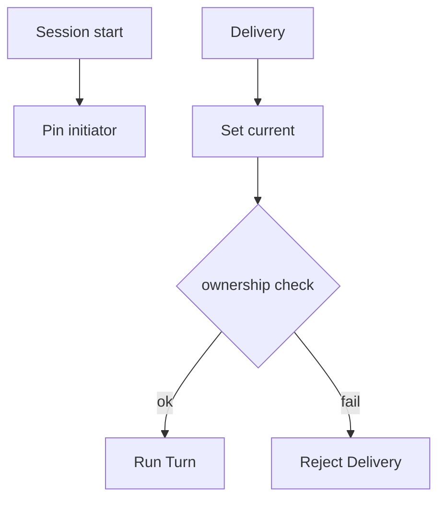

<h1>Initiator vs Current Principal </h1>

## Overview

The Initiator vs Current Principal pattern stores two durable auth contexts on the Session: `initiator` (who started it) and `current` (who sent the active Delivery)—so ownership, coalesce, and capability checks can use the right principal.
Primitives used: Session auth state, Delivery Authorization Timing, Mid-Turn Delivery Coalescing, Dynamic Capability Resolution.

## Problem

A single “user id” on the Session confuses the starter with later speakers.
Schedules and shared inboxes need a stable owner distinct from the latest caller.

## Solution

1. On Session create, pin `auth.initiator` from accept-time authz.
2. Each Delivery sets `auth.current` for that Turn.
3. Ownership and cancel rights compare against initiator (or ACL).
4. Capability resolution chooses current and/or initiator per policy.
5. Mid-Turn coalescing requires matching initiator (or documented rule).



The following describes each step in the diagram:

1. Session creation records the initiator.
2. Each Delivery updates current only.
3. Authorization compares the right principal for the operation.
4. Turns run only after checks pass.

```python
from dataclasses import dataclass
from temporalio import workflow

@dataclass
class Principal:
    principal_id: str
    principal_type: str

@workflow.defn
class AgentSessionWorkflow:
    def __init__(self) -> None:
        self.initiator: Principal | None = None
        self.current: Principal | None = None

    @workflow.run
    async def run(self, initiator: Principal, delivery_from: Principal) -> str:
        self.initiator = initiator
        self.current = delivery_from
        if self.current.principal_id != self.initiator.principal_id:
            return "rejected:not_owner"
        return f"ok:{self.current.principal_id}"
```

## Implementation

<DaytonaRunner pattern="initiator-vs-current-principal" />

### Schedules

Runtime principals (for example an app identity) may be initiator for scheduled Sessions.
Document whether humans may deliver into those Sessions.

### Accept vs apply

Combine with [Delivery Authorization Timing](/delivery-authorization-timing):
re-check current at apply if the Session parked.

## When to use

Use this for multi-user inboxes, shared agent Sessions, and any product where starter ≠ latest speaker.
Single-user CLI agents can still store both fields for uniformity.

## Benefits and trade-offs

You separate ownership from turn-time identity cleanly.
Policies must specify which principal gates which operation.

## Comparison with alternatives

| Field | Meaning |
| :--- | :--- |
| initiator | Stable Session owner / starter |
| current | Active Delivery caller |

## Best practices

- **Pin initiator immutably** after create.
- **Log both ids** on security-sensitive events.
- **Define ACL overrides** explicitly when non-owners may deliver.

## Common pitfalls

- **Updating initiator on follow-up.** Breaks ownership.
- **Coalescing across different initiators.** Cross-talk.
- **Resolving secrets for current while charging initiator** without a billing policy.

## Related patterns

- [Identity](/identity)
- [Delivery Authorization Timing](/delivery-authorization-timing)
- [Mid-Turn Delivery Coalescing](/mid-turn-delivery-coalescing)
- [Dynamic Capability Resolution](/dynamic-capability-resolution)
- [Split Resume and Observe Handles](/split-resume-observe-handles)

## Sample code

- [Python sample](https://github.com/temporal-sa/temporal-agentic-patterns/tree/main/sandbox-runner/patterns/initiator-vs-current-principal/python)
- [Temporal Workflows](https://docs.temporal.io/workflows)

## References

- [Temporal Python SDK](https://docs.temporal.io/develop/python)
- [Workflows](https://docs.temporal.io/workflows)
