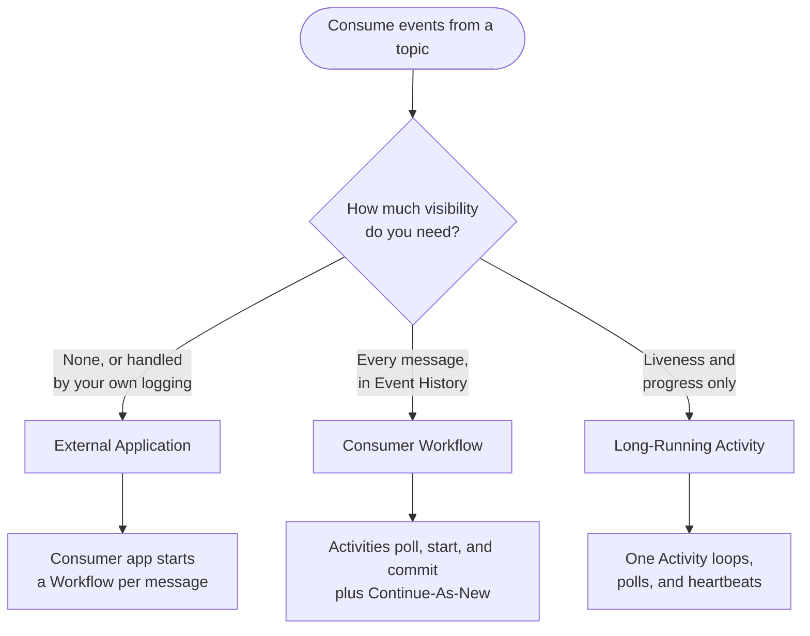
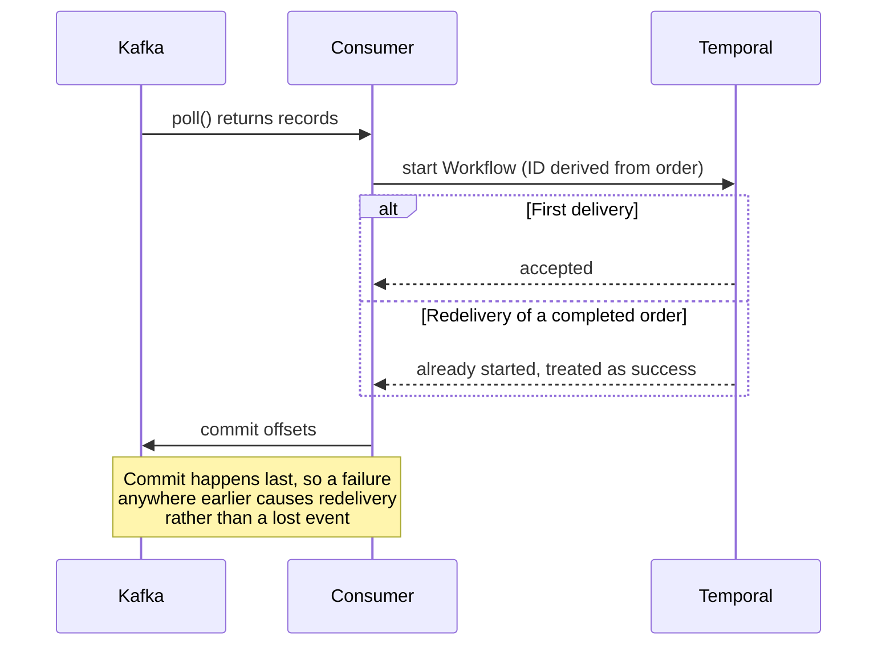

<h1>Kafka Consumption </h1>

## Overview

The Kafka Consumption pattern reads events from a message topic and starts one Workflow Execution per event, so that the work triggered by each event inherits durable execution.
You can place the consumer in an external application, in a Workflow, or in a long-running Activity.
The three options differ in how much visibility you get and how much each message costs.

While this pattern is written with Kafka in mind, the same structure applies to other messaging systems such as RabbitMQ, Amazon SQS, Amazon Kinesis, Google Cloud Pub/Sub, and IBM MQ.

## Problem

Consider an eCommerce system that publishes an `OrderCompleted` event to a Kafka topic, with a downstream consumer that sends the order confirmation email.
That consumer has to look up the order, fetch shipping details, and attach an invoice before it can send anything.
When the email provider is unavailable or the order database is slow to respond, the consumer fails partway through, and the customer never receives the email.

This is the general shape of the problem.
Message brokers deliver events reliably, but they say nothing about the work those events trigger.
You are left to implement retries, backoff, and partial-failure recovery in the consumer, where a process restart discards whatever progress was in memory.

Kafka's default delivery semantics compound this.
Delivery is at-least-once, so any consumer restart or partition rebalance can replay records whose offsets were not yet committed.
A consumer that starts work on every record it sees will send some customers a second email.

You need consumption that starts durable work per event, survives restarts on both sides, and does the right thing when the same message arrives twice.

## Solution

You place the Kafka consumer in one of three locations, and in every case you start a Workflow rather than performing the work inline.
The consumer hands each event to Temporal and moves on, which decouples consumption throughput from downstream latency.



The following describes each path in the diagram:

1. If you do not need per-message visibility inside Temporal, use an external application. This is the least expensive option at one Action per message, and the closest to a conventional consumer deployment.
2. If you need every message that was read to appear in Event History, use a Consumer Workflow that calls Activities to poll, start, and commit. This is the only option that records each step durably, and it costs the most Actions.
3. If you need to know that a consumer is alive and making progress but not to see each message, use a long-running Activity that loops and heartbeats.

### Making at-least-once delivery safe

All three options depend on the same three-part arrangement, and none of them are correct without it.

1. Derive the Workflow ID from the message itself, such as the order ID, so a redelivered message resolves to the same Workflow Execution rather than starting a new one.
2. Set a Workflow ID reuse policy that rejects duplicates of successful runs while allowing a failed run to be retried.
3. Commit the Kafka offset only after the Workflow start has been durably accepted.



The following describes each step in the diagram:

1. The consumer polls and receives one or more records.
2. For each record, the consumer starts a Workflow whose ID is derived from the message payload.
3. On a first delivery, Temporal accepts the start.
4. On a redelivery of an order that already ran successfully, the reuse policy rejects the start. The consumer treats that rejection as success, because the work is already accounted for.
5. Only after every record in the batch is handed off does the consumer commit its offsets. A failure before that point leaves the offsets uncommitted, so Kafka redelivers.

This ordering protects you on both sides.
If something goes wrong after the poll, Kafka replays the event.
If an event is replayed after it was already handled, the reuse policy prevents a second execution.

## Implementation

### External application

A conventional consumer application reads from the topic and starts a Workflow for each record.
The entire pattern fits in one method, and everything else is configuration around it:

::: code-group
```java [Java]
@KafkaListener(
    topics = "${app.consumer.topic}",
    groupId = "${app.consumer.group-id}",
    containerFactory = "kafkaListenerContainerFactory")
public void onOrderCompleted(ConsumerRecord<String, OrderCompleted> record, Acknowledgment ack) {
    OrderCompleted event = record.value();

    // Start first, acknowledge second. If the start throws, the offset is never
    // committed and the error handler retries the same record, so a Temporal
    // outage delays events instead of dropping them.
    starter.start(event);

    ack.acknowledge();
}
```
:::

The Workflow start itself carries the idempotency guarantees:

::: code-group
```java [Java]
public StartOutcome start(OrderCompleted event) {
    String workflowId = "order-email-" + event.orderId();

    OrderEmailWorkflow workflow = client.newWorkflowStub(
        OrderEmailWorkflow.class,
        WorkflowOptions.newBuilder()
            .setTaskQueue(TaskQueues.ORDER_EMAIL)
            .setWorkflowId(workflowId)
            .setWorkflowIdReusePolicy(
                WorkflowIdReusePolicy.WORKFLOW_ID_REUSE_POLICY_ALLOW_DUPLICATE_FAILED_ONLY)
            .build());

    try {
        // start(), not execute(): hand the work to Temporal and move on. Blocking
        // until the email is sent would tie consumption throughput to downstream latency.
        WorkflowExecution execution = WorkflowClient.start(workflow::sendOrderEmail, event);
        return new StartOutcome(workflowId, execution.getRunId(), false);
    } catch (WorkflowExecutionAlreadyStarted alreadyStarted) {
        // This event was already handled. Commit the offset and move on.
        return new StartOutcome(workflowId, null, true);
    }
}
```
:::

Scale this option the way you would scale any consumer, by running more instances in the consumer group.

### Consumer Workflow

A Workflow runs the consumer loop, calling an Activity to retrieve a batch of events and to acknowledge processing the event(s).
As a result, you are getting visibility into every event that is processed.
It is also why each poll cycle costs three Actions, one to retrieve the event(s), one to start the workflow and another to
letting Kafka know that everything was processed successfully. If the event payload doesn't match what is expected, another
action is used to send the event(s) to a dead letter queue. 

::: code-group
```java [Java]
@Override
public ConsumerStatus consume(ConsumerParams params) {
    activities.subscribe(params.settings());

    long processed = params.messagesProcessed();

    while (!stopRequested) {
        PolledBatch batch = activities.poll(params.settings());
        iterations++;

        if (!batch.isEmpty()) {
            if (!batch.orders().isEmpty()) {
                activities.startTargetWorkflows(batch.orders());
                processed += batch.orders().size();
            }
            if (!batch.poison().isEmpty()) {
                activities.deadLetter(params.settings(), batch.poison());
            }
            // Only now is it safe to advance the offsets.
            activities.commitOffsets(params.settings(), batch.offsets());
        }

        if (shouldContinueAsNew()) {
            KafkaConsumerWorkflow next =
                Workflow.newContinueAsNewStub(KafkaConsumerWorkflow.class);
            return next.consume(new ConsumerParams(
                params.settings(), processed, poisoned, params.continuations() + 1));
        }
    }

    activities.close(params.settings());
    return status();
}

private boolean shouldContinueAsNew() {
    // Let the service decide when history is getting large, rather than hardcoding
    // a threshold that would go stale as limits change.
    return Workflow.getInfo().isContinueAsNewSuggested() || iterations >= MAX_ITERATIONS_PER_RUN;
}
```
:::

Note what the loop does not contain.
There is no try/catch around it, no retry bookkeeping, and no reconnection logic.
Activity retry policies cover everything, and the loop's position is durable, 
which is why you can put the loop in a Workflow.

#### Why the consumer cannot be Workflow state

A Workflow's state has to be reconstructible by replaying its Event History.
Everything a Workflow holds is either an argument or a result recorded in that history.
A Kafka consumer is neither.
It is a live network connection, a position in each partition it has been assigned, and a membership in a consumer group.
Making it serializable would not help, because a replay would then have to re-establish the connection and rejoin the group, 
and Event History has no way to describe either.

The consumer has to stay in the Worker process, and only plain data travels between the Workflow and its Activities:

- The Workflow holds an instance identifier, along with the topic, consumer group, and other settings.
- The Worker holds a map, in memory, from that identifier to the live consumer.
- Each Activity receives the identifier as an argument, looks the consumer up in that map, and uses it. 
- If there is no entry, because the Worker restarted, the Activity creates the consumer, subscribes, and resumes from Kafka's committed offsets.

#### One Task Queue per consumer instance

Because the map exists in a single Worker's memory, an Activity that executes in another process will not find it.
Poll, start, and commit must all run in the process that holds the consumer.

Temporal's mechanism for routing tasks to a specific process is a Task Queue.
A Worker executes only what it polls from the queues it is registered on, and Activities inherit their Workflow's Task Queue unless told otherwise.
There is no way to address a particular process directly.

This pattern therefore needs a Task Queue per consumer process instance.

- Derive the Task Queue name from the instance identifier, such as `kafka-consumer-1`. Give the Consumer Workflow the same identifier, so one instance is one queue, one Worker, and one Workflow Execution.
- That instance's Worker registers both the Consumer Workflow type and its Activity implementations on that queue, and nothing else registers there.
- Leave the Activities on the Workflow's Task Queue. They inherit it by default, and if your Activity options set one explicitly, it must be the same queue.
- Continue-As-New inherits the Task Queue, so the binding survives every continuation.

Adding a consumer means starting another instance with a new identifier, new queue, new Worker, and new Workflow Execution.
It does not mean adding replicas of an existing one.
Each consumer instance is a separate deployable unit carrying its own identifier, rather than one deployment scaled to N replicas.
This is the part of the pattern that costs the most operationally, and it is worth considering before choosing it.

The Workflows that get started run on their own shared Task Queue and scale normally, with as many Workers and replicas as you need.
**Only the consumer loop is bound to a single process.**

#### Recovering from a Worker restart

Worker restart is the only path that rebuilds a consumer.
The cached consumer dies with the process, the restarted Worker recreates it on the next poll, and it resumes from Kafka's committed offsets.
Because offsets are committed only after the target Workflows have started, the worst case is that a few records are redelivered, which the Workflow ID reuse policy absorbs.

#### Batch sizing

Batch size is the most consequential setting in this option.
With one record per poll and three Activities per message, a single consumer tops out at a few messages per second, regardless of Kafka's or the target Workflow's speed.

| Batch size | Throughput | Kept up? | P50 latency | Actions per message |
| :--- | :--- | :--- | :--- | :--- |
| 1 | 3.4 msgs/s | no | 25.8 s | 4.0 |
| 50 | 51.7 msgs/s | yes | 0.57 s | 1.06 |

Batch the poll for anything beyond the lowest volumes.

The Actions count includes both the Workflow start and the three Activity schedules, which is what makes it a fair comparison to the other two options, since each of those costs one Action per message.
For a batch of N messages, one poll cycle starts N Workflows and schedules 3 Activities, so the total cost is 3 + N Actions, or (1 + 3/N) Actions per message.
A count of "3 per message" only includes the Activities, not the Workflow start. That makes this option look cheaper than it really is, so it can't be fairly compared to the other two.

Note also that an empty poll still costs one Action, so an idle consumer carries a standing cost of roughly 60,000 divided by the poll timeout in milliseconds, in Actions per minute.

### Long-running Activity

A Workflow starts a single Activity that opens the consumer, loops, and never returns under normal operation.
This removes the Event History growth of the previous option and the Continue-As-New handling that goes with it:

::: code-group
```java [Java]
@Override
public void consume(KafkaConsumerSettings settings) {
    // try-with-resources: the consumer is closed on cancellation, on error, and on
    // Worker shutdown. Without this the consumer group waits out the session timeout
    // on every restart before rebalancing.
    try (KafkaConsumer<String, byte[]> consumer = KafkaConsumers.create(settings)) {
        consumer.subscribe(List.of(settings.topic()));

        // Heartbeat before the first poll so Temporal sees the Activity as alive
        // immediately, rather than only after the first record arrives on a quiet topic.
        heartbeat(settings, processed, Map.of());

        while (true) {
            PolledBatch batch =
                KafkaConsumers.poll(consumer, Duration.ofMillis(settings.pollTimeoutMs()));

            for (ConsumedOrder order : batch.orders()) {
                starter.start(order.event());
            }

            if (!batch.poison().isEmpty()) {
                deadLetterPublisher.publish(settings.dltTopic(), batch.poison());
            }

            if (!batch.isEmpty()) {
                // Commit only after every record has been handed off or dead-lettered.
                KafkaConsumers.commit(consumer, batch.offsets());
            }

            // Every iteration, including idle ones. The SDK throttles these to a
            // fraction of the heartbeat timeout, so this costs far fewer Actions than
            // it appears to. Do not hand-roll your own throttling on top.
            heartbeat(settings, processed, batch.offsets());
        }
    } catch (ActivityCompletionException cancelled) {
        // Thrown by heartbeat() when the Workflow is cancelled. The only clean way
        // out of an infinite loop.
        throw cancelled;
    }
}
```
:::

The Activity options carry the liveness contract:

::: code-group
```java [Java]
ActivityOptions.newBuilder()
    // The Activity never returns under normal operation, so this is not a deadline for
    // "how long the work takes" but an upper bound on the life of one consumer.
    .setStartToCloseTimeout(Duration.ofDays(365))
    // The real liveness check. If the Activity stops heartbeating for this long,
    // Temporal treats it as dead and retries it, which is how a wedged or killed
    // consumer gets replaced automatically.
    .setHeartbeatTimeout(Duration.ofSeconds(30))
    .setRetryOptions(RetryOptions.newBuilder()
        // A broker outage should pause consumption, never end it.
        .setMaximumAttempts(0)
        .build())
    .build();
```
:::

Unlike the Consumer Workflow, this option needs no per-instance Task Queue and no single-Worker rule.
The consumer handle is created and used inside one Activity invocation, so it never has to be reachable from a second Activity in the same process.
You scale it by starting several consumer Activities asynchronously from the same Workflow.

#### Worker slots

A long-running Activity never completes, so it never releases its execution slot.
With SDK defaults, a handful of consumers permanently occupy the Worker's Activity slots and every other Activity on that Worker queues forever, producing a Worker that looks healthy and does nothing.
Set the maximum concurrent Activity executors comfortably above your consumer count, and use a dedicated Worker and Task Queue for consumer Activities.

#### Stopping a consumer

Killing the process does not stop it.
The consumer's lifecycle belongs to Temporal.
The Workflow survives, the Activity stops heartbeating, and the next Worker to poll that Task Queue picks it up and resumes consuming under its original settings.

To stop a consumer, terminate or cancel its Workflow.
Left unmanaged, orphaned consumers accumulate across restarts until they exhaust the Worker's Activity slots, which presents not as "too many consumers" but as a consumer that silently never starts.

### Scaling and the partition ceiling

All three options share one throughput ceiling, which is the number of partitions on the Kafka topic.
Kafka assigns each partition to at most one consumer in a group, so a fleet of Consumer Workflows and a fleet of long-running Activities are bounded the same way.
Adding a seventh consumer of any kind to a six-partition topic yields an idle consumer, not more throughput.
If throughput is the problem, add partitions.
The option you choose will not change the ceiling.

Below the ceiling, adding consumers does help, though not proportionally.
Tripling them raised throughput by roughly 2.1x in testing, and that multiple is a lower bound rather than a measurement: 
the three-consumer run sat within 5% of the load generator's own ceiling, so it was probably starved.
The larger effect was on latency: with a backlog to work through, p50 fell from roughly 14 seconds to under one second.

What stops the external application and the long-running Activity between 50 and 100 messages per second on the laptop was not identified.
It was measurably not namespace rate limiting, since `RESOURCE_EXHAUSTED` was zero throughout, and not Worker capacity, since Worker CPU stayed under 5% and heap under 190 MB.
Whatever binds first in your own environment, measure it before you tune consumption, because consumption is rarely the part that repays the effort.

Because the ceiling is shared, choose between the options on visibility requirements, Action cost, and your preferred deployment model rather than on throughput.

## When to use

### External application

This option is a good fit when you do not need visibility into individual messages inside Temporal, when you want the lowest Action cost per message, and when you already have consumer deployment and scaling practices you want to keep.
It is not a good fit when you need the read-to-start step recorded durably, since you will have to build that yourself.

### Consumer Workflow

This option is a good fit when every message read from Kafka must appear in Event History, and when you want the consumer loop itself to be durable and inspectable.
It is not a good fit when Action cost is a primary concern, when you cannot batch polls, or when running one deployable unit per consumer instance is operationally unacceptable.

### Long-running Activity

This option is a good fit when you want Temporal to own the consumer's lifecycle, including automatic replacement of a wedged consumer, without recording every message.
It is not a good fit when you need per-message history, or when you cannot dedicate Worker Activity slots to consumers that never release them.

### When to reconsider the topic

Before adopting any of these, step back and look at the business process the topic supports. Ask whether that whole process could be run as a Temporal workflow instead.
Events and queues are just implementation details. 
Once you model the business process directly in Temporal, the topics discussed here no longer apply. 

## Benefits and trade-offs

All three options turn at-least-once delivery into exactly-once work, because the deterministic Workflow ID absorbs redelivery.
All three decouple consumption from downstream latency, because the consumer starts a Workflow rather than waiting for the work to finish.
All three leave you with retries, backoff, and recovery handled by Temporal rather than by consumer code.

The external application is the least expensive and the most familiar to operate, and it gives you nothing inside Temporal between the poll and the Workflow start.
The Consumer Workflow gives you a durable record of every step and pays for it in Actions and in a deployment model of one unit per consumer instance.
The long-running Activity sits between the two, giving you liveness and progress through heartbeat details at roughly the external application's cost, in exchange for permanently occupied Worker slots.

At the time of this writing, Temporal directly supports the competing consumers pattern, where each message is handled by exactly one Worker.
Publish-subscribe, where several independent subscribers each receive every message, is not directly supported, though you can approximate it by starting several Workflows asynchronously from one consumer.

## Comparison with alternatives

| | Long-running Activity | Consumer Workflow | External application |
| :--- | :--- | :--- | :--- |
| Visibility into execution | Liveness and progress | Every message | None, or custom |
| Bounded by Event History limits | No | Yes | Not applicable |
| Requires Activity heartbeating | Yes | No | No |
| Dedicated Task Queue per instance | No | Yes | Not applicable |
| How to scale | Run several Activities in parallel | Run several Workflow instances | Run several application instances |
| Throughput, single consumer | ~100 msgs/s at the saturation edge | ~3 msgs/s at 1 record per poll, 51.7 msgs/s at 50 records, the highest rate tested | ~100 msgs/s at the saturation edge |
| Actions per message | 1, plus throttled heartbeats | 4.0 at 1 record per poll, 1.06 at 50 | 1 |

Measured throughput under an increasing offered rate:

| Offered rate | External application | Consumer Workflow (1 record per poll) | Long-running Activity |
| :--- | :--- | :--- | :--- |
| 10 / sec | 10.3 ✓ | 3.4 ✗ | 10.3 ✓ |
| 50 / sec | 51.6 ✓ | 3.4 ✗ | 51.5 ✓ |
| 100 / sec | 93 to 103 ~ | 3.4 ✗ | 99 to 107 ~ |
| P50 latency at 50 / sec | 0.011 s | 24.7 s | 0.011 s |

✓ kept up, with lag flat. ✗ fell behind, so the figure is a ceiling rather than a sustained rate. ~ sat at the saturation edge, keeping up in most runs but not all.

These figures were measured on a single machine running Kafka, the Worker, and a Temporal development server together.
They are useful for comparing the options under identical conditions, not as absolute capacity.

The 100 per second row is a range over six runs rather than one measurement.
Do not use it to rank the external application against the long-running Activity: the two ranges overlap, and the spread within each is wider than the distance between them.
There is deliberately no row above 100 per second, because the load generator used for these runs tops out near 157 events per second, and every higher rate measures the generator instead of the consumer.
That matters for how much of a difference to believe.
Below saturation, repeated runs at 100 per second spread 1.11x for the external application and 1.07x for the long-running Activity.
At 150 per second, where the generator was close to its own limit, two runs of one identical configuration disagreed by 1.95x.
The batch size result above is 15x, which sits comfortably outside all of this.

## Best practices

- **Derive the Workflow ID from the message.** An ID built from the order or entity in the payload is what makes redelivery safe.
- **Commit offsets last.** Advance the offset only after every record in the batch has been handed off, so a failure causes redelivery rather than a lost event.
- **Choose a reuse policy deliberately.** `ALLOW_DUPLICATE_FAILED_ONLY` rejects replays of successful runs while letting a failed run recover.
- **Count your deduplications.** Treating the already-started exception as success is correct, but record it as a metric so duplicate handling stays measurable.
- **Batch the poll.** For the Consumer Workflow option, batching is the difference between a few messages per second and roughly fifty.
- **Dead-letter undecodable records.** Route poison records to a dead-letter topic so a single malformed message cannot block its partition indefinitely.
- **Let the service decide on Continue-As-New.** Use the Continue-As-New suggestion rather than a hardcoded history threshold that goes stale as limits change.
- **Set unlimited Activity retry attempts for consumers.** A broker outage should pause consumption, not end it.
- **Give consumer Activities their own Worker and Task Queue.** This keeps consumers that never release slots away from ordinary Activity traffic.
- **Monitor for rate limiting.** Watch `temporal_cloud_v0_resource_exhausted_error_count` in Temporal Cloud, or `temporal_request_failure` and `temporal_long_request_failure` with `status_code="RESOURCE_EXHAUSTED"` from SDK metrics.
- **Load test before committing.** Tune Actions per second, Task Queue Activity rates, Worker poller and executor counts, cached Workflows, and replica counts against your own volumes.
- **Establish your load generator's ceiling first.** Any offered rate the producer cannot sustain measures the producer, and a harness that does not compare delivered rate against requested rate will report that as a consumer result.
- **Count the Workflow start when you compare Action costs.** Every option pays one Action per message to start a Workflow, so a per-message figure that omits it is not comparable across options.

## Common pitfalls

- **Polling one record at a time.** In the Consumer Workflow option this caps a single consumer near 3 messages per second regardless of downstream capacity.
- **Committing the offset before the Workflow start returns.** This creates a window in which a crash loses the message permanently.
- **Scaling a Consumer Workflow with replicas.** A second Worker on an instance's Task Queue lets Activities land on a process with no consumer. Add instances, each with its own identifier and queue.
- **Leaving Activity slots at their defaults.** A few long-running consumers exhaust the Worker's slots and every other Activity queues forever, in a Worker that still reports healthy.
- **Killing the process to stop a consumer.** The Workflow survives and another Worker resumes consumption. Terminate or cancel the Workflow instead.
- **Letting orphaned consumers accumulate.** Unmanaged consumers build up across restarts and present as a new consumer that silently never starts.
- **Adding consumers past the partition count.** Beyond one consumer per partition you gain idle consumers, not throughput. Add partitions instead.
- **Forgetting the cost of an idle consumer.** An empty poll still costs one Action, so a short poll timeout on a quiet topic carries a standing charge.
- **Assuming heartbeat details drive recovery.** Recovery comes from Kafka's committed offsets. Heartbeat details are for visibility.
- **Ranking options on single saturation runs.** Repeat runs of one identical configuration near saturation disagreed by 1.95x. A ranking that close needs repeated runs and a stated spread.

## Related patterns

- **[Long Running Activity](long-running-activity.md)**: Heartbeating and lifecycle management for Activities that run indefinitely.
- **[Worker-Specific Task Queues](worker-specific-taskqueue.md)**: The same routing constraint that forces one Task Queue per consumer instance.
- **[Continue-As-New](continue-as-new.md)**: Keeping the Consumer Workflow's Event History bounded.
- **[Polling External Services](polling.md)**: Choosing where a polling loop lives, for sources that are not message topics.
- **[Downstream Rate Limiting](downstream-rate-limiting.md)**: Protecting downstream systems when consumption outpaces them.

## Sample code

### Java

A reference implementation of all three options, in Java and Spring Boot, along with the load tests that produced the figures on this page:

- [External application](https://github.com/temporal-sa/kafka-consumption-patterns/tree/main/consumer-external): A consumer application that starts a Workflow per message.
- [Consumer Workflow](https://github.com/temporal-sa/kafka-consumption-patterns/tree/main/consumer-workflow): A Workflow that polls, starts, and commits through Activities.
- [Long-running Activity](https://github.com/temporal-sa/kafka-consumption-patterns/tree/main/consumer-activity): A single heartbeating Activity that owns the consumer.
- [Load test and partition ceiling scripts](https://github.com/temporal-sa/kafka-consumption-patterns/tree/main/scripts): The harness behind the throughput, latency, and scaling figures above, including the delivered-against-requested rate check.

Every module that holds a Temporal connection ships `cloud` and `cloud-mtls` Spring profiles, so you can run the same comparison against Temporal Cloud with one set of environment variables.
The consumers are clients as well as Workers, so they need those credentials too, not only the Worker that runs the target Workflow.
