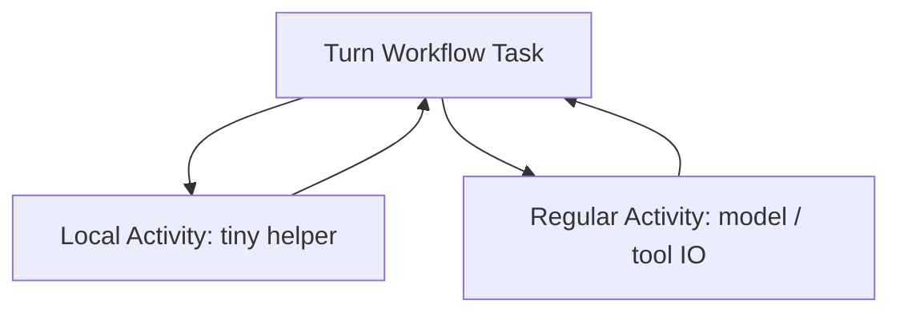

<h1>Local Activity Tools </h1>

## Overview

The Local Activity Tools pattern runs tiny, fast, usually deterministic tool helpers as Local Activities inside the Worker that owns the Workflow Task—cutting schedule overhead for bookkeeping Steps while keeping real model and IO tools as ordinary Activities.
Primitives used: Local Activity, Workflow Tool boundary, Activity Tool, Progress Streaming caveats.

## Problem

Every ordinary Activity pays a Temporal server round-trip.
Agent Turns often include many small Steps: sanitize args, hash ids, format a prompt prefix, touch in-memory caches.
If those micro-Steps are ordinary Activities, history and latency grow without gaining useful retry isolation.
If you push the same micro-Steps into Workflow code incorrectly, you risk non-determinism or blocking the Workflow Task.

## Solution

Use Local Activities only for short, idempotent helpers that finish well inside the Workflow Task timeout.
Keep Durable Model Call, network tools, sandboxes, and anything that publishes Progress Streaming tokens as regular Activities.
Default to ordinary Activities until you have measured a latency problem.



The following describes each step in the diagram:

1. The Turn runs on a Worker Workflow Task.
2. Tiny helpers execute as Local Activities in-process and record results with the same Workflow Task.
3. Model calls and side-effecting tools schedule as regular Activities with their own retries, heartbeats, and Task Queues.

```python
from datetime import timedelta

from temporalio import workflow

@workflow.defn
class AgentTurnWorkflow:
    @workflow.run
    async def run(self, user_text: str) -> str:
        cleaned = await workflow.execute_local_activity(
            sanitize_user_text,
            user_text,
            start_to_close_timeout=timedelta(seconds=2),
        )
        return await workflow.execute_activity(
            call_model,
            cleaned,
            start_to_close_timeout=timedelta(seconds=60),
            # Prefer a dedicated model Task Queue when rate-limiting
        )
```

## Implementation

<DaytonaRunner pattern="local-activity-tools" />


### Good Local Activity candidates

- Argument normalization and schema checks that are still easier as code than pure Workflow logic
- Short CPU hashing / id minting that must not hit the network
- Reading Worker-local config already injected into the process

### Never Local Activity

- Provider model calls (especially streaming)
- HTTP tools, MCP calls, Nexus Operations
- Sandbox boot or Code Mode script execution
- Anything that needs Task Queue rate limits, fairness keys, or long heartbeats

### Progress Streaming conflict

Workflow Streams and long interactive agents expect model token publish from regular Activities via `WorkflowStreamClient.from_within_activity()` (or equivalent).
Local Activities run inside the Workflow Task and are a poor host for streaming publishers and multi-minute work—prefer regular Activities for those Steps.

### Debugging and QoS

Local Activities are harder to rate-limit per downstream API and harder to see as separate Activity executions.
If you need [Downstream Tool Rate Limiting](/downstream-tool-rate-limiting) or clear per-tool metrics, keep the Step as a regular Activity.

## When to use

Use after you measure Workflow Task latency from many tiny ordinary Activities.
Prefer Workflow Tools for pure deterministic state updates with no Activity boundary.
Prefer regular Activity Tools for side effects and model calls.

## Benefits and trade-offs

You cut per-call scheduling overhead for micro-helpers.
You give up separate Activity retries, heartbeats, and queue-level throttles on those helpers.

## Comparison with alternatives

| Approach | Overhead | Isolation |
| :--- | :--- | :--- |
| Local Activity Tools | Lowest for tiny work | Same Worker / Workflow Task |
| Regular Activity Tool | Higher | Full Activity machinery |
| Workflow Tool | None | Must stay deterministic |

## Best practices

- **Measure first.** Do not convert model or tool IO to Local Activities for theoretical savings.
- **Keep Local Activities short.** Seconds, not minutes.
- **Fail closed to regular Activities** when unsure.
- **Document the allowlist** of Local Activity helpers next to your tool registry.

## Common pitfalls

- **Streaming or long model calls as Local Activities.** Blocks Workflow Tasks and breaks stream publish patterns.
- **Putting network I/O in a Local Activity.** Retries and timeouts behave differently than you expect for tools.
- **Assuming Local Activities fix fairness.** They do not participate in Task Queue activity rate limits the same way.
- **Huge Local Activity payloads.** They still enlarge history via the Workflow Task completion.

## Related patterns

- [Activity Tool](/activity-tool)
- [Workflow Tool](/workflow-tool)
- [Durable Model Call](/durable-model-call)
- [Heartbeat Long Steps](/heartbeat-long-steps)
- [Progress Streaming](/progress-streaming)
- [Downstream Tool Rate Limiting](/downstream-tool-rate-limiting)

## Sample code

- [`sandbox-runner/patterns/local-activity-tools/python/`](https://github.com/temporal-sa/temporal-agentic-patterns/tree/main/sandbox-runner/patterns/local-activity-tools/python)

## References

- [Temporal Docs: Local Activities](https://docs.temporal.io/local-activity)
- [Temporal Docs: Activity overview](https://docs.temporal.io/activities)
