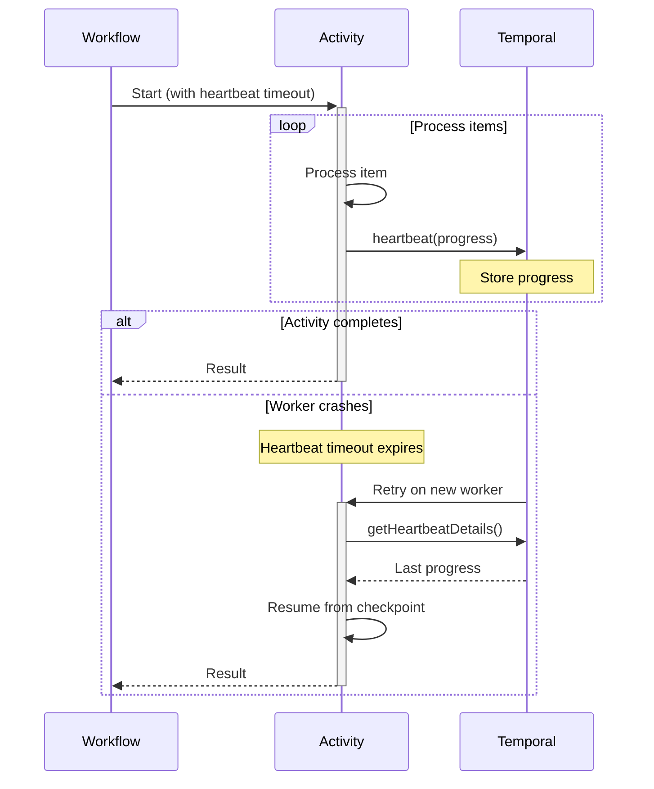

# Long-Running Activity - Tracking Progress and Handling Cancellation with Heartbeats

## Overview

The Activity Heartbeat pattern enables long-running Activities to report progress, handle cancellation gracefully, and resume from the last checkpoint after failures.
Heartbeats inform Temporal that the Activity is still alive and allow storing progress details that survive Worker restarts.

## Problem

In long-running operations, you often need Activities that process large datasets or perform time-consuming operations (minutes to hours), report progress to avoid appearing stuck or timing out, resume from the last checkpoint after Worker crashes or restarts, handle cancellation requests gracefully and clean up resources, and avoid reprocessing already-completed work.

Without heartbeats, you must set very long Activity timeouts that delay failure detection, reprocess entire batches from the beginning on failures, accept no visibility into Activity progress, risk zombie Activities that appear alive but are stuck, and implement custom checkpointing and recovery logic.

## Solution

Activity heartbeats use `Activity.getExecutionContext().heartbeat(details)` to periodically report progress.
The heartbeat details are persisted and available to retry attempts, enabling resumption from the last checkpoint.
Heartbeat timeouts detect stuck Activities faster than execution timeouts.



The following describes each step in the diagram:

1. The Workflow starts the Activity with a heartbeat timeout.
2. The Activity processes items in a loop, heartbeating progress after each batch.
3. If the Activity completes normally, it returns the result to the Workflow.
4. If the Worker crashes, the heartbeat timeout expires and Temporal retries the Activity on a new Worker. The new attempt retrieves the last heartbeat details and resumes from the checkpoint.

## Implementation

### Basic progress tracking

The following implementation processes a large file line by line, heartbeating every 100 lines.
On retry, it retrieves the last processed line number and skips ahead:

```java
// FileProcessingActivityImpl.java
@ActivityInterface
public interface FileProcessingActivity {
  void processLargeFile(String filePath);
}

public class FileProcessingActivityImpl implements FileProcessingActivity {
  @Override
  public void processLargeFile(String filePath) {
    ActivityExecutionContext context = Activity.getExecutionContext();
    Optional<Integer> lastProcessedLine = context.getHeartbeatDetails(Integer.class);
    int startLine = lastProcessedLine.orElse(0);
    
    try (BufferedReader reader = new BufferedReader(new FileReader(filePath))) {
      for (int i = 0; i < startLine; i++) {
        reader.readLine();
      }
      
      String line;
      int currentLine = startLine;
      while ((line = reader.readLine()) != null) {
        processLine(line);
        currentLine++;
        
        if (currentLine % 100 == 0) {
          context.heartbeat(currentLine);
        }
      }
    }
  }
}
```

The `getHeartbeatDetails(Integer.class)` call retrieves the last heartbeat value from a previous attempt.
If this is the first attempt, it returns empty and the Activity starts from line 0.
The Activity heartbeats every 100 lines, storing the current line number as the checkpoint.

### Handling cancellation

The following implementation adds cancellation support.
The Activity checks for cancellation on each heartbeat and cleans up resources before exiting:

```java
// FileProcessingActivityImpl.java
public class FileProcessingActivityImpl implements FileProcessingActivity {
  @Override
  public void processLargeFile(String filePath) {
    ActivityExecutionContext context = Activity.getExecutionContext();
    Optional<Integer> lastProcessedLine = context.getHeartbeatDetails(Integer.class);
    int currentLine = lastProcessedLine.orElse(0);
    
    try (BufferedReader reader = new BufferedReader(new FileReader(filePath))) {
      for (int i = 0; i < currentLine; i++) {
        reader.readLine();
      }
      
      String line;
      while ((line = reader.readLine()) != null) {
        context.heartbeat(currentLine);
        processLine(line);
        currentLine++;
      }
    } catch (ActivityFailure e) {
      if (e.getCause() instanceof CanceledFailure) {
        cleanupResources();
        throw e;
      }
      throw e;
    }
  }
}
```

Cancellation is delivered to the Activity when it heartbeats.
If the Workflow has cancelled the Activity, the next `heartbeat()` call causes an `ActivityFailure` with a `CanceledFailure` cause.
The catch block performs cleanup before re-throwing the exception.

### Complex progress state

The following implementation tracks multiple progress fields — processed count, failed count, and the last processed ID:

```java
// BatchProcessingActivityImpl.java
public class BatchProcessingActivityImpl implements BatchProcessingActivity {
  
  static class ProgressState {
    int processedCount;
    int failedCount;
    String lastProcessedId;
  }
  
  @Override
  public BatchResult processBatch(List<String> itemIds) {
    ActivityExecutionContext context = Activity.getExecutionContext();
    Optional<ProgressState> details = context.getHeartbeatDetails(ProgressState.class);
    ProgressState progress = details.orElse(new ProgressState());
    
    int startIndex = itemIds.indexOf(progress.lastProcessedId) + 1;
    
    for (int i = startIndex; i < itemIds.size(); i++) {
      String itemId = itemIds.get(i);
      
      try {
        processItem(itemId);
        progress.processedCount++;
      } catch (Exception e) {
        progress.failedCount++;
      }
      
      progress.lastProcessedId = itemId;
      context.heartbeat(progress);
    }
    
    return new BatchResult(progress.processedCount, progress.failedCount);
  }
}
```

The `ProgressState` object stores all the checkpoint data needed to resume.
On retry, the Activity finds the index of the last processed ID and starts from the next item.
Each heartbeat stores the full progress state, so the next attempt has everything it needs to resume.

## When to use

The Heartbeat pattern is a good fit for batch processing of large datasets, file uploads and downloads with progress tracking, database migrations or bulk operations, long-running computations (ML training, video encoding), external API polling with multiple attempts, and any Activity running longer than 30 seconds.

It is not a good fit for quick operations (under 10 seconds), operations that cannot be checkpointed, Activities requiring exact-once semantics without idempotency, or real-time streaming (use Workflows instead).

## Benefits and trade-offs

Heartbeats enable fault tolerance by resuming from the last checkpoint after failures.
Heartbeat timeouts detect stuck Activities faster than execution timeouts.
You gain visibility into Activity progress in real-time.
Activities can handle cancellation gracefully and clean up resources.
Completed work is not reprocessed, and Activities can move between Workers.

The trade-offs to consider are that frequent heartbeats increase network traffic.
You must implement checkpointing logic and state management.
You must handle partial reprocessing of the last checkpoint (idempotency).
You need to balance heartbeat frequency between responsiveness and overhead.
Heartbeat details have size limits, so you should avoid large objects.

## Comparison with alternatives

| Approach | Progress tracking | Resumable | Cancellation | Complexity |
| :--- | :--- | :--- | :--- | :--- |
| Heartbeat | Yes | Yes | Graceful | Medium |
| Long Timeout | No | No | Delayed | Low |
| Child Workflows | Yes | Yes | Immediate | High |
| Local Activity | No | No | N/A | Low |

## Best practices

- **Set heartbeat timeout.** Configure to 2–3x the expected heartbeat interval.
- **Heartbeat at regular intervals.** Balance between responsiveness (every 10–30 seconds) and overhead.
- **Checkpoint strategically.** Save progress at meaningful boundaries (records, pages, chunks).
- **Keep details small.** Store minimal state (IDs, offsets, counts), not full objects.
- **Handle idempotency.** Ensure reprocessing the last checkpoint is safe.
- **Check cancellation.** Heartbeat regularly to detect cancellation quickly.
- **Clean up on cancel.** Catch `ActivityFailure` and check for `CanceledFailure` cause.
- **Log progress.** Log heartbeat details for debugging and monitoring.
- **Test resumption.** Verify Activities resume correctly after simulated failures.
- **Avoid heartbeat spam.** Do not heartbeat on every iteration of tight loops.

## Common pitfalls

- **Missing HeartbeatTimeout.** Without a HeartbeatTimeout, Temporal cannot detect a stuck or crashed Worker until the StartToCloseTimeout expires. Always set HeartbeatTimeout shorter than StartToCloseTimeout.
- **Heartbeating too infrequently.** Cancellation is only delivered on the next heartbeat. If the Activity heartbeats every 5 minutes, cancellation takes up to 5 minutes to propagate.
- **Not resuming from heartbeat progress on retry.** When an Activity retries, use `Activity.getExecutionContext().getHeartbeatDetails()` (Java) or equivalent to resume from the last checkpoint instead of restarting from scratch.
- **Catching the wrong exception for cancellation.** In Java, cancellation is delivered as `ActivityFailure` with a `CanceledFailure` cause, not a standalone exception. Catch `ActivityFailure` and check `getCause()`.

## Related patterns

- **[Saga Pattern](saga-pattern.md)**: Compensating transactions with long-running steps.
- **[Polling](polling.md)**: Heartbeating Activity for frequent polling.

## Sample code

- [Heartbeating Activity Batch](https://github.com/temporalio/samples-java/tree/main/core/src/main/java/io/temporal/samples/batch/heartbeatingactivity) — Complete batch processing implementation.
- [Auto-Heartbeating](https://github.com/temporalio/samples-java/tree/main/core/src/main/java/io/temporal/samples/autoheartbeat) — Automatic heartbeating via interceptor.
