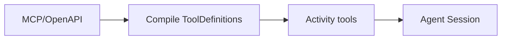

<h1>MCP / OpenAPI Tooling </h1>

## Overview

The MCP / OpenAPI Tooling pattern discovers external tools and services (via MCP servers or OpenAPI descriptions) and compiles them into typed Activity tools.
The agent calls them as first-class tools with schemas, retries, approvals, and telemetry.
Primitives used: ToolDefinition generation, Activity Tools, SafetyProfile assignment.

## Problem

Hand-writing Activity wrappers for every external API does not scale and drifts from the upstream schema.

## Solution

At build or startup, ingest MCP/OpenAPI descriptions, generate ToolDefinitions (JSON Schema → Pydantic), and register Activity bodies that call the remote API.
Assign safety profiles and approval defaults during compilation.



The following describes each step in the diagram:

1. A connector spec is fetched or vendored.
2. Compilation produces typed tools with IDs and schemas.
3. Workers register generated Activities.
4. The agent uses them like any other Activity Tool under policy.

```python
# Generated tooling registration example
defs = compile_openapi(spec_path)
for d in defs:
    register_activity_tool(d.name, d.input_model, d.output_model, d.endpoint)
```

## Implementation

### Freshness

Pin specs in-repo or validate digests so tool IDs do not churn silently.

### Auth

Broker credentials in the Activity layer; never ask the model for secrets.

## When to use

Use when integrating many external APIs or MCP servers.
Hand-write tools when you need custom semantics beyond the spec.

## Benefits and trade-offs

You scale tool ingestion with schema fidelity.
Generated tools still need safety review.

## Comparison with alternatives

| Source | Output |
| :--- | :--- |
| OpenAPI | HTTP Activity tools |
| MCP | ToolDefinitions from server list |
| Hand-written | Custom tools |

## Best practices

- **Review safety profiles after generation.**
- **Stable tool IDs.** Avoid renaming on every spec refresh.
- **Contract tests against the real API in CI.**

## Common pitfalls

- **Auto-enabling all generated tools in prod.**
- **Passing raw user tokens to the model context.**

## Related patterns

- [Activity Tool](/activity-tool)
- [Safety-Profiled Tools](/safety-profiled-tools)
- [Security Profiles per Agent](/security-profiles-per-agent)

## Sample code

See related runnable samples under `sandbox-runner/patterns/` when this pattern builds on Session Workflow, Activity Tool, or Code Mode.

## References

- [Temporal Docs: Activities](https://docs.temporal.io/activities)
