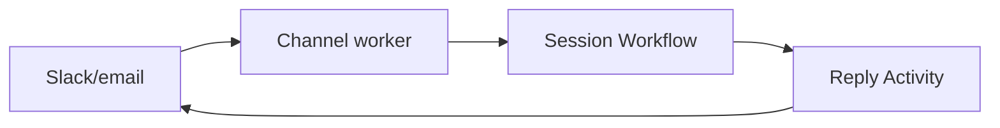

<h1>Messaging Channel Agent </h1>

## Overview

The Messaging Channel Agent pattern binds an agent to messaging platforms (Slack, Teams, email) by mapping incoming messages to Session/Turn inputs and outgoing replies to channel-specific payloads.
Durable timers and retries shield the channel from transient failures.
Primitives used: Channel adapter Activities/workers, Session with Signal-and-Start, Event Stream.

## Problem

Chat platforms retry webhooks, reorder events, and rate-limit replies.
A naive bot process loses sessions on deploy.

## Solution

Channel workers verify signatures, derive `session_id`, and signal-with-start the Session.
Outbound replies are Activities with retries; the Session remains channel-agnostic.



The following describes each step in the diagram:

1. A platform webhook hits the channel adapter.
2. The adapter maps thread/user to session_id and signals the Session.
3. The Session runs the Turn and emits events.
4. A reply Activity posts back to the platform with retries.

```python
async def on_slack_message(team: str, channel: str, thread: str, text: str):
    session_id = f"slack:{team}:{channel}:{thread}"
    await client.start_workflow(
        AgentSessionWorkflow.run,
        args=[session_id],
        id=session_id,
        task_queue=TASK_QUEUE,
        start_signal="user_message",
        start_signal_args=[text],
    )
```

## Implementation

### Idempotency

Deduplicate platform event IDs before signaling.

### Typing indicators and slash commands

Map operator commands to Session Signals; keep user chat as ordinary turns.

## When to use

Use for human chat surfaces.
Use HTTP Channel Agent for first-party apps and services.

## Benefits and trade-offs

You absorb platform quirks outside the Session.
You maintain per-channel adapters.

## Comparison with alternatives

| Concern | Owner |
| :--- | :--- |
| Signature verify | Channel adapter |
| Agent logic | Session |
| Send message | Reply Activity |

## Best practices

- **Deterministic session IDs from thread keys.**
- **Retry outbound posts in Activities.**
- **Keep channel formatting out of core tools when possible.**

## Common pitfalls

- **Using wall-clock timestamps for Workflow timeouts.** Channel event times are not Workflow time; use timers and `wait_condition`.
- **One global Workflow for all Slack threads.**
- **Not deduping platform delivery IDs before Signal.** Retried webhooks double-process the same message.

## Related patterns

- [HTTP Channel Agent](/http-channel-agent)
- [Idempotent Delivery](/idempotent-delivery)
- [Session with Signal-and-Start](/session-signal-and-start)
- [Operator Slash Commands](/operator-slash-commands)

## Sample code

See related runnable samples under `sandbox-runner/patterns/` when this pattern builds on Session Workflow, Activity Tool, or Code Mode.

## References

- [Temporal Docs: Activities](https://docs.temporal.io/activities)
