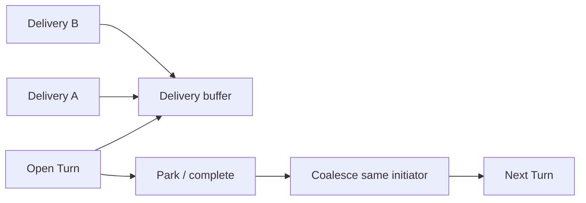

<h1>Mid-Turn Delivery Coalescing </h1>

## Overview

The Mid-Turn Delivery Coalescing pattern queues inbound Deliveries while a Turn is open and folds them—losslessly, in arrival order, same initiator—into the **next** Turn at park, instead of starting one Turn per message.
Primitives used: Session delivery buffer, Signals/Updates, Idempotent Delivery, Continue-As-New Session drain rules.

## Problem

Chatty channels send several messages while a Turn is still running.
Starting a Turn per message races the open tool loop, duplicates work, and confuses approvals.
Dropping extras loses user intent; replacing with “last message wins” deletes earlier text and files.

## Solution

1. While a Turn is active, accept Deliveries into a Session buffer (after ingress validation / idempotency).
2. At the next park (Turn complete or waiting boundary), drain the buffer into one following Turn.
3. Coalesce **same initiator only**; stop the batch before a different principal.
4. Preserve each payload: join text in order; concatenate attachments; keep ask/approval responses distinct from chat text.



The following describes each step in the diagram:

1. Deliveries arrive while Turn 1 runs and enqueue on the Session.
2. Turn 1 parks or completes.
3. The buffer drains into one coalesced input for Turn 2.
4. Turn 2 sees A then B in order—not two competing Turns.

```python
from dataclasses import dataclass, field

from temporalio import workflow

@dataclass
class Delivery:
    delivery_id: str
    actor_id: str
    text: str

@workflow.defn
class AgentSessionWorkflow:
    def __init__(self) -> None:
        self._buffer: list[Delivery] = []
        self._turn_open = False

    @workflow.update
    async def deliver(self, d: Delivery) -> str:
        if self._turn_open:
            self._buffer.append(d)
            return "queued"
        # start turn immediately when idle …
        return "accepted"

    def _coalesce(self) -> list[Delivery]:
        if not self._buffer:
            return []
        first = self._buffer[0].actor_id
        batch: list[Delivery] = []
        while self._buffer and self._buffer[0].actor_id == first:
            batch.append(self._buffer.pop(0))
        return batch
```

## Implementation

<DaytonaRunner pattern="mid-turn-delivery-coalescing" />

### Lossless vs lossy

| Path | Rule |
| :--- | :--- |
| User chat messages | Lossless fold (order preserved) |
| Approval / ask-user responses | Route by `request_id`; do not merge with chat |
| Proxied HITL routing maps | May be last-write-wins **only** for routing metadata—not user text |

### Continue-As-New

Drain or carry the buffer across Continue-As-New.
Losing ready Deliveries at the boundary drops user messages.

### Persistent subagents

Keep one Turn in flight on persistent threads so follow-ups are not coalesced ambiguously into a busy child ([Persistent Subagent Threads](/persistent-subagent-threads)).

## When to use

Use for messaging and HTTP chat where users type ahead.
Skip for strictly serial APIs that never send while a Turn is open.

## Benefits and trade-offs

You absorb bursts without Turn storms and keep every message.
You must implement initiator checks, response routing, and CAN drain discipline.

## Comparison with alternatives

| Approach | Burst behavior | Message loss |
| :--- | :--- | :--- |
| Mid-Turn Delivery Coalescing | One next Turn | No (lossless fold) |
| Turn per Delivery | Storm / races | No |
| Last message wins | One Turn | Yes |

## Best practices

- **Same initiator per batch.**
- **Idempotent Delivery ids** still apply before the buffer ([Idempotent Delivery](/idempotent-delivery)).
- **Separate chat from HITL responses** in the coalesce path.
- **Surface `queued` acks** so clients know the Turn did not start yet.

## Common pitfalls

- Mixing principals in one coalesce (auth bleed).
- Flattening multi-message Deliveries into a single payload object that drops fields.
- Using coalesce as a substitute for delivery idempotency.
- Leaving the buffer behind on Continue-As-New.

## Related patterns

- [Idempotent Delivery](/idempotent-delivery)
- [Validated Session Ingress](/validated-session-ingress)
- [Session with Signal-and-Start](/session-signal-and-start)
- [Messaging Channel Agent](/messaging-channel-agent)
- [HTTP Channel Agent](/http-channel-agent)
- [Continue-As-New Session](/continue-as-new-session)
- [Delivery Authorization Timing](/delivery-authorization-timing)

## Sample code

- [`sandbox-runner/patterns/mid-turn-delivery-coalescing/python/`](https://github.com/temporal-sa/temporal-agentic-patterns/tree/main/sandbox-runner/patterns/mid-turn-delivery-coalescing/python)

## References

- [Temporal Docs: Signals](https://docs.temporal.io/encyclopedia/workflow-message-passing)
- [Temporal Docs: Continue-As-New](https://docs.temporal.io/workflows#continue-as-new)
