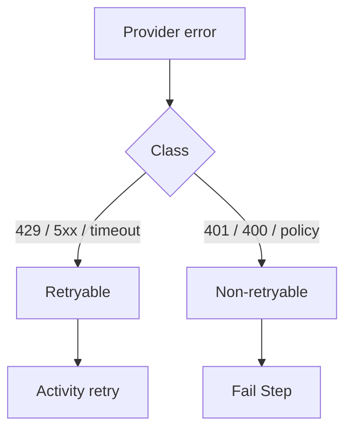

<h1>Model Error Classification </h1>

## Overview

The Model Error Classification pattern maps provider failures to retryable versus non-retryable Temporal errors so Activities do not loop on permanent faults.
Primitives used: Durable Model Call, ApplicationError non_retryable flag, Step failure events.

## Problem

Treating every model exception as retryable burns quota on bad API keys and invalid prompts.
Treating every exception as fatal drops transient 503s.

## Solution

In the model Activity, classify errors:
retryable — rate limits, timeouts, 5xx, network;
non-retryable — 401, invalid request, content policy, model not found.
Raise ApplicationError with non_retryable=True for the permanent class.



The following describes each step in the diagram:

1. The provider client raises an error.
2. The Activity maps it to a Temporal failure type.
3. Retryable errors follow the Activity RetryPolicy.
4. Non-retryable errors fail the Step for the Turn to handle.

```python
except AuthenticationError as e:
    raise ApplicationError(str(e), type="AuthenticationError", non_retryable=True)
except APIStatusError as e:
    if e.status_code >= 500:
        raise ApplicationError(str(e), type="ServerError")
    raise ApplicationError(str(e), type="ClientError", non_retryable=True)
```

## Implementation

### Turn-level handling

Non-retryable model failures may trigger Resumable Correction, a user-visible error, or a fallback model—decide explicitly in the Turn.

### Content policy

Treat policy violations as non-retryable unless you have a safe rewrite path.

## When to use

Use with every Durable Model Call.
Skip only for stubbed demo Activities that never call a provider.

## Benefits and trade-offs

You save cost and time on permanent faults.
You must maintain the mapping as providers evolve.

## Comparison with alternatives

| Error | Retry |
| :--- | :--- |
| Rate limit 429 | Yes |
| Timeout / 503 | Yes |
| Invalid API key | No |
| Invalid prompt / 400 | No |
| Content policy | No (unless rewrite) |

## Best practices

- **Put classification next to the provider client.**
- **Emit error class on step_failed events.**
- **Test both branches** with mocked exceptions.

## Common pitfalls

- **Retrying 401 forever.**
- **Marking all APIStatusError as retryable.**

## Related patterns

- [Provider Retry Delegation](/provider-retry-delegation)
- [Rate-Limit Aware Model Calls](/rate-limit-aware-model-calls)
- [Resumable Correction](/resumable-correction)

## Sample code

See related runnable samples under `sandbox-runner/patterns/` when this pattern builds on Session Workflow, Activity Tool, or Code Mode.

## References

- [Temporal Docs: Failures](https://docs.temporal.io/references/failures)
