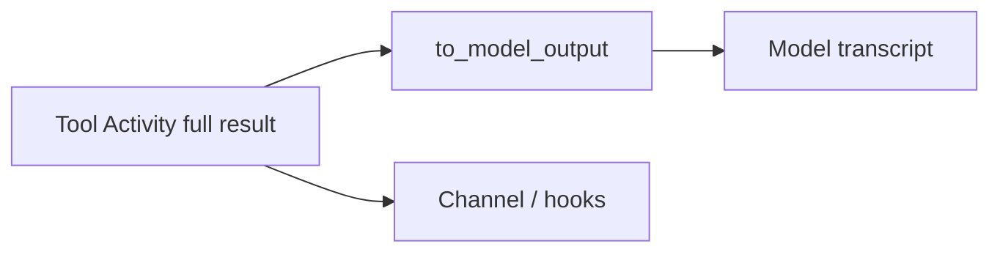

<h1>Model-Output Projection </h1>

## Overview

The Model-Output Projection pattern lets a Tool return a full typed result for channels and hooks while projecting a smaller `text`/`json` view into the model transcript—so UIs stay rich and models stay uncluttered (and free of secrets).
Primitives used: Tool `to_model_output` (or summarize) hook, Standardized Event Stream, Claim-Check Payloads, Agent Tool Loop.

## Problem

Feeding full Tool payloads to the model burns tokens and can leak secrets embedded in rich results.
Feeding only summaries to the channel starves UI and auditors of detail.

## Solution

1. Tool Activity returns the full typed payload.
2. Runtime applies `to_model_output` before appending to the model transcript.
3. Channel/UI events receive the full payload (or a claim-check reference plus projection).
4. The next model Step sees only the projection.
5. Evals can assert projections redact secrets.



The following describes each step in the diagram:

1. The Activity yields the complete result.
2. Projection shapes what the model may see next.
3. Channels still observe the full result.
4. Later model Steps consume the projection only.

```python
from datetime import timedelta
from temporalio import workflow

def to_model_output(full: dict) -> dict:
    return {"type": "json", "value": {"status": full["status"], "id": full["id"]}}

@workflow.defn
class AgentTurnWorkflow:
    @workflow.run
    async def run(self) -> dict:
        full = await workflow.execute_activity(
            create_ticket, start_to_close_timeout=timedelta(seconds=30)
        )
        projected = to_model_output(full)
        return {"channel": full, "model": projected}
```

## Implementation

<DaytonaRunner pattern="model-output-projection" />

### Claim-check

For large blobs, store full results externally and put a reference on the channel event.
Still project a short model view.

### Manifest flag

Advertise `has_model_output_projection` so clients know channel payloads differ from model views.

## When to use

Use this when Tool results are large, structured, or contain fields the model must not see.
Skip when results are already tiny and non-sensitive.

## Benefits and trade-offs

You separate operator fidelity from model context cost.
You must keep projection functions deterministic and tested.

## Comparison with alternatives

| Consumer | Sees |
| :--- | :--- |
| Model transcript | Projection |
| Channel / hooks | Full result |

## Best practices

- **Redact secrets in projections by default.**
- **Version projection functions** with the Tool schema.
- **Test that channel events still carry fields the UI needs.**

## Common pitfalls

- **Projecting differently on replay** (time, randomness).
- **Dropping ids the model needs** for follow-up Tool calls.
- **Assuming structured model output replaces projection.** That pattern schemas the *model* reply, not Tool views.

## Related patterns

- [Structured Model Output](/structured-model-output)
- [Claim-Check Payloads](/claim-check-payloads)
- [Standardized Event Stream](/standardized-event-stream)
- [Agent Tool Loop](/agent-tool-loop)
- [Context Compaction](/context-compaction)

## Sample code

- [Python sample](https://github.com/temporal-sa/temporal-agentic-patterns/tree/main/sandbox-runner/patterns/model-output-projection/python)
- [Temporal Activities](https://docs.temporal.io/activities)

## References

- [Temporal Python SDK](https://docs.temporal.io/develop/python)
- [Workflows](https://docs.temporal.io/workflows)
