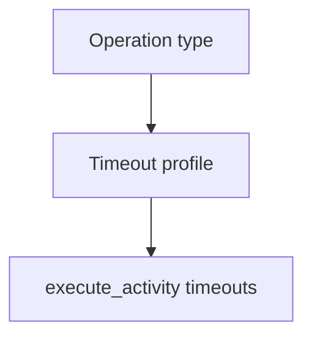

<h1>Model Timeout Profiles </h1>

## Overview

The Model Timeout Profiles pattern assigns start_to_close (and related) timeouts by operation class—fast chat, reasoning models, web search, image generation—so Activities neither cut off expensive work nor hang forever.
Primitives used: Durable Model Call / Activity Tool timeouts, StepPolicy.

## Problem

One 30s timeout kills reasoning models; one 15m timeout hides stuck calls and blocks Turns.

## Solution

Maintain a small timeout table keyed by operation type or model class and apply it when scheduling Activities.



The following describes each step in the diagram:

1. The Turn knows the operation class (chat, reasoning, search, image).
2. It loads timeouts from a profile table.
3. The Activity is scheduled with those timeouts.
4. Stuck calls fail at the profile bound and surface as Step failures.

```python
TIMEOUTS = {
    "chat": timedelta(seconds=30),
    "reasoning": timedelta(minutes=5),
    "web_search": timedelta(minutes=5),
    "image": timedelta(minutes=2),
}

await workflow.execute_activity(
    call_llm,
    request,
    start_to_close_timeout=TIMEOUTS[request.op_class],
)
```

## Implementation

### Recommended starting points

| Class | start_to_close |
| :--- | :--- |
| Simple chat LLM | 30s |
| Reasoning / extended thinking | 5m |
| Web search tool | 5m |
| Simple tool | 30–60s |
| Image generation | 2m |
| Document processing | 1–2m |

Tune from production metrics.

## When to use

Use whenever an agent mixes fast and slow model or tool operations.
A single timeout is enough for uniform short chat demos.

## Benefits and trade-offs

You match timeouts to real latency distributions.
Profiles need periodic review as models change.

## Comparison with alternatives

| Timeout too short | Timeout too long |
| :--- | :--- |
| False failures | Stuck Turns |
| Wasted retries | Poor UX |

## Best practices

- **Pair with schedule_to_close** when many retries are expected.
- **Heartbeat long generations** when streaming inside an Activity.
- **Document profiles next to model routing.**

## Common pitfalls

- **Copying chat timeouts onto reasoning models.**
- **No schedule_to_close on gather() fan-out searches.** One bad retry loop can stall the join.

## Related patterns

- [Durable Model Call](/durable-model-call)
- [Best-Effort Parallel Tools](/best-effort-parallel-tools)
- [Rate-Limit Aware Model Calls](/rate-limit-aware-model-calls)

## Sample code

See related runnable samples under `sandbox-runner/patterns/` when this pattern builds on Session Workflow, Activity Tool, or Code Mode.

## References

- [Temporal Docs: Activity timeouts](https://docs.temporal.io/encyclopedia/detecting-activity-failures)
