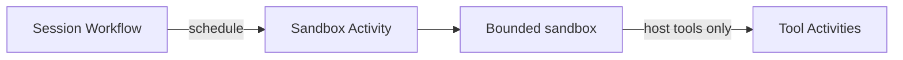

<h1>Network & Resource Sandboxing </h1>

## Overview

The Network & Resource Sandboxing pattern uses sandbox backends (containers, microsandboxes, restricted Python) to enforce network, filesystem, and resource limits for model-authored code and tools.
The Workflow is the control plane; sandboxes are bounded data planes.
Primitives used: SandboxProfile limits, ScriptExecution isolation, Activity-hosted sandboxes.

## Problem

Model-authored code and some tools can exhaust CPU, memory, or reach unexpected networks if they share the worker's privileges.

## Solution

Run untrusted execution inside a sandbox Activity with explicit CPU, memory, time, import, and egress controls.
The Session Workflow only schedules and awaits those Activities.



The following describes each step in the diagram:

1. The Turn needs Code Mode or an untrusted tool.
2. An Activity starts a sandbox with the selected profile limits.
3. The script or tool runs inside the box.
4. Host tool calls leave the box through controlled callbacks to Activities.

```python
@activity.defn
async def run_sandboxed(script: str, profile: str) -> str:
    # Enforce time/memory/network from profile inside this Activity.
    return execute_restricted(script, profile)
```

## Implementation

### Control vs data plane

Never run untrusted code inside the Workflow process.
Keep credentials on the trusted worker side and broker them only at tool boundaries.

## When to use

Use for Code Mode and any tool that executes model-influenced code.
Trusted pure Activity tools may run without a nested sandbox if the worker is already locked down.

## Benefits and trade-offs

You contain blast radius for untrusted execution.
You operate another moving part (sandbox backend).

## Comparison with alternatives

| Layer | Responsibility |
| :--- | :--- |
| Workflow | Schedule, wait, approvals |
| Sandbox Activity | Isolate untrusted code |
| Host tool Activities | Real side effects |

## Best practices

- **Set hard timeouts and memory caps.**
- **Deny egress by default.**
- **Separate sandbox images from worker images when possible.**

## Common pitfalls

- **Running Code Mode in-process with the Workflow worker.**
- **Secrets in Workflow args instead of Activity environment.** Tokens land in history and Continue-As-New payloads.
- **Sandbox Activity without heartbeats during long boots.** The Activity looks dead and is retried or timed out mid-start.

## Related patterns

- [Tools-Only Sandbox](/tools-only-sandbox)
- [Code Mode Orchestrator](/code-mode-orchestrator)
- [Security Profiles per Agent](/security-profiles-per-agent)

## Sample code

See related runnable samples under `sandbox-runner/patterns/` when this pattern builds on Session Workflow, Activity Tool, or Code Mode.

## References

- [Temporal Docs: Activities](https://docs.temporal.io/activities)
