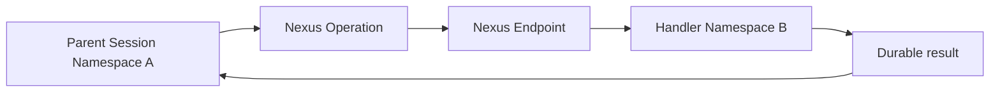

<h1>Nexus Tool </h1>

## Overview

The Nexus Tool pattern exposes a cross-Namespace capability as a Temporal Nexus Operation and calls it from an agent Turn like any other tool Step.
The parent Session stays durable; the handler Namespace owns retries, Workers, and implementation details behind a service contract.
Primitives used: Nexus Endpoint, Nexus Operation, Activity Tool semantics (approvals, events), optional Remote Subagent comparison.

## Problem

HTTP Remote Subagent works across clusters, but you rebuild retries, auth, and audit on top of an ad-hoc API.
Same-Namespace Child Workflows cannot reach another team's isolated Namespace without sharing Workers or weakening isolation.

## Solution

Publish specialist capabilities as Nexus Operations on a Nexus Endpoint.
From the agent Workflow, execute the Operation as the tool body (or wrap it in a thin Activity when you need Activity-local IO around the call).
Record the same `tool_*` / `subagent_*` events you use for local tools so the Session audit trail stays uniform.



The following describes each step in the diagram:

1. The Turn selects a tool that maps to a Nexus Operation.
2. The caller Workflow schedules the Operation through the Endpoint name (not the handler Task Queue).
3. Handler Workers in the target Namespace run the Operation (often starting a Workflow for long work).
4. The result returns to the parent Turn; failures surface as retryable or application errors like other durable Steps.

```python
# Conceptual caller shape — Operation as a tool Step inside the Session Workflow
@workflow.defn
class AgentSessionWorkflow:
    @workflow.run
    async def run(self, query: str) -> str:
        # Nexus client / stub is created per your SDK's Nexus APIs.
        # Prefer async Operations for agent tools that may run longer than a few seconds.
        result = await specialist_tools.search(SearchRequest(query=query))
        return result.summary
```

## Implementation

### Sync vs async Operations

Use asynchronous Nexus Operations for agent tools that may run longer than a few seconds (search, specialist agents, long Activities).
Reserve synchronous handlers for low-latency, highly reliable paths that finish well inside the sync deadline.

### Approvals and events

Gate Nexus Tools with the same ApprovalPolicy as Activity Tools when side effects are risky.
Emit `tool_call_started` / `tool_call_completed` (or subagent brackets) so Progress Streaming and Cost & Token Accounting stay consistent.

### Idempotency

Handler Operations that write must accept idempotency keys from the parent Turn so at-least-once Nexus delivery does not double-apply side effects.

## When to use

Use Nexus Tools when another team or Namespace owns the capability and you need Temporal-native durability across that boundary.
Prefer local Activity Tools or Child Workflow subagents inside one Namespace.
Prefer HTTP Remote Subagent when the peer is not a Temporal Nexus service.

## Benefits and trade-offs

You get durable cross-Namespace composition with Endpoint-level routing, retries, and isolation.
You take on Endpoint/registry operations and clearer contracts between caller and handler teams.

## Comparison with alternatives

| Approach | Boundary | Durability |
| :--- | :--- | :--- |
| Nexus Tool | Temporal Namespace / Endpoint | Native Nexus Machinery |
| Remote Subagent | HTTP session API | Activity + custom resume |
| Local Child Workflow | Same Namespace | Child Workflow |

## Best practices

- **Name Operations like tools.** Stable IDs and schemas beat opaque RPC paths.
- **Pass tenant and fairness context** when the handler shares Workers with other callers.
- **Version contracts.** Treat Operation input/output like public APIs.

## Common pitfalls

- **Using sync Nexus handlers for long model or search work.** They hit short handler deadlines.
- **Skipping idempotency keys** on write Operations.
- **Calling the handler Task Queue directly** instead of the Endpoint name.
- **Not mapping Nexus failures into tool or step failure events.** Audit and Progress Streaming lose the failure unless you record it like other tools.

## Related patterns

- [Activity Tool](/activity-tool)
- [Remote Subagent](/remote-subagent)
- [Subagent Toolset](/subagent-toolset)
- [Fan-Out Subagents](/fanout-subagents)
- [Fairness](/fairness)

## Sample code

See Temporal Nexus Python quickstart and Operation feature guides for caller/handler Workers.
Wire the Operation into your agent Turn the same way you wire an Activity Tool.

## References

- [Temporal Docs: Nexus](https://docs.temporal.io/nexus)
- [Temporal Docs: Nexus — Python](https://docs.temporal.io/develop/python/nexus)
- [Temporal Docs: Nexus Operations](https://docs.temporal.io/nexus/operations)
