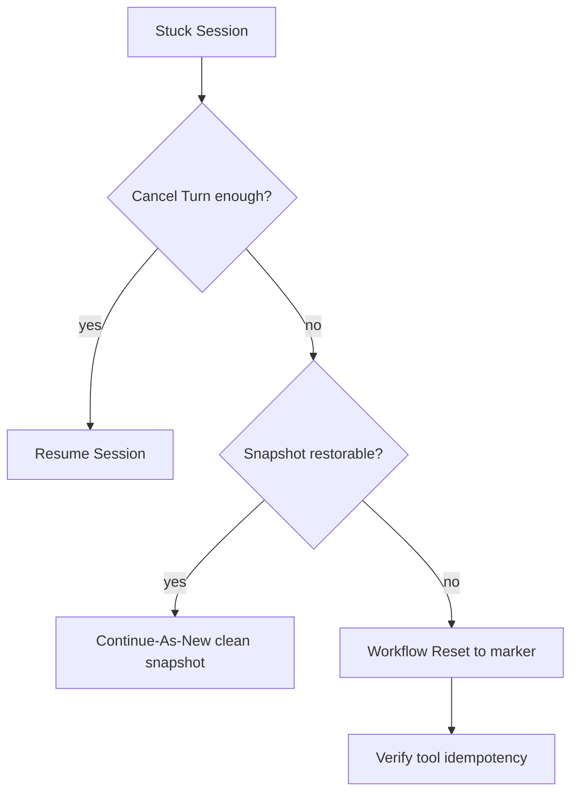

<h1>Operator Session Reset </h1>

## Overview

The Operator Session Reset pattern gives support/on-call a controlled way to recover a stuck or corrupt Session without inventing a new `session_id`—choosing among Workflow Reset, Continue-As-New snapshot restore, or cancel-and-rebuild—with clear rules so tools do not double-apply.
Primitives used: Workflow Reset, Continue-As-New Session, Cancel In-Flight Turn, Idempotent Delivery / tool idempotency, Operator Slash Commands, Session Visibility Attributes.

## Problem

A Session can wedge on bad state, a failed deploy, or a poison mid-Turn.
Users still hold the channel thread keyed by `session_id`.
Blindly starting a new Id orphans the conversation; Reset without canceling Activities can double-write tools.

## Solution

Document an operator runbook with three tiers:

1. **Soft recover** — cancel the open Turn, resume Session ([Cancel In-Flight Turn](/cancel-in-flight-turn)).
2. **Continue-As-New restore** — snapshot known-good memory/pins, Continue-As-New onto cleaned state (same Workflow Id).
3. **Workflow Reset** — Temporal Reset to a prior event/marker when history itself is the problem; cancel in-flight Activities first; verify idempotency keys.

Prefer soft recover → CAN restore → Reset. Emit `session_reset` with reason and actor.



The following describes each step in the diagram:

1. Operators try Turn cancel / correction first.
2. If state is wrong but history is fine, Continue-As-New with a repaired snapshot.
3. If history/replay is broken, Reset to a safe event after draining Activities.
4. Channels keep the same `session_id` across successful recoveries.

```python
# Soft restore via Continue-As-New (same session_id / Workflow Id)
@workflow.signal
async def operator_restore(self, snapshot: dict, reason: str) -> None:
    self._restore = (snapshot, reason)

# in run loop after canceling open Turn:
if self._restore:
    snapshot, reason = self._restore
    workflow.logger.info("session_reset %s", reason)
    workflow.continue_as_new(args=[session_id, snapshot])
```

## Implementation

<DaytonaRunner pattern="operator-session-reset" />

### Before Reset

- Cancel open Turns and children.
- Confirm tool idempotency keys / ledgers will not double-apply.
- Record actor_id and reason in ops tickets and Session events.

### vs Idle Eviction

[Session Idle Eviction](/session-idle-eviction) is automatic lifecycle.
Operator Reset is human-driven recovery.

### Channel continuity

HTTP continuation tokens keyed by `session_id` + `delivery_id` remain valid when Workflow Id is unchanged ([Idempotent Delivery](/idempotent-delivery)).

## When to use

Use for production support playbooks on long-lived Sessions and Entity Agents.
Do not expose raw Reset to end users.

## Benefits and trade-offs

You recover without orphaning channel identity.
You accept operational risk if idempotency is weak.

## Comparison with alternatives

| Approach | Keeps session_id | History |
| :--- | :--- | :--- |
| Cancel Turn | Yes | Intact |
| Continue-As-New restore | Yes | Fresh run |
| Workflow Reset | Yes | Truncated/replayed |
| New session_id | No | Clean |

## Best practices

- **Authorize operator-only** Signals/Updates / CLI.
- **Cancel before Reset.**
- **Prefer CAN restore** when you can build a clean snapshot.
- **Upsert Visibility** `AgentTurnStatus=resetting` / `idle`.

## Common pitfalls

- **Reset mid-Activity** without cancel—duplicate side effects.
- **New Workflow Id** "to be safe"—breaks Signal-with-Start clients.
- **No audit event** for who reset what.
- **Resetting away delivery ledger** → duplicate Turns on retry.

## Related patterns

- [Cancel In-Flight Turn](/cancel-in-flight-turn)
- [Continue-As-New Session](/continue-as-new-session)
- [Idempotent Delivery](/idempotent-delivery)
- [Operator Slash Commands](/operator-slash-commands)
- [Patched Agent Workflow Evolution](/patched-agent-workflow-evolution)
- [Session Idle Eviction](/session-idle-eviction)
- [Tool Compensation](/tool-compensation)

## Sample code

- [`sandbox-runner/patterns/operator-session-reset/python/`](https://github.com/temporal-sa/temporal-agentic-patterns/tree/main/sandbox-runner/patterns/operator-session-reset/python)

## References

- [Temporal Docs: Reset](https://docs.temporal.io/workflow-execution/reset)
- [Temporal Docs: Continue-As-New](https://docs.temporal.io/workflow-execution/continue-as-new)
