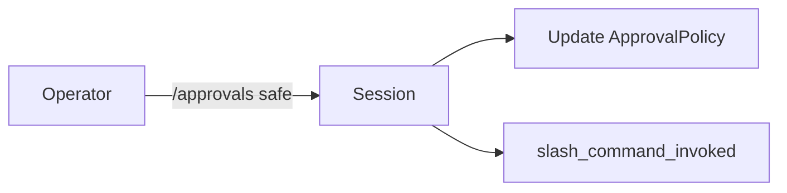

<h1>Operator Slash Commands </h1>

## Overview

The Operator Slash Commands pattern exposes textual commands (`/approvals`, `/status`, `/stop`) that operators send into the Session Workflow.
Commands change approval modes, inspect status, or stop the agent, and are processed deterministically inside the Workflow.
Primitives used: control events (`slash_command_invoked`), ApprovalPolicy updates, Queries for status.

## Problem

Operators need a low-friction way to steer a live session without redeploying code.
Ad-hoc admin APIs drift from session state; you need commands that mutate the same durable Session that runs turns.

## Solution

Accept slash commands as Signals (or Updates) on the Session Workflow.
Parse the command in deterministic Workflow code, update Session fields (policy, stop flag), and emit `slash_command_invoked`.

The following describes each step in the diagram:

1. An operator sends a slash command into the Session.
2. The Workflow parses the command and updates durable Session state.
3. The event stream records the invocation for audit.

## Implementation

<DaytonaRunner pattern="operator-slash-commands" />

### Packaged commands

Common commands include:

- `/approvals strict|safe|skip` — change live approval policy
- `/status` — query current policy and turn state
- `/stop` — request a graceful session stop

Keep handlers in the Workflow so behavior replays correctly.

## When to use

Use slash commands for operator control during long sessions.
Do not use them as the primary end-user chat protocol; keep user messages as ordinary turns.

## Benefits and trade-offs

Operators get durable, auditable control.
You must validate command grammar and authorize who may send Signals.

## Comparison with alternatives

| Approach | Durability | Audit |
| :--- | :--- | :--- |
| Slash commands on Session | High | Event stream |
| Separate admin service | Medium | Easy to diverge |
| Redeploy to change policy | Low | Poor |

## Best practices

- **Authorize command senders.** Not every channel user is an operator.
- **Prefer Updates with validation** when you need a typed response.
- **Expose `/status` as a Query** for read-only inspection.

## Common pitfalls

- **Parsing commands in an Activity.** Command effects on Session state belong in the Workflow.
- **`/stop` that does not cancel in-flight Activities or children.** Work keeps running after the Session looks stopped.
- **Policy mutated via Activity side effects that never land in Session state.** Replay and Continue-As-New lose the change.

## Related patterns

- [Approval-Gated Tools](/approval-gated-tools)
- [Session-Scoped Approvals](/session-scoped-approvals)
- [Cancel In-Flight Turn](/cancel-in-flight-turn)
- [Session Workflow](/session-workflow)

## Sample code

- [`sandbox-runner/patterns/operator-slash-commands/python/`](https://github.com/temporal-sa/temporal-agentic-patterns/tree/main/sandbox-runner/patterns/operator-slash-commands/python)

## References

- [Temporal Docs: Queries](https://docs.temporal.io/encyclopedia/workflow-message-passing#sending-queries)
- [Temporal Docs: Signals](https://docs.temporal.io/encyclopedia/workflow-message-passing#sending-signals)
