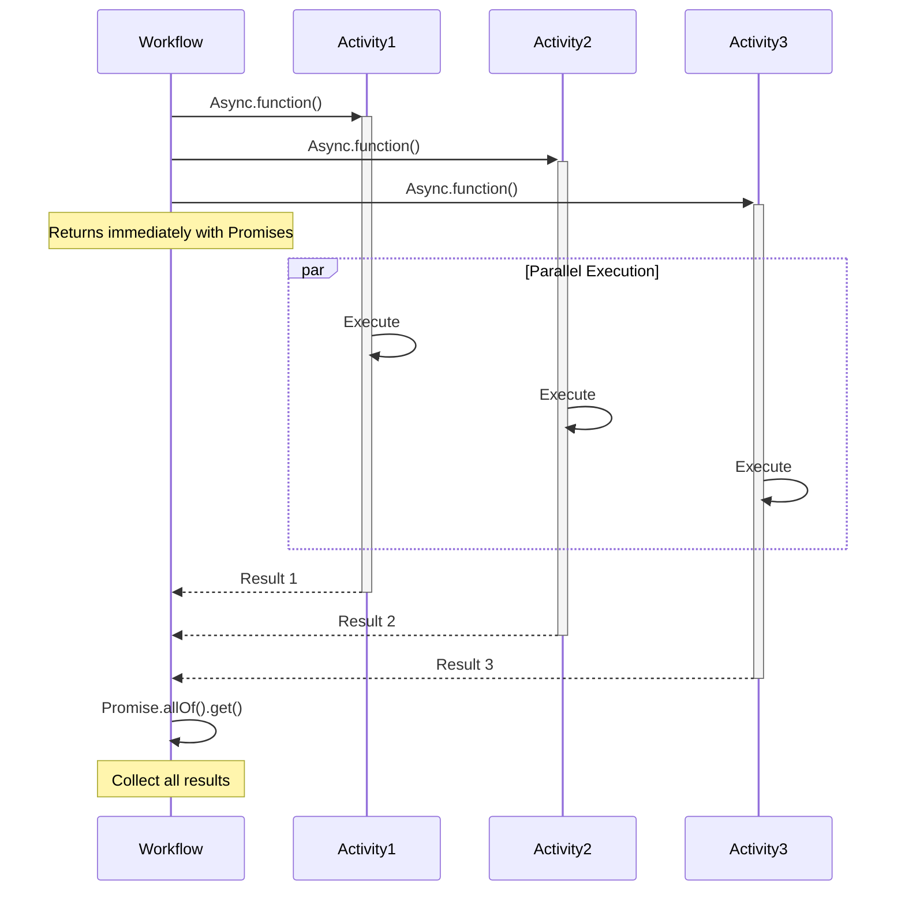

# Parallel Execution

## Overview

The Parallel Execution pattern enables concurrent execution of multiple Activities or Child Workflows to maximize throughput and minimize total execution time.
Using Temporal's Promise API, you can launch multiple operations asynchronously and wait for their completion.

## Problem

In sequential execution, operations run one after another, causing unnecessary delays when multiple independent operations could run simultaneously.
Total execution time equals the sum of all operation durations, resources sit idle while waiting, and batch processing takes hours when it could take minutes.

Without parallel execution, you must accept slow sequential processing, implement complex threading or async logic manually, risk inconsistent state management across threads, and handle thread safety and synchronization issues.

## Solution

Temporal's `Async.function()` and `Promise.allOf()` enable launching multiple Activities or Child Workflows concurrently.
Each operation returns a Promise that resolves when complete.
You use `Promise.allOf()` to wait for all operations or `Promise.anyOf()` for the first completion.



The following describes each step in the diagram:

1. The Workflow starts three Activities asynchronously using `Async.function()`, which returns immediately with Promises.
2. All three Activities execute in parallel on available Workers.
3. As each Activity completes, its Promise resolves with the result.
4. The Workflow calls `Promise.allOf().get()` to block until all Promises resolve, then collects the results.

## Implementation

### Basic parallel Activities

The following implementation starts one Activity per item in a list and waits for all of them to complete:

```java
// ParallelWorkflowImpl.java
@WorkflowInterface
public interface ParallelWorkflow {
  @WorkflowMethod
  List<String> processInParallel(List<String> items);
}

public class ParallelWorkflowImpl implements ParallelWorkflow {
  private final ProcessingActivity activity = 
    Workflow.newActivityStub(ProcessingActivity.class);
  
  @Override
  public List<String> processInParallel(List<String> items) {
    List<Promise<String>> promises = new ArrayList<>();
    
    for (String item : items) {
      Promise<String> promise = Async.function(activity::process, item);
      promises.add(promise);
    }
    
    Promise.allOf(promises).get();
    return promises.stream().map(Promise::get).collect(Collectors.toList());
  }
}
```

Each `Async.function()` call schedules an Activity and returns a Promise immediately.
`Promise.allOf(promises).get()` blocks until every Activity completes.
After all Promises resolve, the Workflow collects the results.

### Controlled parallelism

The following implementation limits the number of concurrent Activities by processing items in batches:

```java
// BatchWorkflowImpl.java
public class BatchWorkflowImpl implements BatchWorkflow {
  private final ProcessingActivity activity = 
    Workflow.newActivityStub(ProcessingActivity.class);
  
  @Override
  public BatchResult processBatch(List<String> items, int maxParallel) {
    List<String> results = new ArrayList<>();
    
    for (int i = 0; i < items.size(); i += maxParallel) {
      int end = Math.min(i + maxParallel, items.size());
      List<String> batch = items.subList(i, end);
      
      List<Promise<String>> promises = batch.stream()
        .map(item -> Async.function(activity::process, item))
        .collect(Collectors.toList());
      
      Promise.allOf(promises).get();
      results.addAll(promises.stream().map(Promise::get).collect(Collectors.toList()));
    }
    
    return new BatchResult(results);
  }
}
```

The Workflow processes items in chunks of `maxParallel`.
Each chunk runs in parallel, and the Workflow waits for the entire chunk to complete before starting the next one.
This prevents overwhelming Workers or external services.

### Error handling

The following implementation wraps each Activity in a try-catch so that individual failures do not prevent other Activities from completing:

```java
// ResilientParallelWorkflowImpl.java
public class ResilientParallelWorkflowImpl implements ParallelWorkflow {
  
  @Override
  public ProcessingReport processWithErrorHandling(List<String> items) {
    List<Promise<Result>> promises = new ArrayList<>();
    
    for (String item : items) {
      Promise<Result> promise = Async.function(() -> {
        try {
          return activity.process(item);
        } catch (Exception e) {
          return Result.failed(item, e.getMessage());
        }
      });
      promises.add(promise);
    }
    
    Promise.allOf(promises).get();
    
    List<Result> results = promises.stream().map(Promise::get).collect(Collectors.toList());
    return new ProcessingReport(results);
  }
}
```

Each Activity catches its own exceptions and returns a failure result instead of propagating the error.
This allows the Workflow to collect results from all Activities, including those that failed.

## When to use

The Parallel Execution pattern is a good fit for processing independent items in batches, calling multiple external services simultaneously, fan-out/fan-in patterns, parallel data transformations, concurrent API requests, and multi-step pipelines with independent stages.

It is not a good fit for operations with dependencies between them, resource-constrained environments (use controlled parallelism), operations requiring strict ordering, or a single fast operation (the overhead is not worth it).

## Benefits and trade-offs

Parallel execution reduces total execution time dramatically and maximizes Worker and external service usage.
Temporal handles retries and failures per operation, and you do not need manual thread management or synchronization.

The trade-offs to consider are that more concurrent operations require more Workers.
Error handling across parallel operations is harder.
Parallel execution makes tracing more difficult.
You may overwhelm external services without throttling, and storing many Promises consumes Workflow memory.

## Comparison with alternatives

| Approach | Parallelism | Complexity | Control | Use case |
| :--- | :--- | :--- | :--- | :--- |
| Async.function() | High | Low | Medium | Independent operations |
| Sequential | None | Very Low | Full | Dependent operations |
| Child Workflows | High | Medium | High | Complex sub-processes |
| ContinueAsNew | None | Medium | Full | Large iterations |

## Best practices

- **Limit concurrency.** Use batching to avoid overwhelming Workers or external services.
- **Handle failures.** Wrap operations in try-catch or use Activity retry policies.
- **Set timeouts.** Configure appropriate Activity timeouts for parallel operations.
- **Monitor resources.** Ensure sufficient Workers for the desired parallelism.
- **Aggregate carefully.** Consider memory when collecting large result sets.
- **Use Child Workflows.** For complex parallel operations with their own state.
- **Test scalability.** Verify performance with realistic parallel loads.
- **Rate limit.** Implement throttling for external API calls.
- **Support partial results.** Consider returning partial results on some failures.
- **Avoid blocking.** Do not call `Promise.get()` until you are ready to wait for results.

## Common pitfalls

- **Exceeding the pending Activities limit.** A single Workflow Execution can have at most 2,000 pending (concurrently running) Activities. Scheduling more causes Workflow Task failures. Batch Activities or use child Workflows for higher concurrency.
- **Ignoring errors from individual Activities.** `Promise.allOf()` (Java) fails immediately on the first promise failure. If you need partial results, catch errors inside each async function rather than letting them propagate.
- **Blowing the 4 MB gRPC message limit.** Scheduling hundreds of Activities in a single Workflow Task can exceed the 4 MB gRPC message size limit if their combined inputs are large. Batch scheduling across multiple Workflow Tasks.
- **Not using Continue-As-New for large fan-outs.** Each Activity adds events to history. Hundreds of parallel Activities can quickly approach the 50K event limit. Use `isContinueAsNewSuggested()` or child Workflows to partition work.

## Related patterns

- **[Child Workflows](child-workflows.md)**: For complex parallel operations with their own state.
- **[Saga Pattern](saga-pattern.md)**: Parallel operations with compensation.

## Sample code

- [HelloParallelActivity](https://github.com/temporalio/samples-java/tree/main/core/src/main/java/io/temporal/samples/hello/HelloParallelActivity.java) — Basic parallel Activity execution.
- [HelloAsync](https://github.com/temporalio/samples-java/tree/main/core/src/main/java/io/temporal/samples/hello/HelloAsync.java) — Async execution with Promises.
- [Sliding Window Batch](https://github.com/temporalio/samples-java/tree/main/core/src/main/java/io/temporal/samples/batch/slidingwindow) — Controlled parallel Child Workflows.
