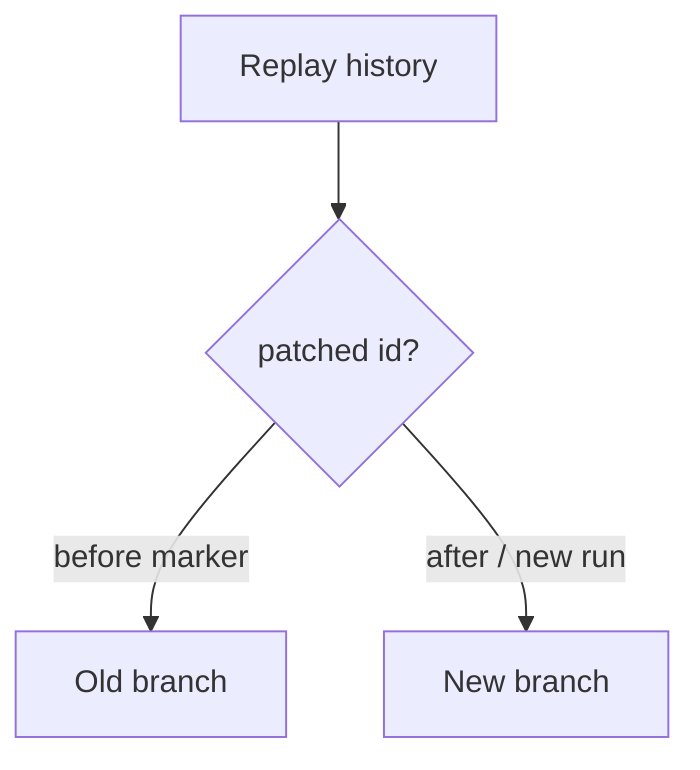

<h1>Patched Agent Workflow Evolution </h1>

## Overview

The Patched Agent Workflow Evolution pattern uses Temporal `workflow.patched` / version markers so you can change Session/Turn branching (new tool gate, compaction trigger, approval path) without breaking replay of open agent histories.
Primitives used: `workflow.patched`, `workflow.deprecate_patch`, Agent Worker Versioning, Continue-As-New migration, Agent Definition Versioning (orthogonal config pins).

## Problem

Open Sessions replay historical events against new Workflow code.
Adding a new Activity, changing wait order, or inserting a guardrail mid-history without a version marker fails replay or silently diverges behavior.
Worker Versioning alone does not express fine-grained logical branches inside one build line.

## Solution

When Workflow logic must change while old histories still run:

1. Wrap the new path in `workflow.patched("change-id")`.
2. Old histories take the `else` (pre-patch) path; new executions take the patched path.
3. After all open Sessions have passed the change (or Continue-As-New'd), `deprecate_patch` and delete the old branch.
4. Prefer Continue-As-New onto clearly new behavior for large migrations when patching would nest too deeply.



The following describes each step in the diagram:

1. Deploy Worker code that includes a patch id around the new branch.
2. Histories that already passed that command event keep the old branch.
3. New runs and histories that reach the patch fresh take the new branch.
4. Later deploys deprecate the patch once old executions are gone.

```python
from datetime import timedelta

from temporalio import workflow

@workflow.defn
class AgentSessionWorkflow:
    @workflow.run
    async def run(self, session_id: str, user_message: str) -> str:
        if workflow.patched("guardrail-pre-model-v1"):
            await workflow.execute_activity(
                guardrail_check,
                args=["pre_model", user_message],
                start_to_close_timeout=timedelta(seconds=10),
            )
        return await workflow.execute_activity(
            call_model,
            user_message,
            start_to_close_timeout=timedelta(seconds=60),
        )
```

## Implementation

<DaytonaRunner pattern="patched-agent-workflow-evolution" />

### vs Agent Worker Versioning

[Agent Worker Versioning](/agent-worker-versioning) pins Deployment/build identity for compatible Workers.
Patches express *logical* evolution inside Workflow code when both old and new branches must coexist during rollout.

### vs Definition / Prompt pins

Config pins change prompts and bindings without Workflow command graph changes.
Patches are for Workflow/Activity orchestration changes (new Steps, new waits).

### Agent-specific patch points

Common ids: new guardrail Step, compaction-before-CAN, approval gate, ask-user tool, spend-cap check order.
Name patches after the behavior (`ask-user-wait-v1`), not ticket numbers alone.

### Exit strategy

Track open Workflows still needing the old branch; `deprecate_patch` only when safe.
Large incompatible redesigns → new Workflow Type or Continue-As-New with an explicit migration event.

## When to use

Use whenever you change Session/Turn control flow under open agent histories.
Skip for greenfield queues where killing open Sessions is acceptable.

## Benefits and trade-offs

You evolve agent orchestration without mass-failing open Sessions.
You carry dual branches until deprecation.

## Comparison with alternatives

| Approach | Open Sessions | Complexity |
| :--- | :--- | :--- |
| Patched evolution | Safe | Dual branches |
| Break and Reset all | Broken until Reset | Ops heavy |
| New Workflow Type only | Old type stays | Parallel code |
| Worker Versioning only | Code compat | Not fine-grained branches |

## Best practices

- **One behavioral change per patch id.**
- **Keep the old branch correct** until deprecated.
- **Combine with Worker Versioning** for binary rollout.
- **Test replay** with histories from before the patch.

## Common pitfalls

- **Inserting Activities without `patched`.**
- **Changing Signal/Update handler order** without a marker.
- **Deprecating too early** while Entity Agents still replay.
- **Using patches for prompt text**—use definition/prompt pins instead.

## Related patterns

- [Agent Worker Versioning](/agent-worker-versioning)
- [Agent Definition Versioning](/agent-definition-versioning)
- [Continue-As-New Session](/continue-as-new-session)
- [Guardrail Steps](/guardrail-steps)
- [Operator Session Reset](/operator-session-reset)

## Sample code

- [`sandbox-runner/patterns/patched-agent-workflow-evolution/python/`](https://github.com/temporal-sa/temporal-agentic-patterns/tree/main/sandbox-runner/patterns/patched-agent-workflow-evolution/python)

## References

- [Temporal Docs: Workflow Versioning (patched)](https://docs.temporal.io/workflow-definition#workflow-versioning)
- [Temporal Docs: Python Patching](https://docs.temporal.io/develop/python/versioning)
