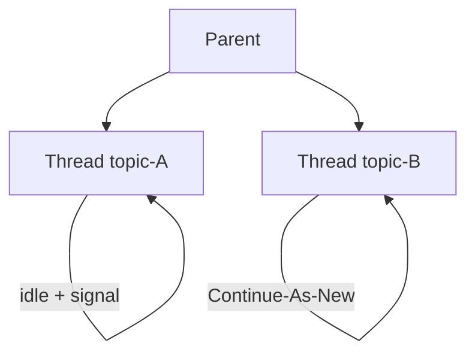

<h1>Persistent Subagent Threads </h1>

## Overview

The Persistent Subagent Threads pattern gives each user, project, or topic a durable subagent thread with its own context.
The root agent creates and reuses these threads, which idle durably and periodically Continue-As-New.
Primitives used: SubagentHandle reuse, Entity-like child Sessions, Continue-As-New.

## Problem

Starting a fresh subagent every time drops specialized context.
Keeping everything in the parent Session mixes concerns and grows history faster.

## Solution

Allocate stable child session IDs such as `{parent}-researcher-{topic}`.
Reuse signal-with-start against that ID.
Children idle on Signals and Continue-As-New independently of the parent.



The following describes each step in the diagram:

1. The parent maps a topic or user to a child session ID.
2. It starts or signals that child for work.
3. The child retains its own memory and tools across invocations.
4. Each thread Continues-As-New on its own schedule.

```python
thread_id = f"{session_id}-topic-{topic}"
await client.start_workflow(
    TopicAgent.run,
    args=[thread_id],
    id=thread_id,
    task_queue=TASK_QUEUE,
    start_signal="user_message",
    start_signal_args=[text],
)
```

## Implementation

### Directory of threads

Keep a map of topic → thread_id in parent Session state or an external index.

### Idle cost

Durable idle is cheap; avoid polling loops inside children.

## When to use

Use for ongoing specialists tied to entities or topics.
Use one-shot subagents for disposable tasks.

## Benefits and trade-offs

You preserve specialized context without bloating the parent.
You operate more long-lived Workflows.

## Comparison with alternatives

| Approach | Context retention | Lifecycle |
| :--- | :--- | :--- |
| Persistent threads | High | Long-lived |
| New subagent each call | None | Ephemeral |
| All in parent | High | Parent hotspot |

## Best practices

- **Stable thread IDs.** Deterministic from parent + topic.
- **Close unused threads.** Avoid unbounded idle agents.
- **Isolate secrets.** Thread tools should not see other topics' data.

## Common pitfalls

- **Never Continue-As-New on busy threads.**
- **Caching the Run ID after a thread Continue-As-New.** Signals and queries hit a closed run.
- **Unbounded threads with no idle close.** History grows without bound.

## Related patterns

- [Subagent Toolset](/subagent-toolset)
- [Entity Agent](/entity-agent)
- [Continue-As-New Session](/continue-as-new-session)

## Sample code

See related runnable samples under `sandbox-runner/patterns/` when this pattern builds on Session Workflow, Activity Tool, or Code Mode.

## References

- [Temporal Docs: Signal-With-Start](https://docs.temporal.io/encyclopedia/workflow-message-passing#signal-with-start)
