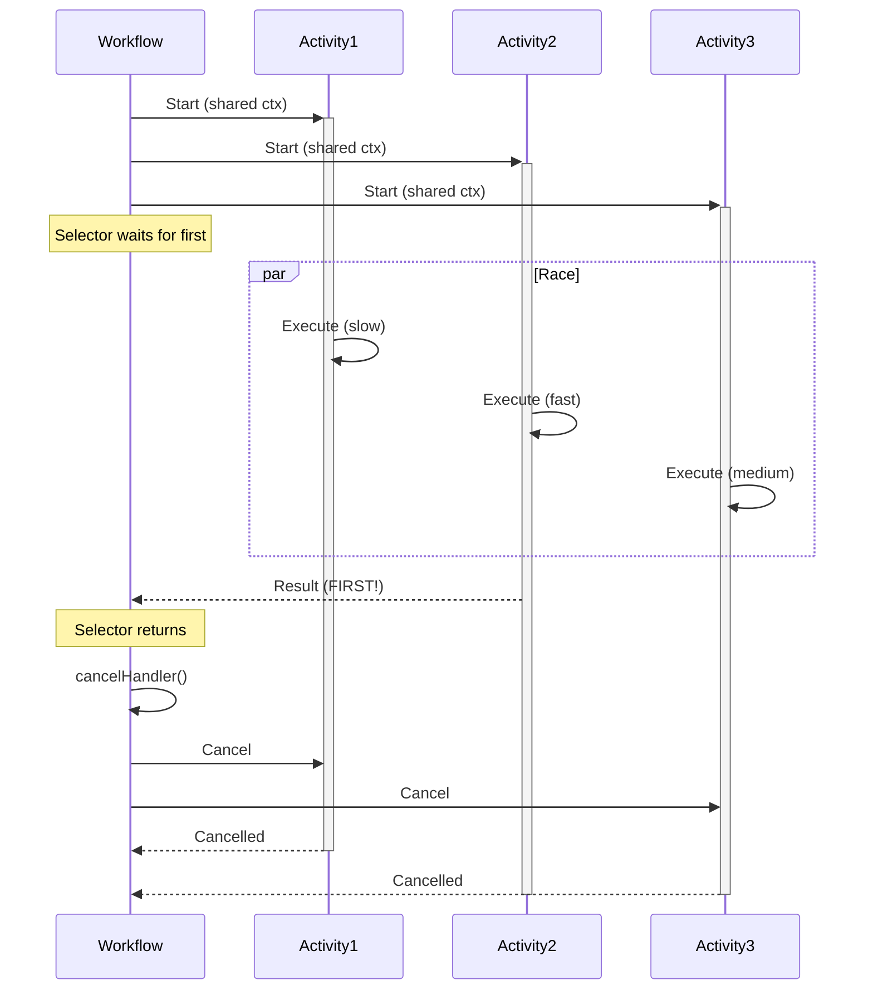

# Pick First Pattern

## Overview

The Pick First pattern executes multiple Activities in parallel and returns the result of whichever completes first, then cancels the remaining Activities.
It is suitable for racing multiple approaches to the same task, implementing timeout alternatives, or optimizing for fastest response when multiple options are available.

## Problem

In distributed systems, you often need Workflows that execute multiple Activities that can accomplish the same goal, return as soon as any one succeeds (fastest wins), cancel remaining Activities to avoid wasted resources, and handle scenarios where speed matters more than trying all options.

Without the Pick First pattern, you must wait for all Activities to complete even when only one result is needed, manually track which Activity finished first, implement complex cancellation logic for remaining Activities, and waste compute resources on Activities whose results will not be used.

## Solution

The Pick First pattern uses `workflow.NewSelector()` to wait for multiple futures simultaneously, captures the first result, then cancels remaining Activities using a shared cancellation context.



The following describes each step in the diagram:

1. The Workflow starts three Activities in parallel using a shared cancellable context.
2. The Selector waits for the first Activity to complete.
3. Activity 2 completes first. The Selector captures its result.
4. The Workflow calls `cancelHandler()` to cancel the shared context, which cancels Activities 1 and 3.

The following implementation shows the core pattern in Go.
The Workflow creates a cancellable context, starts two Activities, and uses a Selector to capture the first result:

```go
// workflow.go
func PickFirstWorkflow(ctx workflow.Context) (string, error) {
  selector := workflow.NewSelector(ctx)
  var firstResponse string
  
  childCtx, cancelHandler := workflow.WithCancel(ctx)
  childCtx = workflow.WithActivityOptions(childCtx, activityOptions)
  
  f1 := workflow.ExecuteActivity(childCtx, Activity, "option1")
  f2 := workflow.ExecuteActivity(childCtx, Activity, "option2")
  
  selector.AddFuture(f1, func(f workflow.Future) {
    _ = f.Get(ctx, &firstResponse)
  }).AddFuture(f2, func(f workflow.Future) {
    _ = f.Get(ctx, &firstResponse)
  })
  
  selector.Select(ctx) // Blocks until first completes
  cancelHandler()      // Cancel remaining activities
  
  return firstResponse, nil
}
```

The `workflow.WithCancel(ctx)` call creates a cancellable context shared by all Activities.
`selector.Select(ctx)` blocks until the first future resolves and executes its callback.
`cancelHandler()` cancels the shared context, which sends a cancellation Signal to all remaining Activities.

## Implementation

### Activity with cancellation support

For the Pick First pattern to work efficiently, Activities must detect cancellation via heartbeats and `ctx.Done()`:

```go
// activity.go
func SampleActivity(ctx context.Context, branchID int, duration time.Duration) (string, error) {
  logger := activity.GetLogger(ctx)
  elapsed := time.Nanosecond
  
  for elapsed < duration {
    time.Sleep(time.Second)
    elapsed += time.Second
    
    activity.RecordHeartbeat(ctx, "status-report")
    
    select {
    case <-ctx.Done():
      msg := fmt.Sprintf("Branch %d cancelled", branchID)
      logger.Info(msg)
      return msg, ctx.Err()
    default:
      // Continue working
    }
  }
  
  return fmt.Sprintf("Branch %d completed", branchID), nil
}
```

The Activity heartbeats on each iteration and checks `ctx.Done()` to detect cancellation.
When the context is cancelled, the Activity logs the cancellation and returns the context error.

### Wait for cancellation completion

The following implementation waits for all Activities to finish their cleanup before returning:

```go
// workflow.go
func PickFirstWithCleanup(ctx workflow.Context) (string, error) {
  selector := workflow.NewSelector(ctx)
  var firstResponse string
  
  childCtx, cancelHandler := workflow.WithCancel(ctx)
  childCtx = workflow.WithActivityOptions(childCtx, workflow.ActivityOptions{
    StartToCloseTimeout: 2 * time.Minute,
    WaitForCancellation: true,
  })
  
  f1 := workflow.ExecuteActivity(childCtx, Activity, "branch1")
  f2 := workflow.ExecuteActivity(childCtx, Activity, "branch2")
  pendingFutures := []workflow.Future{f1, f2}
  
  selector.AddFuture(f1, func(f workflow.Future) {
    _ = f.Get(ctx, &firstResponse)
  }).AddFuture(f2, func(f workflow.Future) {
    _ = f.Get(ctx, &firstResponse)
  })
  
  selector.Select(ctx)
  cancelHandler()
  
  // Wait for all activities to finish cancellation
  for _, f := range pendingFutures {
    _ = f.Get(ctx, nil)
  }
  
  return firstResponse, nil
}
```

Setting `WaitForCancellation: true` tells Temporal to wait for the Activity to acknowledge cancellation before marking it as cancelled.
The loop at the end waits for all futures (including cancelled ones) to resolve, ensuring cleanup completes before the Workflow returns.

## When to use

The Pick First pattern is a good fit for racing multiple data sources (primary vs backup), trying multiple algorithms and picking the fastest, implementing fallback strategies with timeout, optimizing for latency when multiple options exist, and testing multiple service endpoints for fastest response.

It is not a good fit when you need results from all Activities (use parallel execution), Activities have side effects that should not be cancelled, order matters (use sequential execution), or all Activities must complete.

## Benefits and trade-offs

The pattern returns as soon as the fastest option completes, optimizing for latency.
Unnecessary work is cancelled automatically.
The Selector ensures replay consistency, and cancellation cleanup is handled properly.

The trade-offs to consider are that cancelled Activities may have done partial work.
Activities need heartbeats to detect cancellation quickly.
Activities do not cancel instantly (they wait for the next heartbeat).
You must implement proper cancellation handling in Activities.
Only the first result is used; others are discarded.

## Comparison with alternatives

| Approach | Returns first | Cancels others | Complexity | Use case |
| :--- | :--- | :--- | :--- | :--- |
| Pick First | Yes | Yes | Medium | Race for fastest |
| workflow.Go() | No | No | Low | All must complete |
| Sequential | No | N/A | Low | Order matters |
| Split/Merge | No | No | Medium | Aggregate results |

## Best practices

- **Use heartbeats.** Activities must heartbeat to detect cancellation quickly.
- **Set WaitForCancellation.** Decide if the Workflow should wait for cleanup.
- **Handle ctx.Done().** Activities must check context cancellation.
- **Use a shared context.** Use a single cancellable context for all Activities.
- **Track futures.** Keep references to all futures if waiting for cleanup.
- **Set Activity timeouts.** Configure appropriate StartToCloseTimeout.
- **Log cancellations.** Log when Activities are cancelled for observability.
- **Design idempotent Activities.** Ensure Activities handle cancellation safely.

## Common pitfalls

- **Missing heartbeats in Activities.** Activities must heartbeat to detect cancellation. Without heartbeats, cancelled Activities continue running until their StartToCloseTimeout expires, wasting resources.
- **Not setting WaitForCancellation.** Without `WaitForCancellation: true`, calling `Get` on a cancelled Activity's future returns a `CanceledError` immediately, before the Activity has finished cleanup. Set it to `true` if you need to wait for cleanup to complete.
- **Ignoring errors from the winning Activity.** The Selector callback should check the error from `f.Get()`. If the first Activity to complete returns an error, the Workflow captures that error as the result.
- **Forgetting to cancel the shared context.** If you forget to call `cancelHandler()` after the Selector returns, the remaining Activities continue running indefinitely.

## Related patterns

- **[Parallel Execution](parallel-execution.md)**: Execute in parallel and combine all results.

## Sample code

- [Full Go Sample](https://github.com/temporalio/samples-go/tree/main/pickfirst) — Complete implementation with Worker and starter.
