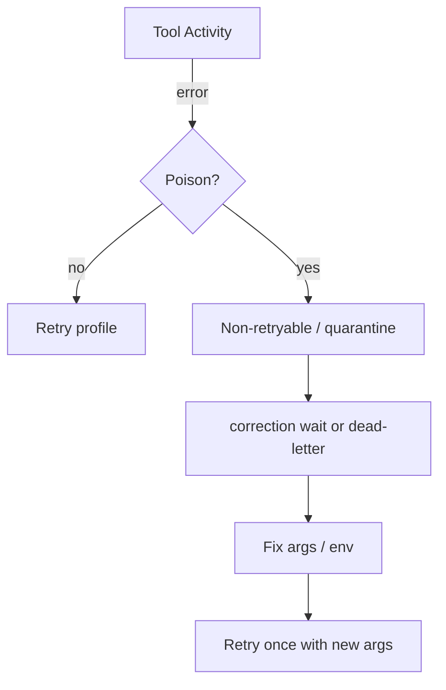

<h1>Poison Tool Quarantine </h1>

## Overview

The Poison Tool Quarantine pattern stops a bad tool payload or permanent downstream defect from retrying forever: classify the failure as non-retryable, park or fail the Turn, and surface a quarantine state for correction or dead-letter handling.
Primitives used: ApplicationError non-retryable, Tool Retry Profiles, Model Error Classification patterns for tools, Resumable Correction, Session Visibility Attributes, Best-Effort Parallel Tools budgets.

## Problem

A permanently invalid tool argument or broken downstream schema burns retry budgets, tokens, and Worker slots.
Blind retries block the Agent Tool Loop gather; best-effort siblings may still finish while one poison call loops until `schedule_to_close`.

## Solution

1. Classify tool errors: transient vs poison (bad args, 4xx permanent, schema reject).
2. Raise **non-retryable** ApplicationError for poison cases (or return typed `quarantined`).
3. Park the Turn/Session for [Resumable Correction](/resumable-correction) or emit dead-letter and continue without that tool result.
4. Upsert Visibility (`AgentTurnStatus=quarantined`) and emit `tool_quarantined`.



The following describes each step in the diagram:

1. The tool Activity fails.
2. Classification marks poison vs transient.
3. Poison skips the retry storm and enters quarantine.
4. A human or operator supplies corrected args; the Step runs again once.

```python
from temporalio import activity
from temporalio.exceptions import ApplicationError

@activity.defn
async def call_tool(name: str, args: dict) -> str:
    if args.get("id") == "poison":
        raise ApplicationError("poison_payload", type="PoisonTool", non_retryable=True)
    return f"{name}:ok"
```

## Implementation

<DaytonaRunner pattern="poison-tool-quarantine" />

### Classification hints

| Signal | Likely poison |
| :--- | :--- |
| HTTP 400/404 with stable body | Yes |
| Schema / validation error | Yes |
| HTTP 429 / 503 | No (transient) |
| Timeout / connection reset | No |

Pair with [Tool Retry Profiles](/tool-retry-profiles) so poison types are in `non_retryable_error_types`.

### Parallel tools

In [Best-Effort Parallel Tools](/best-effort-parallel-tools), quarantine one sibling without cancelling others unless the Turn policy requires all-or-nothing.

### Dead-letter child

Optional: start a short-lived child Workflow or external ticket with the poison payload ref (claim-check)—do not leave huge bad payloads in Session history.

## When to use

Use for any mutating or externally validated tool.
Skip only for pure read tools where empty results are enough.

## Benefits and trade-offs

You stop retry storms and keep Sessions operable.
You must maintain classification and a correction path.

## Comparison with alternatives

| Approach | Retry storm | Recoverable |
| :--- | :--- | :--- |
| Poison Tool Quarantine | Stopped | Yes via correction |
| Unlimited retries | Yes | Eventually maybe |
| Fail whole Session | Stopped | Poor |
| Ignore error | Stopped | Silent wrongness |

## Best practices

- **Non-retryable for poison; retryable for blips.**
- **Park with actionable error fields** (tool, arg paths, rule id).
- **Bound parallel stragglers** with `schedule_to_close`.
- **Meter quarantines** for tool quality.

## Common pitfalls

- **Marking 429 as poison.**
- **Retrying validation errors** with the same args.
- **Putting full poison payloads in Search Attributes.**
- **Quarantine without a human/ops resume path.**

## Related patterns

- [Tool Retry Profiles](/tool-retry-profiles)
- [Resumable Correction](/resumable-correction)
- [Best-Effort Parallel Tools](/best-effort-parallel-tools)
- [Model Error Classification](/model-error-classification)
- [Guardrail Steps](/guardrail-steps)
- [Session Visibility Attributes](/session-visibility-attributes)
- [Claim-Check Payloads](/claim-check-payloads)

## Sample code

- [`sandbox-runner/patterns/poison-tool-quarantine/python/`](https://github.com/temporal-sa/temporal-agentic-patterns/tree/main/sandbox-runner/patterns/poison-tool-quarantine/python)

## References

- [Temporal Docs: Non-retryable errors](https://docs.temporal.io/encyclopedia/retry-policies#non-retryable-errors)
