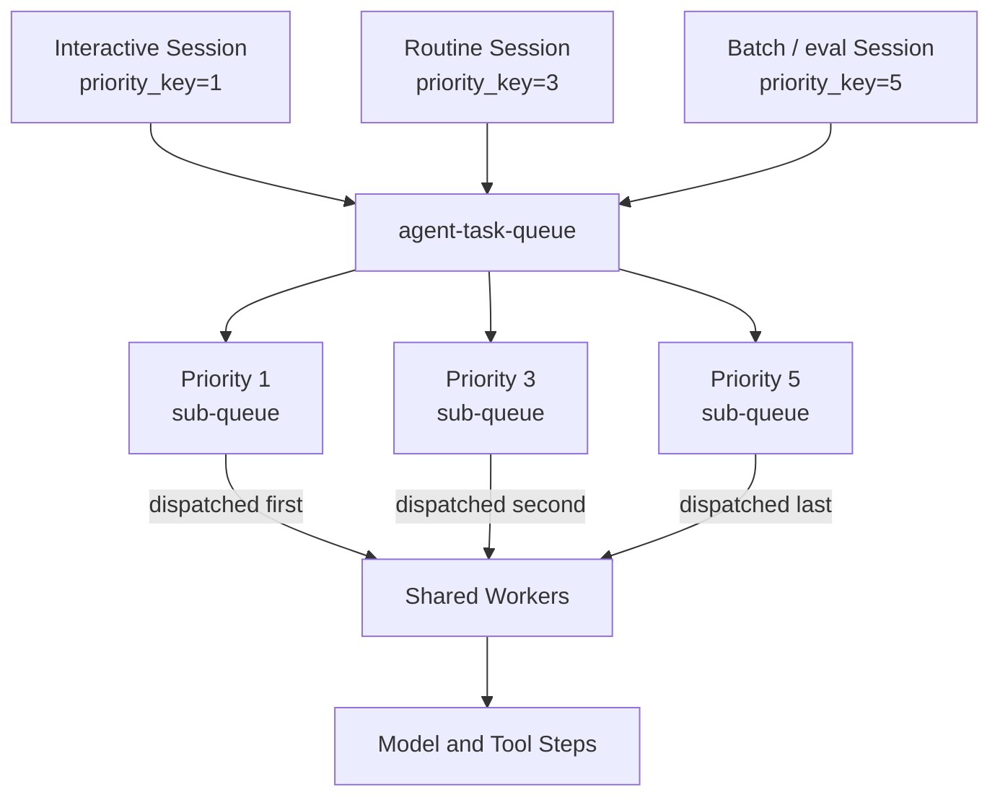

<h1>Priority Task Queues </h1>

## Overview

The Priority Task Queues pattern assigns a `priority_key` (1–5) to Session Workflows, Turns, and Steps so interactive agent work executes ahead of batch, eval, or background Sessions on one shared Task Queue.
Primitives used: Session, Turn, Step, Task Queue priority.

## Problem

Agent platforms mix latency-sensitive interactive Turns with long-running research Sessions, nightly evals, and backlog reprocessing.
On a shared Task Queue without ordering, a flood of low-urgency batch work can delay user-facing Turns even when Workers are busy on less important Steps.
Separate queues per urgency class add routing and Worker management without solving mixed load on a single pool.

## Solution

Assign Temporal's native `priority_key` (integer 1–5, where 1 is highest and 5 is lowest) when you start a Session Workflow, schedule a model or tool Activity, or start a child subagent.
The matching service keeps a sub-queue per priority level and exhausts higher-priority tasks before dispatching lower ones.
Tasks default to priority 3 when unset.
Activities and Child Workflows inherit the parent Session's priority unless they set their own.



The following describes each step in the diagram:

1. Interactive Sessions start with `priority_key=1`; routine chat Sessions use the default `3`; batch or eval Sessions use `5`.
2. The matching service routes each Workflow and Activity task into the matching priority sub-queue inside the single Task Queue.
3. Workers receive tasks in priority order: all priority-1 tasks dispatch before any priority-2 task, and so on.
4. Model and tool Steps inherit the Session priority unless a Turn overrides a specific Activity.

```python
from datetime import timedelta
from temporalio.common import Priority
from temporalio import workflow

# Interactive user Session — highest priority
handle = await client.start_workflow(
    AgentSessionWorkflow.run,
    args=[session_id, user_message],
    id=f"session-{session_id}",
    task_queue="agent-task-queue",
    priority=Priority(priority_key=1),
)

# Inside a Turn: keep model Steps at Session priority (or raise for escalations)
@workflow.defn
class AgentSessionWorkflow:
    @workflow.run
    async def run(self, session_id: str, user_message: str) -> str:
        return await workflow.execute_activity(
            call_model,
            user_message,
            start_to_close_timeout=timedelta(minutes=2),
            priority=Priority(priority_key=1),
        )
```

## Implementation

### Enable Priority

Priority is enabled by default in Temporal Cloud and self-hosted Temporal.

### Set Session priority at start

Set `priority_key` in Workflow start options so the whole Session—including subsequent Turns after Continue-As-New unless you override—competes at that level.

```python
from temporalio.common import Priority

# Interactive chat
await client.start_workflow(
    AgentSessionWorkflow.run,
    args=[session_id, user_message],
    id=f"session-{session_id}",
    task_queue="agent-task-queue",
    priority=Priority(priority_key=1),
)

# Background eval or batch reprocess
await client.start_workflow(
    EvalSessionWorkflow.run,
    eval_batch,
    id=f"eval-{batch_id}",
    task_queue="agent-task-queue",
    priority=Priority(priority_key=5),
)
```

### Set Activity priority for individual Steps

Override Activity priority when one Step must outrank or yield relative to its Session—for example, a user-facing Durable Model Call at priority 1 inside a Session that otherwise runs at 3.

```python
from datetime import timedelta
from temporalio import workflow
from temporalio.common import Priority

result = await workflow.execute_activity(
    call_model,
    prompt,
    start_to_close_timeout=timedelta(minutes=2),
    priority=Priority(priority_key=1),
)
```

### Set Child Workflow priority for subagents

```python
from temporalio import workflow
from temporalio.common import Priority

result = await workflow.execute_child_workflow(
    ResearchSubagent.run,
    item,
    id=f"subagent-{item_id}",
    task_queue="agent-task-queue",
    priority=Priority(priority_key=2),
)
```

### Combine with Fairness

When many tenants share the queue, set both `priority_key` and `fairness_key` so urgent Turns still win, and no tenant monopolizes a priority level.
See [Fairness](/fairness).

```python
from temporalio.common import Priority

await client.start_workflow(
    AgentSessionWorkflow.run,
    args=[tenant_id, user_message],
    id=f"session-{session_id}",
    task_queue="agent-task-queue",
    priority=Priority(
        priority_key=1,
        fairness_key=tenant_id,
        fairness_weight=1.0,
    ),
)
```

### Align timeouts with urgency

Pair priority with [Model Timeout Profiles](/model-timeout-profiles) so interactive Steps use short timeouts and batch research uses longer ones without blocking the high-priority sub-queue longer than needed at the Activity layer.

## When to use

Use Priority Task Queues when interactive agent Turns must stay ahead of batch, eval, or background Sessions on shared Workers.
It fits platforms that already consolidate model and tool Activities onto one Task Queue.

Skip strict priority when all work has equal urgency, when a continuously replenished high-priority backlog would starve batch forever without monitoring, or when you need proportional tenant sharing—use [Fairness](/fairness) for that case.

## Benefits and trade-offs

A single Worker pool serves all priority levels; idle capacity at lower levels is available to higher-priority agent work without extra routing.

Lower-priority Sessions wait until higher-priority tasks have started.
A continuously replenished priority-1 backlog can delay evals and batch jobs indefinitely.
Only five levels exist; keep mappings coarse.

## Comparison with alternatives

| Approach | Isolation | Dynamic urgency | Complexity |
| :--- | :--- | :--- | :--- |
| Temporal PriorityKey (native) | Soft | Yes | Low |
| [Fairness](/fairness) | Soft (by tenant) | Yes | Low |
| Separate Task Queues per tier | Hard | No | Medium |
| Single queue (no control) | None | N/A | Lowest |

## Best practices

- **Keep levels coarse.** Example mapping: `1` = interactive Turns, `3` = routine automation, `5` = batch / eval / reprocess.
- **Reserve priority 1 for user-facing work.** Default is 3; if every Session sets 1, ordering disappears.
- **Set priority at Session start.** Workflow code cannot change its own priority after start; cancel and restart to re-prioritize.
- **Override Activity priority deliberately.** Most Steps should inherit the Session; override only for escalations or demotions.
- **Watch queue depth per priority level.** Growing backlog at level 1 means Worker capacity cannot meet interactive load.

## Common pitfalls

- **Assigning priority 1 to all Sessions.** Policy must define which work qualifies for each level.
- **Ignoring low-priority starvation.** Under sustained interactive load, priority-5 evals may wait indefinitely; use `ScheduleToStartTimeout` on batch Activities to surface starvation.
- **Changing priority after queueing.** `priority_key` is fixed when the task enters the queue; cancel and reschedule to change it.
- **Assuming hard isolation.** Priority orders dispatch; a priority-5 Activity already running still holds a Worker slot.

## Related patterns

- [Fairness](/fairness)
- [Session Workflow](/session-workflow)
- [Durable Model Call](/durable-model-call)
- [Model Timeout Profiles](/model-timeout-profiles)

## Sample code

See related runnable samples under `sandbox-runner/patterns/` when this pattern builds on Session Workflow, Activity Tool, or Code Mode.

Official SDK examples for priority keys:

- [Task Queue Priority and Fairness — Temporal docs](https://docs.temporal.io/develop/task-queue-priority-fairness#task-queue-priority)

## References

- [Temporal Docs: Task Queue Priority and Fairness](https://docs.temporal.io/develop/task-queue-priority-fairness)
