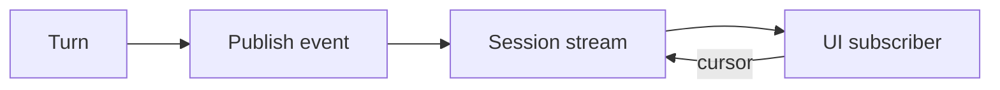

<h1>Progress Streaming </h1>

## Overview

The Progress Streaming pattern lets a Session publish incremental agent events (tokens, tool starts, approvals) to UIs through a durable, offset-addressed stream built on Signals, Updates, and Queries—not ad-hoc websockets inside the worker.
Primitives used: Standardized Event Stream, Session Workflow, client cursors.

## Problem

Polling Workflow queries for every token is inefficient.
Pushing from Activities to a global socket bypasses durability and Continue-As-New.

## Solution

Host a durable stream on the Session Workflow.
Publish events as the Turn progresses; clients subscribe with an offset/cursor and resume after disconnect.
HTTP Channel Agent exposes the stream as SSE or NDJSON.



The following describes each step in the diagram:

1. The Session initializes a durable stream at Workflow init.
2. Model/tool Steps publish progress events to topics.
3. A UI subscribes with a cursor and receives batches.
4. Reconnects resume from the last offset after Continue-As-New via carried state.

```python
# Conceptual shape — stream hosted on the Session Workflow
@workflow.init
def __init__(self) -> None:
    self.stream = DurableEventStream()  # Signals/Updates/Queries under the hood

# During a turn
self.stream.publish("agent", {"type": "tool_call_started", "tool_id": "search"})
```

## Implementation

### Same-Workflow hosting

For agents, host the stream on the Session that does the work so lifecycle aligns.

### Publish from Activities

Model token deltas usually publish from inside the model Activity (not from Workflow code).
Batch small deltas; use forced flush only for punctuated markers (start, retry, complete)—not per character.

### Activity retries and consumer reducers

When a streaming Activity retries, earlier attempts may have already published partial tokens.
On each new attempt, publish a `RETRY` (or equivalent) sentinel with a forced flush, and have UI consumers **clear or annotate** the prior attempt's accumulator before accepting new deltas.
Treat terminal events (`TEXT_COMPLETE`, final reply) as overwrite points so partial attempts cannot leave sticky garbage in the UI.

### End-of-stream ordering

Do not complete the Workflow Turn before subscribers have observed the terminal stream event (or an explicit consumer-done Signal).
Racing Workflow return against the last batch can drop the final tokens.

### Continue-As-New

Carry stream state (offsets / stream snapshot) together with Session memory across Continue-As-New so reconnecting clients do not see a gap.

### Limits

Target modest subscriber counts (UI tabs), not thousands of consumers per Workflow.
Skip for ultra-low-latency audio streaming.

## When to use

Use for agent UIs that show live tool and token progress.
Query-only snapshots are enough for admin dashboards that refresh slowly.

## Benefits and trade-offs

You get reconnectable live progress with durable offsets.
You must manage stream storage across Continue-As-New.

## Comparison with alternatives

| Approach | Durable cursor | Fits agents |
| :--- | :--- | :--- |
| Progress Streaming | Yes | Yes |
| Query polling | Snapshot only | Coarse |
| Side-channel websocket | No | Fragile |

## Best practices

- **Publish from Workflow or via validated Signals** so history stays coherent.
- **Batch small token events** to limit history growth.
- **Authorize subscribers** per session.

## Common pitfalls

- **Publishing secrets in stream payloads.**
- **Assuming real-time media suitability.**
- **Appending retry tokens without a RETRY reset.** UIs show duplicated or garbled text.
- **Dropping stream state on Continue-As-New.** Clients jump or miss history.

## Related patterns

- [Standardized Event Stream](/standardized-event-stream)
- [HTTP Channel Agent](/http-channel-agent)
- [Session Workflow](/session-workflow)
- [Continue-As-New Session](/continue-as-new-session)
- [Durable Model Call](/durable-model-call)

## Sample code

See related runnable samples under `sandbox-runner/patterns/` when this pattern builds on Session Workflow, Activity Tool, or Code Mode.

## References

- [Temporal Docs: Workflow Streams](https://docs.temporal.io/workflow-streams)
- [Temporal Docs: Workflow Streams — Python](https://docs.temporal.io/develop/python/workflows/workflow-streams)
- [Temporal Docs: Workflow message passing](https://docs.temporal.io/encyclopedia/workflow-message-passing)
