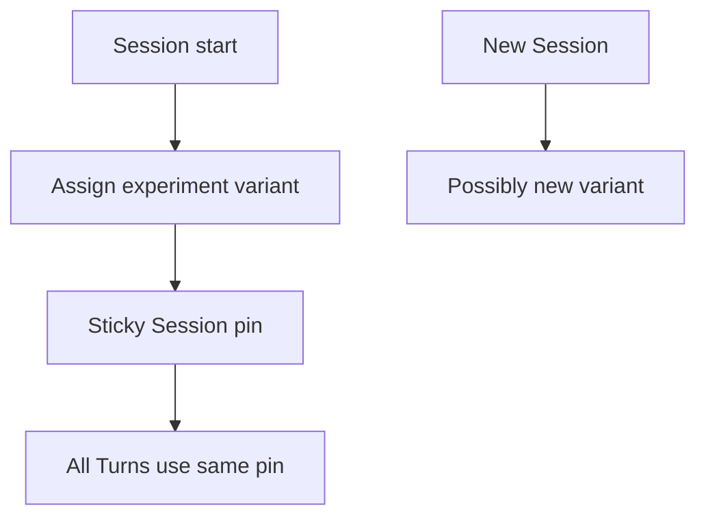

<h1>Prompt Experiment Pins </h1>

## Overview

The Prompt Experiment Pins pattern assigns an experiment variant (A/B or canary prompt/model route) at Session start and sticks that pin for the Session lifetime so evals and user experience stay consistent, while new Sessions can roll to the next variant.
Primitives used: Session-start pin (`experiment_id`, `variant`, prompt/model route), Prompt Versioning, Agent Definition Versioning, Eval-Backed Behavior Checks, Session Visibility Attributes.

## Problem

Flipping a global "latest prompt" mid-Session mixes variants inside one conversation and ruins A/B measurement.
Assigning a new random variant on every Turn makes evals and support unreproducible.

## Solution

At Session create (Signal-with-Start / Update-With-Start):

1. Choose `experiment_id` + `variant` (hash of `session_id`, sticky bucketing, or explicit override).
2. Map variant → `prompt_version` / model route / definition slice.
3. Persist the pin in Session state and pass it into every Durable Model Call.
4. New Sessions may see a new assignment; open Sessions keep theirs until explicit migration.



The following describes each step in the diagram:

1. Session start runs the assignment function once.
2. The pin is stored with definition/prompt versions.
3. Every Turn/Step reads the pin—no re-roll.
4. Later Sessions can receive a different variant for the same experiment.

```python
from dataclasses import dataclass
from datetime import timedelta

from temporalio import workflow

@dataclass
class ExperimentPin:
    experiment_id: str
    variant: str
    prompt_version: str

def assign_variant(session_id: str, experiment_id: str) -> ExperimentPin:
    variant = "A" if int(session_id[-1], 16) % 2 == 0 else "B"
    prompt_version = "v3" if variant == "A" else "v3-exp"
    return ExperimentPin(experiment_id, variant, prompt_version)

@workflow.defn
class AgentSessionWorkflow:
    @workflow.run
    async def run(self, session_id: str, user_message: str) -> str:
        pin = assign_variant(session_id, "summarizer-2026-08")
        return await workflow.execute_activity(
            call_model,
            args=[pin.prompt_version, user_message],
            start_to_close_timeout=timedelta(seconds=60),
        )
```

## Implementation

<DaytonaRunner pattern="prompt-experiment-pins" />

### Sticky assignment

Prefer hashing `session_id` (or user+experiment) so Signal-with-Start retries get the same variant.
Do not call an external randomizer from Workflow code—pass assignment in from the starter or use a deterministic Workflow-side hash.

### Relationship to Prompt Versioning

Prompt Versioning is the artifact pin; experiment pins *choose which* prompt version a Session gets.
Record both on Queries and traces.

### Evals

Fixtures include `experiment_id` + `variant` so offline scoring groups correctly ([Eval-Backed Behavior Checks](/eval-backed-behavior-checks)).

### Visibility

Optional `AgentExperiment` / `AgentVariant` Search Attributes for ops ([Session Visibility Attributes](/session-visibility-attributes))—keep cardinality to known enums.

## When to use

Use for canary prompts/models and formal A/B tests.
Skip when every Session should always use one pinned production prompt.

## Benefits and trade-offs

You get fair within-Session consistency and measurable cohorts.
You must operate assignment, analysis, and migration rules.

## Comparison with alternatives

| Approach | Within-Session consistency | Measurable cohorts |
| :--- | :--- | :--- |
| Prompt Experiment Pins | Yes | Yes |
| Latest prompt always | No | Weak |
| Prompt Versioning only | Yes (one version) | No experiments |
| Re-roll each Turn | No | Contaminated |

## Best practices

- **Assign once at Session start.**
- **Pin prompt_version + model route together.**
- **Log variant on cost and trace records.**
- **Migrate open Sessions only with an explicit event.**

## Common pitfalls

- **Non-deterministic random in Workflow code.**
- **Changing assignment on Continue-As-New** accidentally.
- **Indexing free-form experiment names** at high cardinality.
- **Mixing Worker build experiments with prompt experiments** without separate pins.

## Related patterns

- [Prompt Versioning](/prompt-versioning)
- [Agent Definition Versioning](/agent-definition-versioning)
- [Agent Worker Versioning](/agent-worker-versioning)
- [Eval-Backed Behavior Checks](/eval-backed-behavior-checks)
- [Session Visibility Attributes](/session-visibility-attributes)
- [Durable Model Call](/durable-model-call)

## Sample code

- [`sandbox-runner/patterns/prompt-experiment-pins/python/`](https://github.com/temporal-sa/temporal-agentic-patterns/tree/main/sandbox-runner/patterns/prompt-experiment-pins/python)

## References

- [Temporal Docs: Workflow determinism](https://docs.temporal.io/workflow-definition#deterministic-constraints)
