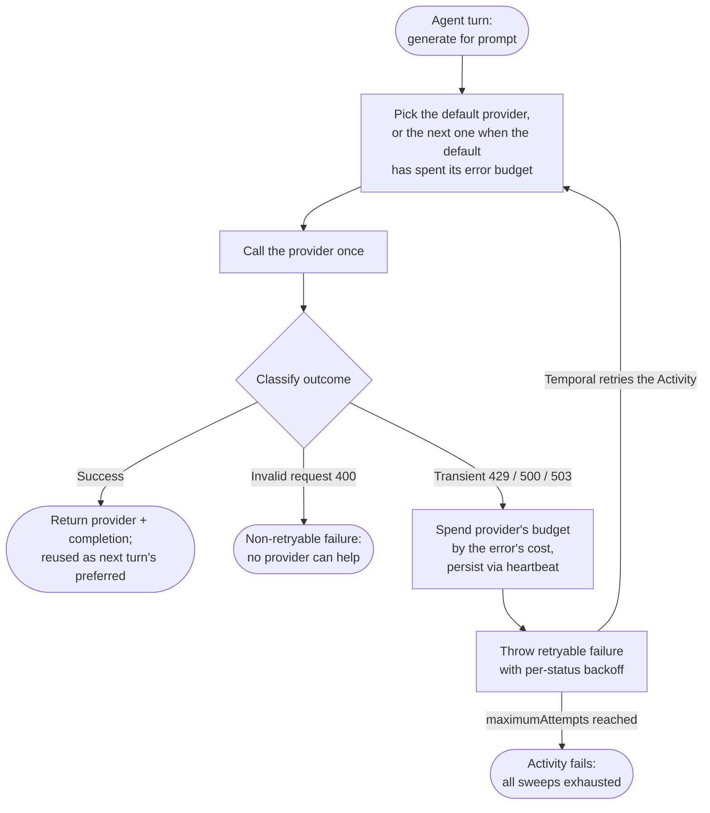

<h1>Model Provider Fallback </h1>

:::info TLDR
Model providers fail unevenly — one throttles, another stalls, a third refuses a prompt its peer would answer — so building on a single provider is fragile.
This pattern routes each request across a preference-ordered list of interchangeable providers, giving each a per-provider **error budget**: as a provider's failures spend its budget, the request **fails over** to the next healthiest one.
Use this for multi-provider LLM completion, embedding, image, or generation pipelines where providers have different failure modes and uneven health.
:::

## Overview

The Model Provider Fallback pattern routes a single logical request — generate a completion for this prompt, embed this document, create this image — across several interchangeable model providers in a defined order of preference.

A single `generate` Activity owns the routing.
On each attempt it picks the highest-preference provider that still has retry budget, calls it once, and classifies the outcome.
A transient failure spends that provider's budget, records the running total in the Activity's heartbeat details, and raises a *retryable* `ApplicationFailure` — so Temporal's retry machinery re-runs the Activity, which then fails over to the next provider.
An invalid request raises a *non-retryable* failure that aborts the whole request, because no provider will accept it.
A hung provider is handled without any HTTP outcome at all: Temporal times the attempt out at the start-to-close deadline, and because that killed attempt records nothing in heartbeat details, the next attempt infers the timeout from the retry count, spends the provider's budget, and fails over.

Because the budget lives in heartbeat details, it survives across retries: each attempt resumes the sweep where the previous one left off instead of restarting from the first provider.
Every attempt is a distinct Activity execution recorded in Workflow history, so you can see which provider was tried, in what order, and why each one was rejected.

::: info Heartbeat details as cross-execution state
Heartbeat details exist to report an Activity's progress and liveness — not to store application state. This pattern repurposes them: Temporal persists the most recent details from each attempt and redelivers them to the next one, which makes them a handy place to carry the spent budget across retry attempts (each a separate Activity execution) without an external store or an extra Workflow round-trip. This is a deliberate trick rather than their intended use, so keep the payload small and treat it as best-effort — a timed-out attempt is killed before it can heartbeat, which is exactly why this pattern reconstructs those missing outcomes from the attempt count.
:::

## Problem

A single LLM provider is not reliable enough to build on directly:

- **Capacity and outages.** Providers hit capacity limits, throttle with HTTP 429, or return transient 503 errors when a model is overloaded. In practice a provider can fail a meaningful share of traffic — around one request in five — during a bad window.
- **Latency.** A degraded provider may still respond, but slowly enough to breach your latency budget.
- **Inconsistent refusals.** For the same benign prompt, one provider's safety filter refuses to answer while another returns a usable completion. The refusal is a property of that provider's model and policy, not of the request.
- **Genuinely invalid requests.** Some requests are malformed — an empty prompt, or a payload that fails schema validation. Every provider rejects them with an HTTP 400, so failing over between providers wastes time and money on every one of them.

Retrying blindly on the failing provider makes all of this worse.
Temporal's default retry policy keeps calling the same provider with the same arguments, so a capacity problem or a policy refusal repeats attempt after attempt.
You pay for each call, wait through the backoff, and still do not get a completion.

## Solution

Give one Activity the job of picking a provider, calling it, and classifying the result — then let Temporal's retries turn that into a fallback sweep.

1. **Seed the attempt with a preferred provider.** The Workflow passes the provider to start from — the one that answered last, or the first in the preference list.
2. **Pick inside the Activity.** From the budget persisted in heartbeat details, sweep forward from the preferred provider and skip any that have spent their budget.
3. **Classify the outcome.** Success returns the completion. An invalid request (HTTP 400) is permanent. A transient error (429/500/503) is worth another attempt. A hung call that breaches the start-to-close timeout is treated as a failure too — Temporal times the attempt out, and the next attempt charges it against the provider's budget.
4. **Spend the budget and persist it.** On a transient error, add the error's cost to that provider's spend — a cheap error (429) costs little, an expensive one (500) can spend the whole budget at once — and record the running total, plus the attempt that recorded it, with a heartbeat. Timeouts leave nothing to persist, so each attempt replays the timeouts implied by the gap since the last recorded outcome.
5. **Let Temporal drive the sweep.** Raise a retryable `ApplicationFailure` with a per-status backoff. Temporal retries the Activity, which re-reads the budget and picks the next healthy provider. `maximumAttempts` bounds the total number of sweeps.



The following describes each step:

1. Each turn, the Workflow executes the `generate` Activity, seeding it with the preferred provider.
2. The Activity picks a provider: it first charges any timeouts that occurred since the last recorded outcome against the budget, then sweeps forward from the preferred provider through the preference list (wrapping around), skipping any whose spent budget has reached the limit.
3. It calls that provider once. On success it returns the provider and the completion; the Workflow reuses that provider as the next turn's preferred choice.
4. On a transient failure (429/500/503), the Activity spends the provider's budget by the error's cost, records the total and the current attempt in heartbeat details, and raises a retryable failure with a per-status backoff. Temporal retries the Activity, which re-picks — failing over once the provider's budget is spent.
5. On a hung call, the Activity never returns. Temporal times the attempt out at the start-to-close deadline and retries. The retried attempt sees no recorded outcome for the timed-out attempts, infers them from the attempt gap, and spends the provider's budget — so a stalled provider fails over even though no HTTP error was ever seen.
6. On an invalid request (400), the Activity raises a non-retryable failure and the request aborts. No provider accepts a malformed request, so failing over would waste every remaining provider's budget.
7. When `maximumAttempts` is reached with every provider exhausted, the Activity's retries stop and the failure surfaces to the Workflow.

## Implementation

<DaytonaRunner pattern="provider-fallback" />

The runnable example above simulates an agentic tool-calling loop over three providers — `anthropic`, `openai`, and `gemini` in preference order — where each provider starts with a retry budget that transient errors and timeouts spend down. A single run walks through three turns: on the first turn the preferred provider (`anthropic`) is rate limited (429) until it spends its budget and fails over to `openai`, which answers; on the second turn `openai` returns a server error (500) that spends its budget in one shot and fails over to `gemini`, which answers; on the third turn `gemini`'s calls hang and time out, and after two timeouts spend its budget the sweep fails over to `anthropic`, which has recovered and answers. The simulated outcomes are hard-coded for the demo and do not reflect any real provider's reliability.

The implementation has three parts: a `generate` Activity that picks a provider, calls it once, and classifies the failure; a Workflow that invokes the Activity under a bounded retry policy so Temporal's retries drive the sweep; and an injected registry that shares the chosen provider with the other Activities on the Worker.

### Pick a provider and classify failures inside the Activity

The Activity keeps a per-provider retry budget in its heartbeat details, so a retried attempt resumes the sweep instead of restarting from the first provider.
It picks the highest-preference provider that still has budget, calls it once, and maps the outcome: success returns; an invalid request raises a **non-retryable** failure; a transient error spends the provider's budget and raises a **retryable** failure with a per-status backoff.
A hung call is handled without any HTTP outcome at all: Temporal times the attempt out at the start-to-close deadline, so the killed attempt records nothing. The next attempt infers how many timeouts occurred from the gap between the current attempt number and the last one that recorded an outcome, replays their cost against the budget, and fails over once a provider is exhausted.
The fallback policy — the provider order, the budget, and what each outcome costs — is passed in as configuration so it stays caller-tunable.

::: code-group
```python [Python]
# activities.py
from dataclasses import dataclass, field
from datetime import timedelta
from temporalio import activity
from temporalio.exceptions import ApplicationError

TIMEOUT = -1   # sentinel: a hung call Temporal times out spends budget like an error

@dataclass
class FallbackConfig:
    providers: list[str]         # preference order
    budget: int                  # retry budget per provider
    # keyed by str(status) and str(TIMEOUT): a config crosses the JSON boundary as an
    # Activity argument, and Temporal's Python converter cannot rebuild a dict[int, int]
    # (JSON object keys are always strings), so use string keys and look up with str().
    error_cost: dict[str, int]   # what each outcome (HTTP status or TIMEOUT) spends
    default_error_cost: int

@dataclass
class ErrorState:                # carried across retries in heartbeat details
    spent: dict[str, int] = field(default_factory=dict)  # budget spent per provider
    last_resolved_attempt: int = 0  # last attempt that recorded an outcome

# Sweep forward from the preferred provider, skipping any that spent their budget.
def pick_provider(spent: dict[str, int], preferred: str, config: FallbackConfig) -> str:
    ps = config.providers
    start = ps.index(preferred) if preferred in ps else 0
    order = [ps[(start + i) % len(ps)] for i in range(len(ps))]
    for p in order:
        if spent.get(p, 0) < config.budget:
            return p
    return order[-1]  # all exhausted — let maximum_attempts stop the retries

# Replay `count` timeouts onto the budget, each spending the provider pick_provider would choose.
def charge_timeouts(spent: dict[str, int], count: int, preferred: str, config: FallbackConfig) -> dict[str, int]:
    cost = config.error_cost.get(str(TIMEOUT), config.default_error_cost)
    for _ in range(count):
        p = pick_provider(spent, preferred, config)
        spent[p] = spent.get(p, 0) + cost
    return spent

@activity.defn
async def generate(prompt: str, preferred: str, config: FallbackConfig) -> tuple[str, str]:
    # A malformed request is an HTTP 400 no provider will accept — abort immediately.
    if prompt.strip() == "":
        raise ApplicationError("empty prompt (HTTP 400)", type="400", non_retryable=True)

    # Budget spent so far survives Activity retries via heartbeat details.
    info = activity.info()
    details = info.heartbeat_details
    state = ErrorState(**details[0]) if details else ErrorState()

    # Attempts since the last recorded outcome were start-to-close timeouts — a hung
    # call Temporal killed before it could heartbeat. Replay their cost onto the budget.
    timeouts = max(0, info.attempt - 1 - state.last_resolved_attempt)
    spent = charge_timeouts(dict(state.spent), timeouts, preferred, config)

    provider = pick_provider(spent, preferred, config)
    try:
        text = await call_provider(provider, prompt)   # your SDK call; a hung call blocks past the timeout
        return provider, text                          # reused as next turn's preferred
    except ProviderError as err:
        if err.status == 400:
            raise ApplicationError(f"{provider} rejected the request", type="400", non_retryable=True)
        # Transient (429 / 500 / 503): spend the budget, record this attempt as the last
        # resolved one, persist, and let Temporal retry — the next attempt may fail over.
        cost = config.error_cost.get(str(err.status), config.default_error_cost)
        spent[provider] = spent.get(provider, 0) + cost
        activity.heartbeat(ErrorState(spent=spent, last_resolved_attempt=info.attempt))
        raise ApplicationError(
            f"{provider} failed with HTTP {err.status}; failing over",
            type=str(err.status),
            next_retry_delay=BACKOFF.get(err.status, timedelta(seconds=1)))
```

```go [Go]
// activities.go
package completion

import (
    "context"
    "errors"
    "strconv"
    "strings"
    "time"

    "go.temporal.io/sdk/activity"
    "go.temporal.io/sdk/temporal"
)

const Timeout = -1 // sentinel: a hung call Temporal times out spends budget like an error

// FallbackConfig is the fallback policy, passed in from the Workflow.
type FallbackConfig struct {
    Providers        []string    `json:"providers"`        // preference order
    Budget           int         `json:"budget"`           // retry budget per provider
    ErrorCost        map[int]int `json:"errorCost"`        // what each outcome (HTTP status or Timeout) spends
    DefaultErrorCost int         `json:"defaultErrorCost"`
}

// ErrorState is carried across retries via heartbeat details.
type ErrorState struct {
    Spent               map[string]int `json:"spent"`               // budget spent per provider
    LastResolvedAttempt int            `json:"lastResolvedAttempt"` // last attempt that recorded an outcome
}

type Result struct {
    Provider string `json:"provider"`
    Text     string `json:"text"`
}

// pickProvider sweeps forward from the preferred provider, skipping exhausted ones.
func pickProvider(spent map[string]int, preferred string, config FallbackConfig) string {
    n := len(config.Providers)
    start := 0
    for i, p := range config.Providers {
        if p == preferred {
            start = i
            break
        }
    }
    for i := 0; i < n; i++ {
        p := config.Providers[(start+i)%n]
        if spent[p] < config.Budget {
            return p
        }
    }
    return config.Providers[(start+n-1)%n] // all exhausted — let MaximumAttempts stop it
}

// chargeTimeouts replays `count` timeouts onto the budget, each spending the provider
// pickProvider would choose.
func chargeTimeouts(spent map[string]int, count int, preferred string, config FallbackConfig) map[string]int {
    cost, ok := config.ErrorCost[Timeout]
    if !ok {
        cost = config.DefaultErrorCost
    }
    for i := 0; i < count; i++ {
        spent[pickProvider(spent, preferred, config)] += cost
    }
    return spent
}

func Generate(ctx context.Context, prompt, preferred string, config FallbackConfig) (Result, error) {
    // A malformed request is an HTTP 400 no provider will accept — abort immediately.
    if strings.TrimSpace(prompt) == "" {
        return Result{}, temporal.NewNonRetryableApplicationError("empty prompt (HTTP 400)", "400", nil)
    }

    // Budget spent so far survives Activity retries via heartbeat details.
    attempt := int(activity.GetInfo(ctx).Attempt)
    state := ErrorState{Spent: map[string]int{}}
    if activity.HasHeartbeatDetails(ctx) {
        _ = activity.GetHeartbeatDetails(ctx, &state)
        if state.Spent == nil {
            state.Spent = map[string]int{}
        }
    }

    // Attempts since the last recorded outcome were start-to-close timeouts — a hung
    // call Temporal killed before it could heartbeat. Replay their cost onto the budget.
    timeouts := attempt - 1 - state.LastResolvedAttempt
    if timeouts < 0 {
        timeouts = 0
    }
    spent := map[string]int{}
    for p, n := range state.Spent {
        spent[p] = n
    }
    spent = chargeTimeouts(spent, timeouts, preferred, config)

    provider := pickProvider(spent, preferred, config)
    text, err := callProvider(ctx, provider, prompt) // your SDK call; a hung call blocks past the timeout
    if err == nil {
        return Result{Provider: provider, Text: text}, nil // reused as next turn's preferred
    }

    var provErr *ProviderError
    if !errors.As(err, &provErr) {
        return Result{}, err
    }
    if provErr.Status == 400 {
        return Result{}, temporal.NewNonRetryableApplicationError(provider+" rejected the request", "400", nil)
    }
    // Transient (429 / 500 / 503): spend the budget, record this attempt as the last
    // resolved one, persist, and let Temporal retry — the next attempt may fail over.
    cost, ok := config.ErrorCost[provErr.Status]
    if !ok {
        cost = config.DefaultErrorCost
    }
    spent[provider] += cost
    activity.RecordHeartbeat(ctx, ErrorState{Spent: spent, LastResolvedAttempt: attempt})

    delay, ok := backoff[provErr.Status]
    if !ok {
        delay = time.Second
    }
    return Result{}, temporal.NewApplicationErrorWithOptions(
        provider+" failing over", strconv.Itoa(provErr.Status),
        temporal.ApplicationErrorOptions{NextRetryDelay: delay})
}
```

```java [Java]
// CompletionActivitiesImpl.java
import io.temporal.activity.Activity;
import io.temporal.activity.ActivityExecutionContext;
import io.temporal.failure.ApplicationFailure;
import java.time.Duration;
import java.util.HashMap;
import java.util.List;
import java.util.Map;

public class CompletionActivitiesImpl implements CompletionActivities {
    static final int TIMEOUT = -1; // sentinel: a hung call Temporal times out spends budget like an error

    // Fallback policy, passed in from the Workflow. errorCost is keyed by HTTP status and by TIMEOUT.
    public record FallbackConfig(
        List<String> providers, int budget,
        Map<Integer, Integer> errorCost, int defaultErrorCost) {}

    // Carried across retries in heartbeat details.
    public record ErrorState(Map<String, Integer> spent, int lastResolvedAttempt) {}

    public record Result(String provider, String text) {}

    // Sweep forward from the preferred provider, skipping any that spent their budget.
    private static String pickProvider(Map<String, Integer> spent, String preferred, FallbackConfig config) {
        List<String> ps = config.providers();
        int n = ps.size();
        int start = Math.max(0, ps.indexOf(preferred));
        for (int i = 0; i < n; i++) {
            String p = ps.get((start + i) % n);
            if (spent.getOrDefault(p, 0) < config.budget()) {
                return p;
            }
        }
        return ps.get((start + n - 1) % n); // all exhausted — let maximumAttempts stop it
    }

    // Replay `count` timeouts onto the budget, each spending the provider pickProvider would choose.
    private static void chargeTimeouts(Map<String, Integer> spent, int count, String preferred, FallbackConfig config) {
        int cost = config.errorCost().getOrDefault(TIMEOUT, config.defaultErrorCost());
        for (int i = 0; i < count; i++) {
            spent.merge(pickProvider(spent, preferred, config), cost, Integer::sum);
        }
    }

    @Override
    public Result generate(String prompt, String preferred, FallbackConfig config) {
        // A malformed request is an HTTP 400 no provider will accept — abort immediately.
        if (prompt == null || prompt.isBlank()) {
            throw ApplicationFailure.newNonRetryableFailure("empty prompt (HTTP 400)", "400");
        }

        ActivityExecutionContext ctx = Activity.getExecutionContext();
        // Budget spent so far survives Activity retries via heartbeat details.
        int attempt = ctx.getInfo().getAttempt();
        ErrorState state = ctx.getHeartbeatDetails(ErrorState.class)
            .orElse(new ErrorState(new HashMap<>(), 0));

        // Attempts since the last recorded outcome were start-to-close timeouts — a hung
        // call Temporal killed before it could heartbeat. Replay their cost onto the budget.
        int timeouts = Math.max(0, attempt - 1 - state.lastResolvedAttempt());
        Map<String, Integer> spent = new HashMap<>(state.spent());
        chargeTimeouts(spent, timeouts, preferred, config);

        String provider = pickProvider(spent, preferred, config);
        try {
            String text = callProvider(provider, prompt); // your SDK call; a hung call blocks past the timeout
            return new Result(provider, text);             // reused as next turn's preferred
        } catch (ProviderException err) {
            if (err.status == 400) {
                throw ApplicationFailure.newNonRetryableFailure(provider + " rejected the request", "400");
            }
            // Transient (429 / 500 / 503): spend the budget, record this attempt as the last
            // resolved one, persist, and let Temporal retry — the next attempt may fail over.
            int cost = config.errorCost().getOrDefault(err.status, config.defaultErrorCost());
            spent.merge(provider, cost, Integer::sum);
            ctx.heartbeat(new ErrorState(spent, attempt));
            throw ApplicationFailure.newFailureWithCauseAndDelay(
                provider + " failing over", String.valueOf(err.status), null,
                BACKOFF.getOrDefault(err.status, Duration.ofSeconds(1)));
        }
    }
}
```

```typescript [TypeScript]
// activities.ts
import { ApplicationFailure, activityInfo, heartbeat } from '@temporalio/activity';

export const TIMEOUT = -1; // sentinel: a hung call Temporal times out spends budget like an error

// Fallback policy, passed in from the Workflow so it stays caller-tunable.
export interface FallbackConfig {
    providers: string[];                // preference order
    budget: number;                     // retry budget per provider
    errorCost: Record<number, number>;  // what each outcome (HTTP status or TIMEOUT) spends
    defaultErrorCost: number;
}

// Carried across retries in heartbeat details.
interface ErrorState {
    spent: Record<string, number>;  // budget spent per provider
    lastResolvedAttempt: number;    // last attempt that recorded an outcome
}

// Sweep forward from the preferred provider, skipping any that spent their budget.
function pickProvider(spent: Record<string, number>, preferred: string, config: FallbackConfig): string {
    const ps = config.providers;
    const start = Math.max(0, ps.indexOf(preferred));
    const order = ps.map((_, i) => ps[(start + i) % ps.length]);
    return order.find((p) => (spent[p] ?? 0) < config.budget) ?? order[order.length - 1];
}

// Replay `count` timeouts onto the budget, each spending the provider pickProvider would choose.
function chargeTimeouts(spent: Record<string, number>, count: number, preferred: string, config: FallbackConfig): Record<string, number> {
    const cost = config.errorCost[TIMEOUT] ?? config.defaultErrorCost;
    for (let i = 0; i < count; i++) {
        const p = pickProvider(spent, preferred, config);
        spent[p] = (spent[p] ?? 0) + cost;
    }
    return spent;
}

export async function generate(
    prompt: string, preferred: string, config: FallbackConfig,
): Promise<{ provider: string; text: string }> {
    // A malformed request is an HTTP 400 no provider will accept — abort immediately.
    if (prompt.trim() === '') {
        throw ApplicationFailure.nonRetryable('empty prompt (HTTP 400)', '400');
    }

    // Budget spent so far survives Activity retries via heartbeat details.
    const { attempt, heartbeatDetails } = activityInfo();
    const state: ErrorState = (heartbeatDetails as ErrorState | undefined) ?? { spent: {}, lastResolvedAttempt: 0 };

    // Attempts since the last recorded outcome were start-to-close timeouts — a hung
    // call Temporal killed before it could heartbeat. Replay their cost onto the budget.
    const timeouts = Math.max(0, attempt - 1 - state.lastResolvedAttempt);
    const spent = chargeTimeouts({ ...state.spent }, timeouts, preferred, config);

    const provider = pickProvider(spent, preferred, config);
    try {
        const { text } = await callProvider(provider, prompt); // your SDK call; a hung call blocks past the timeout
        return { provider, text };                             // reused as next turn's preferred
    } catch (err) {
        const status = (err as ProviderError).status;
        if (status === 400) {
            throw ApplicationFailure.nonRetryable(`${provider} rejected the request`, '400');
        }
        // Transient (429 / 500 / 503): spend the budget, record this attempt as the last
        // resolved one, persist, and let Temporal retry — the next attempt may fail over.
        const cost = config.errorCost[status] ?? config.defaultErrorCost;
        spent[provider] = (spent[provider] ?? 0) + cost;
        heartbeat({ spent, lastResolvedAttempt: attempt });
        throw ApplicationFailure.create({
            message: `${provider} failed with HTTP ${status}; failing over`,
            type: String(status),
            nextRetryDelay: BACKOFF[status] ?? '1s',
        });
    }
}
```
:::

### Drive the sweep with Temporal retries from the Workflow

The Workflow calls `generate` with a retry policy whose `maximumAttempts` caps the sweep, seeding it with the first provider in preference order.
The `startToCloseTimeout` is set tight enough that a hung provider call breaches it, so Temporal turns a stall into a retry — the same mechanism that drives failover on an HTTP error. The `heartbeatTimeout` sits above it, so the start-to-close deadline (not a missed heartbeat) is what trips a hang.
Each retry re-enters the Activity and may fail over, so the Workflow never has to catch and route failures itself.
The runnable example wraps this call in an agentic tool-calling loop that reuses `result.provider` as the next turn's preferred provider, so a healthy provider is not re-swept from the top of the list every turn.

::: code-group
```python [Python]
# workflows.py
from datetime import timedelta
from temporalio import workflow
from temporalio.common import RetryPolicy

with workflow.unsafe.imports_passed_through():
    from activities import generate, FallbackConfig, TIMEOUT

CONFIG = FallbackConfig(
    providers=["anthropic", "openai", "gemini"],
    budget=3,
    # 429 is cheap to retry; 500 spends the budget at once; a TIMEOUT costs 2,
    # so a hung provider fails over on its second timed-out call.
    error_cost={"429": 1, "500": 3, str(TIMEOUT): 2},
    default_error_cost=2,
)

@workflow.defn
class CompletionWorkflow:
    @workflow.run
    async def run(self, prompt: str) -> str:
        # generate sweeps providers internally; Temporal's retries drive the failover.
        provider, text = await workflow.execute_activity(
            generate,
            args=[prompt, CONFIG.providers[0], CONFIG],
            # Tight enough that a hung call breaches it and Temporal retries with a timeout.
            start_to_close_timeout=timedelta(seconds=6),
            heartbeat_timeout=timedelta(seconds=20),
            retry_policy=RetryPolicy(maximum_attempts=len(CONFIG.providers) * 3),
        )
        return text
```

```go [Go]
// workflow.go
package completion

import (
    "time"

    "go.temporal.io/sdk/temporal"
    "go.temporal.io/sdk/workflow"
)

var config = FallbackConfig{
    Providers: []string{"anthropic", "openai", "gemini"},
    Budget:    3,
    // 429 is cheap to retry; 500 spends the budget at once; a Timeout costs 2,
    // so a hung provider fails over on its second timed-out call.
    ErrorCost:        map[int]int{429: 1, 500: 3, Timeout: 2},
    DefaultErrorCost: 2,
}

func CompletionWorkflow(ctx workflow.Context, prompt string) (string, error) {
    ctx = workflow.WithActivityOptions(ctx, workflow.ActivityOptions{
        // Tight enough that a hung call breaches it and Temporal retries with a timeout.
        StartToCloseTimeout: 6 * time.Second,
        HeartbeatTimeout:    20 * time.Second,
        RetryPolicy:         &temporal.RetryPolicy{MaximumAttempts: int32(len(config.Providers) * 3)},
    })

    // Generate sweeps providers internally; Temporal's retries drive the failover.
    var result Result
    if err := workflow.ExecuteActivity(ctx, Generate, prompt, config.Providers[0], config).Get(ctx, &result); err != nil {
        return "", err
    }
    return result.Text, nil
}
```

```java [Java]
// CompletionWorkflowImpl.java
import io.temporal.activity.ActivityOptions;
import io.temporal.common.RetryOptions;
import io.temporal.workflow.Workflow;
import java.time.Duration;
import java.util.List;
import java.util.Map;

public class CompletionWorkflowImpl implements CompletionWorkflow {
    private static final CompletionActivitiesImpl.FallbackConfig CONFIG =
        new CompletionActivitiesImpl.FallbackConfig(
            List.of("anthropic", "openai", "gemini"),
            3,
            // 429 is cheap to retry; 500 spends the budget at once; a TIMEOUT costs 2,
            // so a hung provider fails over on its second timed-out call.
            Map.of(429, 1, 500, 3, CompletionActivitiesImpl.TIMEOUT, 2),
            2);

    @Override
    public String generate(String prompt) {
        CompletionActivities activities = Workflow.newActivityStub(
            CompletionActivities.class,
            ActivityOptions.newBuilder()
                // Tight enough that a hung call breaches it and Temporal retries with a timeout.
                .setStartToCloseTimeout(Duration.ofSeconds(6))
                .setHeartbeatTimeout(Duration.ofSeconds(20))
                .setRetryOptions(RetryOptions.newBuilder()
                    .setMaximumAttempts(CONFIG.providers().size() * 3)
                    .build())
                .build());

        // generate sweeps providers internally; Temporal's retries drive the failover.
        return activities.generate(prompt, CONFIG.providers().get(0), CONFIG).text();
    }
}
```

```typescript [TypeScript]
// workflows.ts
import * as wf from '@temporalio/workflow';
import type * as activities from './activities';
import { TIMEOUT, type FallbackConfig } from './activities';

const CONFIG: FallbackConfig = {
    providers: ['anthropic', 'openai', 'gemini'],
    budget: 3,
    // 429 is cheap to retry; 500 spends the budget at once; a TIMEOUT costs 2,
    // so a hung provider fails over on its second timed-out call.
    errorCost: { 429: 1, 500: 3, [TIMEOUT]: 2 },
    defaultErrorCost: 2,
};

export async function completionWorkflow(prompt: string): Promise<string> {
    const { generate } = wf.proxyActivities<typeof activities>({
        // Tight enough that a hung call breaches it and Temporal retries with a timeout.
        startToCloseTimeout: '6s',
        heartbeatTimeout: '20s',
        // Bound the sweep: at most this many attempts across all providers.
        retry: { maximumAttempts: CONFIG.providers.length * 3 },
    });

    // generate sweeps providers internally; Temporal's retries drive the failover.
    const { text } = await generate(prompt, CONFIG.providers[0], CONFIG);
    return text;
}
```
:::

### Share the current provider across activities with dependency injection

`generate` returns the provider it settled on, and the Workflow threads that back in as the next turn's preferred provider. When *other* Activities on the same Worker — here the `runTool` calls the agent makes between turns — also need to know which provider is in play, passing it through Workflow arguments couples every Activity signature to the routing state.

Inject a small worker-local registry instead. Construct it once at Worker startup and pass it into the Activities with the [Activity Dependency Injection](activity-dependency-injection.md) pattern — a factory closure in TypeScript, an instance in Python, a struct receiver in Go, constructor injection in Java. `generate` publishes the chosen provider into the registry; `runTool` reads it.

Keep in mind what this registry is and is not. It is process-local Worker state keyed by Workflow ID, so it is correct only when every Activity of one Workflow execution runs on the same Worker — route the Activities to a [worker-specific Task Queue](worker-specific-taskqueue.md) to guarantee that — and it is not durable: a Worker restart loses it. That is why the retry *budget*, which must survive retries Temporal may dispatch to another Worker, still travels through heartbeat details. The registry only shares a convenience hint.

::: code-group
```python [Python]
# activities.py
from typing import Optional
from temporalio import activity

# Worker-local state shared across Activities, keyed by Workflow ID. A same-Worker
# convenience hint, not durable state — the retry budget still uses heartbeat details.
class LLMRegistry:
    def __init__(self) -> None:
        self._by_workflow: dict[str, str] = {}

    def set(self, workflow_id: str, provider: str) -> None:
        self._by_workflow[workflow_id] = provider

    def get(self, workflow_id: str) -> Optional[str]:
        return self._by_workflow.get(workflow_id)

# Activities on a class hold the injected registry through self.
class CompletionActivities:
    def __init__(self, registry: LLMRegistry) -> None:
        self.registry = registry

    @activity.defn
    async def generate(self, prompt: str, preferred: str, config: FallbackConfig) -> GenerateResult:
        provider = pick_provider(...)
        self.registry.set(activity.info().workflow_id, provider)  # publish for run_tool
        ...  # call the provider, classify failures (see above)

    @activity.defn
    async def run_tool(self, tool: str, question: str) -> str:
        provider = self.registry.get(activity.info().workflow_id) or "unknown"
        ...  # run the tool, using the provider generate settled on
        return "..."

# worker.py — construct the dependency once and inject it
activities = CompletionActivities(LLMRegistry())
worker = Worker(
    client,
    task_queue=TASK_QUEUE,
    workflows=[ProviderFallbackWorkflow],
    activities=[activities.generate, activities.run_tool],
)
```

```go [Go]
// activities.go
type LLMRegistry struct {
    mu         sync.Mutex // the Worker runs activities on concurrent goroutines
    byWorkflow map[string]string
}

func NewLLMRegistry() *LLMRegistry { return &LLMRegistry{byWorkflow: map[string]string{}} }

func (r *LLMRegistry) Set(id, provider string) {
    r.mu.Lock()
    defer r.mu.Unlock()
    r.byWorkflow[id] = provider
}

func (r *LLMRegistry) Get(id string) string {
    r.mu.Lock()
    defer r.mu.Unlock()
    return r.byWorkflow[id]
}

// Activities are methods on a struct that holds the injected registry.
type Activities struct{ registry *LLMRegistry }

func (a *Activities) Generate(ctx context.Context, prompt, preferred string, config FallbackConfig) (Result, error) {
    provider := pickProvider(...)
    a.registry.Set(activity.GetInfo(ctx).WorkflowExecution.ID, provider) // publish for RunTool
    // ... call the provider, classify failures (see above) ...
}

func (a *Activities) RunTool(ctx context.Context, tool, question string) (string, error) {
    provider := a.registry.Get(activity.GetInfo(ctx).WorkflowExecution.ID)
    // ... run the tool, using the provider Generate settled on ...
}

// worker.go — construct the dependency once and register the struct's methods
activities := &Activities{registry: NewLLMRegistry()}
w.RegisterActivity(activities)

// workflow.go — a nil *Activities references the methods by name for the proxy
var a *Activities
workflow.ExecuteActivity(ctx, a.Generate, prompt, preferred, config).Get(ctx, &result)
```

```java [Java]
// CompletionActivitiesImpl.java — constructor injection
public final class Impl implements CompletionActivities {
    private final LLMRegistry registry;

    public Impl(LLMRegistry registry) {
        this.registry = registry;
    }

    @Override
    public Result generate(String prompt, String preferred, FallbackConfig config) {
        String provider = pickProvider(...);
        registry.set(Activity.getExecutionContext().getInfo().getWorkflowId(), provider); // publish
        // ... call the provider, classify failures (see above) ...
    }

    @Override
    public String runTool(String tool, String question) {
        String id = Activity.getExecutionContext().getInfo().getWorkflowId();
        String provider = registry.get(id); // provider generate settled on
        // ... run the tool ...
    }
}

// Worker.java — construct the dependency once and inject it
LLMRegistry registry = new LLMRegistry();
worker.registerActivitiesImplementations(new CompletionActivities.Impl(registry));
```

```typescript [TypeScript]
// activities.ts
import { activityInfo } from '@temporalio/activity';

// Worker-local state shared across Activities, keyed by Workflow ID. A same-Worker
// convenience hint, not durable state — the retry budget still uses heartbeat details.
export class LLMRegistry {
    private readonly byWorkflow = new Map<string, string>();
    set(workflowId: string, provider: string) { this.byWorkflow.set(workflowId, provider); }
    get(workflowId: string) { return this.byWorkflow.get(workflowId); }
}

// A factory closes over the injected registry and returns the Activities.
export const createActivities = (registry: LLMRegistry) => ({
    async generate(prompt: string, preferred: string, config: FallbackConfig): Promise<GenerateResult> {
        const { workflowExecution } = activityInfo();
        const provider = pickProvider(/* ... */);
        registry.set(workflowExecution.workflowId, provider); // publish for runTool
        // ... call the provider, classify failures (see above) ...
    },
    async runTool(tool: string, question: string): Promise<string> {
        const { workflowExecution } = activityInfo();
        const provider = registry.get(workflowExecution.workflowId) ?? 'unknown';
        // ... run the tool, using the provider generate settled on ...
        return '...';
    },
});
export type Activities = ReturnType<typeof createActivities>;

// worker.ts — construct the dependency once and inject it
const worker = await Worker.create({
    workflowsPath: require.resolve('./workflows'),
    activities: createActivities(new LLMRegistry()),
    taskQueue: TASK_QUEUE,
});
```
:::

## Best practices

- **Order providers by real health, not list position.** Keep the preference order under configuration control so you can promote a healthier provider without redeploying code. Feed the order from provider success rates you already measure.
- **Weight the budget by failure cost.** Spend little for a 429 (likely to recover after backoff) and a lot for a 500 (the provider is probably broken), so a flaky provider is retried in place while a broken one fails over fast. This is the `errorCost` map in the example.
- **Keep the per-provider budget small.** One or two retries' worth of budget per provider is usually enough. A large budget delays failover and inflates cost during an outage.
- **Persist sweep state in heartbeat details.** When the sweep lives inside one Activity, heartbeat details carry the spent budget across retries without inflating Workflow history. Set a `heartbeatTimeout` so a stalled attempt is detected.
- **Match the retry decision to the failure class.** Retry (and fail over) only for transient failures. An invalid request repeats identically on every provider, so abort it immediately instead of spending budget.
- **Treat a hung call as a failure worth failing over.** A provider that stops responding is as harmful as one returning errors. Set a `startToCloseTimeout` tight enough to catch a stall, and charge the timeout against the provider's budget so the sweep advances instead of re-picking the same stalled provider on every attempt.
- **Give each provider its own Task Queue and Worker pool** when you need to isolate credentials or rate limits or scale providers independently. Route the `generate` Activity for each provider to its own queue. See [Downstream Rate Limiting](downstream-rate-limiting.md) and [Worker-Specific Task Queues](worker-specific-taskqueue.md).
- **Share cross-Activity hints with an injected registry, not Workflow arguments.** When sibling Activities on the Worker need the current provider, inject a worker-local registry rather than widening every Activity signature. Keep durable, must-survive-retry state (the budget) in heartbeat details; the registry is a same-Worker convenience only, so pair it with a [worker-specific Task Queue](worker-specific-taskqueue.md). See [Activity Dependency Injection](activity-dependency-injection.md).
- **Return rich failure details.** Attach the provider name, HTTP status, model name, and request identifier to the `ApplicationFailure` so Workflow history explains exactly why each provider was rejected.
- **Bound the total attempt.** Cap `maximumAttempts` at roughly the provider count times the sweeps you will tolerate, and set a `ScheduleToCloseTimeout` or Workflow-level deadline so a slow sweep still resolves within your latency budget.

## Common pitfalls

- **Restarting the sweep on every retry.** If you do not persist which providers are exhausted — here, in heartbeat details — each retry starts from the top of the list and never advances past the first unhealthy provider.
- **Spending equal budget on every error.** A 500 that means the provider is down should not get the same retries as a recoverable 429. Weight the cost per status, or a broken provider soaks up the whole budget before you fail over.
- **Making transient failures non-retryable.** If you mark a transient failure non-retryable (or set `maximumAttempts` to 1) without your own routing loop, Temporal never retries and the sweep never reaches the next provider.
- **Treating the injected registry as durable state.** The worker-local registry that shares the current provider is lost on a Worker restart and invisible to a retry that lands on a different Worker. Never keep must-survive state (the budget) there — use heartbeat details — and pair the registry with a worker-specific Task Queue so same-Worker execution actually holds.
- **Failing over on an invalid request.** Failing over on an HTTP 400 burns every provider's budget on a request none of them will accept. Classify first: abort permanent errors, sweep only transient ones.
- **Assuming a timed-out attempt persisted its state.** A start-to-close timeout kills the attempt before it can heartbeat, so nothing is recorded for it. If you count only stored outcomes you will under-count timeouts and never fail over a stalled provider. Infer them from the gap between the current attempt and the last one that recorded an outcome, then charge each against the budget.
- **Unbounded sweeps.** Without a `maximumAttempts` cap, a persistently failing set of providers retries forever. Bound the attempts so the request fails cleanly once every provider is exhausted.
- **Losing the reason on abort.** When the sweep exhausts, surface a typed error that names the last failure class so callers and dashboards can distinguish "all providers throttled" from "the request was invalid".

## Related patterns

- [Fast/Slow Retries](fast-slow-retries.md): The per-status `nextRetryDelay` this pattern uses to back off a rate-limited provider longer than a server error.
- [Non-Retryable Errors](non-retryable-errors.md): The mechanism behind the immediate abort on an invalid request.
- [Fixed Count of Retries](fixed-count-retries.md): Caps attempts — the building block behind the per-provider budget and the `maximumAttempts` sweep bound.
- [Downstream Rate Limiting](downstream-rate-limiting.md): Route each provider's Task Queue to a Worker pool that respects that provider's rate limit.
- [Worker-Specific Task Queues](worker-specific-taskqueue.md): Isolate each provider's credentials and capacity on its own Task Queue, and pin an execution's Activities to one Worker so the injected registry stays consistent.
- [Activity Dependency Injection](activity-dependency-injection.md): Inject the shared provider registry (and real provider SDK clients) into the Activities at Worker startup.
- [Error Handling & Retry Patterns](error-handling-patterns.md): Overview and decision tree for the retry strategies this pattern composes.

## References

- [Temporal Retry Policies](https://docs.temporal.io/encyclopedia/retry-policies) — how Activity retries and non-retryable error types work.
- [Activity Heartbeating](https://docs.temporal.io/encyclopedia/detecting-activity-failures#activity-heartbeat) — carrying progress and state across Activity retries.
- [Failure Handling in Practice](https://temporal.io/blog/failure-handling-in-practice) — classifying and handling failures across Activities and Workflows.
