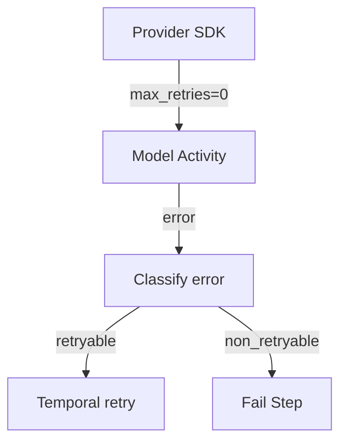

<h1>Provider Retry Delegation </h1>

## Overview

The Provider Retry Delegation pattern disables retries inside model/provider client libraries and lets Temporal Activity retries own backoff, visibility, and crash safety.
Primitives used: Durable Model Call, Activity RetryPolicy, classified ApplicationError.

## Problem

Layered retries (SDK + HTTP + Temporal) multiply delays, hide attempt counts, and can stampede a rate-limited API after a worker restart.

## Solution

Configure the provider client with zero client-side retries.
Raise retryable or non-retryable errors from the Activity and rely on the Activity RetryPolicy.



The following describes each step in the diagram:

1. The worker builds the provider client with retries disabled.
2. Transient failures surface as retryable Activity errors.
3. Temporal schedules the next attempt with durable backoff.
4. Permanent failures fail the Step without spinning.

```python
# Worker process configuration (always outside Workflow code)
provider = ProviderClient(api_key=..., max_retries=0, timeout=30.0)

@activity.defn
async def call_llm(request: LLMRequest) -> LLMResponse:
    try:
        return await provider.complete(request)
    except RateLimitError as e:
        raise ApplicationError(str(e), type="RateLimitError")  # retryable
    except AuthenticationError as e:
        raise ApplicationError(str(e), type="AuthenticationError", non_retryable=True)
```

## Implementation

### One control plane

Document that Temporal is the only retry engine for model calls in this agent.

### Interaction with rate limits

Combine with Rate-Limit Aware Model Calls when the API returns Retry-After.

## When to use

Use for every production Durable Model Call.
Keep provider retries only if you are not using Temporal Activities for that call.

## Benefits and trade-offs

You get durable, visible retries that survive worker crashes.
You must map provider errors carefully.

## Comparison with alternatives

| Retry owner | Survives crash | Visible in history |
| :--- | :--- | :--- |
| Temporal Activity | Yes | Yes |
| Provider SDK only | No | No |
| Both stacked | Unpredictable | Confused |

## Best practices

- **Set max_retries=0 (or equivalent) on every provider client.**
- **Prefer one generic call_llm Activity** with model_id routing.
- **Log attempt metadata** via Activity heartbeats or events.

## Common pitfalls

- **Leaving default SDK retries on.** Stacked SDK and Temporal retries multiply delays and hide attempt counts.
- **Catching all exceptions and returning None.** Hides failures from Temporal so the Step looks successful.
- **HTTP-layer retries still on after max_retries=0.** Transport libraries may retry independently; disable those too or you still stampede.

## Related patterns

- [Durable Model Call](/durable-model-call)
- [Model Error Classification](/model-error-classification)
- [Rate-Limit Aware Model Calls](/rate-limit-aware-model-calls)

## Sample code

See related runnable samples under `sandbox-runner/patterns/` when this pattern builds on Session Workflow, Activity Tool, or Code Mode.

## References

- [Temporal Docs: Retry policies](https://docs.temporal.io/encyclopedia/retry-policies)
- [Temporal Docs: Application failure](https://docs.temporal.io/references/failures)
