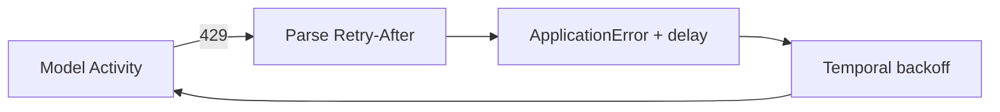

<h1>Rate-Limit Aware Model Calls </h1>

## Overview

The Rate-Limit Aware Model Calls pattern turns provider 429 responses into Temporal retries that honor Retry-After / rate-limit headers via next_retry_delay.
Primitives used: Durable Model Call, ApplicationError next_retry_delay, Activity retries.

## Problem

Fixed backoff ignores the provider's requested delay and can worsen throttling.
Busy-looping in the Workflow is illegal and useless.

## Solution

On rate limit errors, parse Retry-After (or equivalent) and raise a retryable ApplicationError with next_retry_delay set so Temporal waits that long before the next attempt.



The following describes each step in the diagram:

1. The provider returns 429 with rate-limit headers.
2. The Activity parses the suggested delay.
3. It raises a retryable error carrying next_retry_delay.
4. Temporal schedules the retry after that delay without holding a worker thread.

```python
except RateLimitError as e:
    delay = parse_retry_after(e)  # timedelta
    raise ApplicationError(
        f"Rate limited: {e}",
        type="RateLimitError",
        next_retry_delay=delay,
    )
```

## Implementation

### Timeouts

Set schedule_to_close_timeout large enough to cover several delayed retries for search or bursty APIs.

### Fairness across tenants

For multi-tenant agents, consider Task Queue fairness so one hot tenant cannot starve others.

## When to use

Use whenever the provider documents rate limits.
Fixed exponential backoff alone is a weaker fallback when headers are absent.

## Benefits and trade-offs

You align retries with provider guidance and free workers during the wait.
Header formats differ by vendor—keep parsers tested.

## Comparison with alternatives

| Strategy | Uses provider hint | Durable wait |
| :--- | :--- | :--- |
| next_retry_delay | Yes | Yes |
| Fixed exponential only | No | Yes |
| Sleep in Activity thread | Maybe | Holds worker |

## Best practices

- **Prefer header-driven delay when present.**
- **Fall back to RetryPolicy backoff** if headers are missing.
- **Metric rate-limit hits per model and tenant.**

## Common pitfalls

- **time.sleep in the Activity for minutes** instead of next_retry_delay.
- **Parsing Retry-After in the Workflow.**

## Related patterns

- [Provider Retry Delegation](/provider-retry-delegation)
- [Model Error Classification](/model-error-classification)
- [Model Timeout Profiles](/model-timeout-profiles)
- [Fairness](/fairness)

## Sample code

See related runnable samples under `sandbox-runner/patterns/` when this pattern builds on Session Workflow, Activity Tool, or Code Mode.

## References

- [Temporal Docs: Retry policies](https://docs.temporal.io/encyclopedia/retry-policies)
