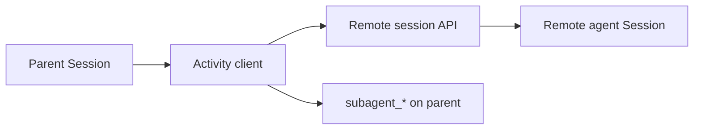

<h1>Remote Subagent </h1>

## Overview

The Remote Subagent pattern drives an agent hosted in another runtime or cluster via its session HTTP API, while representing it locally as a subagent toolset.
Parent and child still exchange events and approvals through the shared session protocol.
Primitives used: HTTP Session client, SubagentHandle, remote session IDs, subagent events.

## Problem

Not every specialist can run as a Child Workflow in the same worker process or cluster.
You still need durable parent orchestration and a unified audit story.

## Solution

Implement subagent tools as Activities that call the remote session HTTP API (create session, send message, stream events).
Record remote `session_id` on the SubagentHandle and mirror important remote events into the parent stream.



The following describes each step in the diagram:

1. The parent starts a remote session through an Activity.
2. Operation calls become HTTP turns against that session.
3. The Activity streams or polls events until the operation completes.
4. The parent emits linked subagent events for local observers.

```python
@activity.defn
async def remote_subagent_call(base_url: str, session_id: str, message: str) -> str:
    # HTTP client to remote session API — runs in Activity only.
    ...
    return reply_text
```

## Implementation

### Durability

The Activity must be restart-safe: resume streaming from a cursor, or reconcile with remote status on retry.

### Trust boundary

Authenticate to the remote API; do not embed long-lived secrets in Workflow history.

## When to use

Use when the child must run in another cluster, language, or scaling domain.
Prefer local Child Workflows when both agents share a Temporal namespace.

## Benefits and trade-offs

You compose across deployment boundaries.
You take on distributed failure modes and schema drift between sides.

## Comparison with alternatives

| Approach | Location | Coupling |
| :--- | :--- | :--- |
| Remote Subagent | Other cluster | HTTP protocol |
| Local subagent | Same Temporal | Child Workflow |
| Ad-hoc webhook | Other cluster | Weak semantics |

## Best practices

- **Mirror IDs.** Parent events should include remote session_id.
- **Timeouts on both sides.** Avoid eternal Activities.
- **Version the session API.** Breaking changes need explicit migration.

## Common pitfalls

- **Calling HTTP from the Workflow.**
- **Losing cursor on Activity retry and double-sending messages.**

## Related patterns

- [Subagent Toolset](/subagent-toolset)
- [HTTP Channel Agent](/http-channel-agent)
- [HTTP and Client](/http-and-client)

## Sample code

See related runnable samples under `sandbox-runner/patterns/` when this pattern builds on Session Workflow, Activity Tool, or Code Mode.

## References

- [Temporal Docs: Activities](https://docs.temporal.io/activities)
