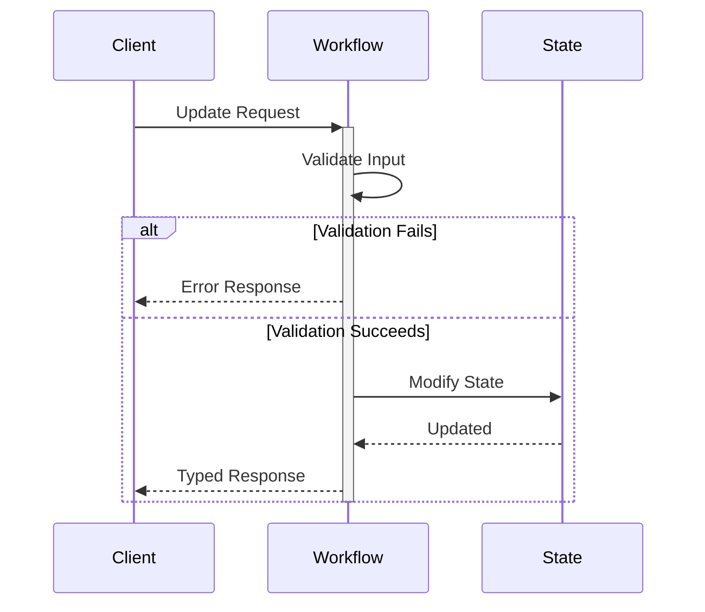

# Request-Response via Updates

## Overview

Workflow Updates enable synchronous request-response interactions where clients receive immediate, typed responses while the workflow continues processing. Updates modify workflow state, validate inputs, and return results directly to the caller with strong consistency guarantees.

## Problem

In distributed systems, you often need workflows that:
- Must provide immediate feedback to clients (validation results, confirmation IDs)
- Require strong consistency guarantees for operations
- Need typed error handling for validation failures
- Should validate inputs before accepting work
- Allow external systems to modify workflow state synchronously

Without Updates, clients must:
- Use signals and poll via queries (complex, eventually consistent)
- Wait for entire workflow completion (slow)
- Implement complex coordination logic
- Handle race conditions between signals and queries

## Solution

Temporal's Update API executes an update handler that can validate inputs, modify state, and return values synchronously. The update is recorded in workflow history before returning, providing strong consistency.



## Implementation

::: code-group

```java [Java]
@WorkflowInterface
public interface TaskWorkflow {
  @WorkflowMethod
  void run();
  
  @UpdateMethod
  AssignmentResult assignTask(String taskName);
  
  @QueryMethod
  List<String> getTasks();
}

public class TaskWorkflowImpl implements TaskWorkflow {
  private static final int MAX_TASKS = 10;
  private List<String> tasks = new ArrayList<>();
  
  @Override
  public void run() {
    Workflow.await(() -> false);
  }
  
  // Optional: Validator runs before update handler
  @UpdateValidatorMethod(updateName = "assignTask")
  protected void validateAssignTask(String taskName) {
    if (tasks.size() >= MAX_TASKS) {
      throw new IllegalStateException("Task limit reached");
    }
  }
  
  @Override
  public AssignmentResult assignTask(String taskName) {
    String assignmentId = UUID.randomUUID().toString();
    tasks.add(taskName);
    
    return new AssignmentResult(assignmentId, taskName, tasks.size());
  }
  
  @Override
  public List<String> getTasks() {
    return new ArrayList<>(tasks);
  }
}

// Client usage
public AssignmentResult assignTask(String workflowId, String taskName) {
  TaskWorkflow workflow = client.newWorkflowStub(TaskWorkflow.class, workflowId);
  return workflow.assignTask(taskName);
}
```

```go [Go]
type TaskWorkflow struct{}

const MaxTasks = 10

func (w *TaskWorkflow) Run(ctx workflow.Context) error {
	tasks := []string{}

	// Optional: Validator runs before update handler
	err := workflow.SetUpdateHandlerWithOptions(
		ctx,
		"AssignTask",
		func(ctx workflow.Context, taskName string) (AssignmentResult, error) {
			assignmentID := uuid.New().String()
			tasks = append(tasks, taskName)
			return AssignmentResult{
				AssignmentID: assignmentID,
				TaskName:     taskName,
				TotalTasks:   len(tasks),
			}, nil
		},
		workflow.UpdateHandlerOptions{
			Validator: func(ctx workflow.Context, taskName string) error {
				if len(tasks) >= MaxTasks {
					return fmt.Errorf("task limit reached")
				}
				return nil
			},
		},
	)
	if err != nil {
		return err
	}

	err = workflow.SetQueryHandler(ctx, "GetTasks", func() ([]string, error) {
		return tasks, nil
	})
	if err != nil {
		return err
	}

	workflow.GetSignalChannel(ctx, "").Receive(ctx, nil)
	return nil
}

// Client usage
func assignTask(c client.Client, workflowID string, taskName string) (AssignmentResult, error) {
	updateHandle, err := c.UpdateWorkflow(context.Background(), client.UpdateWorkflowOptions{
		WorkflowID: workflowID,
		UpdateName: "AssignTask",
		Args:       []interface{}{taskName},
	})
	if err != nil {
		return AssignmentResult{}, err
	}

	var result AssignmentResult
	err = updateHandle.Get(context.Background(), &result)
	return result, err
}
```

```typescript [TypeScript]
import * as wf from '@temporalio/workflow';
import { v4 as uuid } from 'uuid';

interface AssignmentResult {
  assignmentId: string;
  taskName: string;
  totalTasks: number;
}

export const assignTaskUpdate = wf.defineUpdate<AssignmentResult, [string]>('assignTask');
export const getTasksQuery = wf.defineQuery<string[]>('getTasks');

const MAX_TASKS = 10;

export async function taskWorkflow(): Promise<void> {
  const tasks: string[] = [];

  // Optional: Validator runs before update handler
  wf.setHandler(
    assignTaskUpdate,
    (taskName: string): AssignmentResult => {
      const assignmentId = uuid();
      tasks.push(taskName);
      return { assignmentId, taskName, totalTasks: tasks.length };
    },
    {
      validator: (taskName: string): void => {
        if (tasks.length >= MAX_TASKS) {
          throw new Error('Task limit reached');
        }
      },
    }
  );

  wf.setHandler(getTasksQuery, (): string[] => tasks);

  await wf.condition(() => false);
}

// Client usage
async function assignTask(workflowId: string, taskName: string): Promise<AssignmentResult> {
  const handle = client.workflow.getHandle(workflowId);
  return await handle.executeUpdate(assignTaskUpdate, { args: [taskName] });
}
```

:::

## Key Components

1. **Update Handler**: Method annotated with @UpdateMethod that modifies state and returns synchronously
2. **Validation Logic**: Input validation that throws typed exceptions
3. **State Modification**: Updates to workflow state variables
4. **Typed Return**: Synchronous return value sent to client
5. **Strong Consistency**: Update recorded in history before returning

## When to Use

**Ideal for:**
- Request-response patterns requiring immediate confirmation
- Input validation before accepting work
- Synchronous state modifications with typed responses
- Operations requiring strong consistency guarantees
- Entity workflows that need external state updates

**Not ideal for:**
- Fire-and-forget operations (use Signals)
- Read-only operations (use Queries)
- High-throughput scenarios where latency matters (updates are slower than signals)
- Operations that don't need immediate response

## Benefits

- **Synchronous Response**: Client receives typed return value immediately
- **Typed Errors**: Validation failures return as typed exceptions
- **Strong Consistency**: Update is recorded in history before returning
- **State Modification**: Directly modify workflow state from external systems
- **Validation**: Reject invalid inputs before accepting work

## Trade-offs

- **Higher Latency**: Updates are slower than signals (requires history write)
- **Blocking**: Update handler blocks workflow task execution
- **Resource Usage**: Update handlers consume workflow task execution time
- **Complexity**: More complex than signals for simple notifications

## Limitations

- **Payload Size**: Update arguments and return values are limited by the workflow history event size (typically 2MB per event)
- **History Growth**: Each update adds events to workflow history, contributing to the 50K event limit
- **Concurrent Updates**: Maximum of 10 in-flight updates per workflow execution
- **Total Updates**: Maximum of 2,000 total updates in workflow history

## Comparison with Alternatives

| Approach | Use Case | Response Type | Latency | Consistency |
|----------|----------|---------------|---------|-------------|
| Update | Request-response | Sync typed value | Higher | Strong |
| Signal | Fire-and-forget | None | Lower | Eventual |
| Query | Read-only | Sync typed value | Lowest | Eventual |

## Related Patterns

- **Signal**: Fire-and-forget state modifications
- **Query**: Read-only state inspection
- **Entity Workflow**: Long-running workflows representing business entities
- **[Early Return](early-return.md)**: Returning intermediate results before workflow completion

## Best Practices

1. **Validate Early**: Check inputs at the start of update handler to fail fast
2. **Handle Errors**: Throw typed exceptions for validation failures
3. **Return Quickly**: Don't perform long operations in update handler
4. **Idempotency**: Track processed update IDs if updates can be retried
5. **Timeout Configuration**: Set appropriate update timeouts
6. **State Consistency**: Ensure state modifications are atomic within the handler

## Comparison: Signal vs Update

**Use Signal when:**
- No immediate response needed
- Fire-and-forget semantics acceptable
- Minimizing latency is critical
- Eventually consistent is acceptable

**Use Update when:**
- Client needs immediate confirmation
- Typed return values required
- Input validation before acceptance
- Strong consistency guarantees needed
