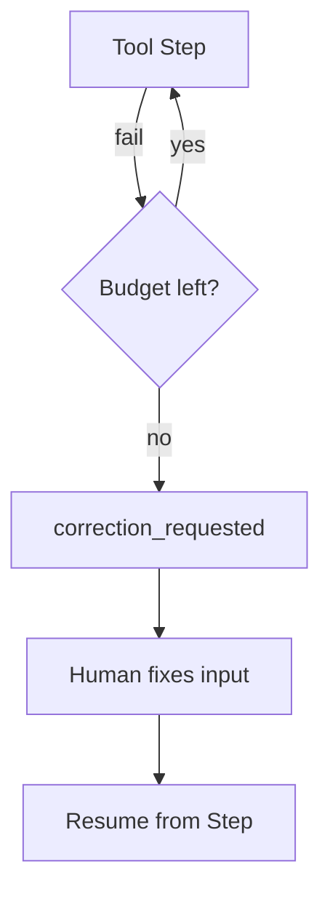

<h1>Resumable Correction </h1>

## Overview

The Resumable Correction pattern combines retries and approvals.
When a tool repeatedly fails (bad input, missing record), the agent parks in a resumable state, emits an event describing the error, and waits for a human to correct inputs or environment before resuming from the last safe step.
Primitives used: Step failure classification, ApprovalWait/human wait, Session resume.

## Problem

Blind retries waste tokens and can worsen bad writes.
Failing the whole session loses successful prior Steps.

## Solution

After a retry budget is exhausted on a retryable-but-stuck error, transition the Turn or Session into a correction wait.
Emit an event with the error and suggested fix fields.
On human correction Signal/Update, resume from the failed Step without replaying completed Steps.



The following describes each step in the diagram:

1. A tool Step fails with a classified error.
2. Retries follow the tool profile until the budget is spent.
3. The Session parks and asks for correction instead of aborting everything.
4. A human supplies corrected args or confirms environment fix; the Step runs again.

```python
if attempts >= max_attempts:
    self._correction = {"tool": tool_id, "error": err, "args": args}
    await workflow.wait_condition(lambda: self._corrected_args is not None)
    args = self._corrected_args
# execute Activity again with corrected args
```

## Implementation

### What humans can change

Allow argument patches, environment acknowledgements, or skip/cancel decisions.
Validate corrected args against the tool schema before resume.

### Completed Steps

Rely on Workflow history / recorded results so successful prior Steps are not re-executed.

## When to use

Use when failures are often fixable by humans (bad IDs, missing tickets).
Fail fast when errors are permanent and uncorrectable.

## Benefits and trade-offs

You preserve partial progress and reduce wasted model loops.
You add operational waits that need clear SLAs.

## Comparison with alternatives

| Approach | Preserves progress | Human load |
| :--- | :--- | :--- |
| Resumable Correction | Yes | On stuck failures |
| Abort session | No | Low |
| Infinite auto-retry | Maybe | Hidden cost |

## Best practices

- **Classify errors.** Only park on correction-eligible classes.
- **Show last args and error.** Operators cannot guess.
- **Cap park duration.** Expire or escalate.

## Common pitfalls

- **Re-running non-idempotent success paths after resume.**
- **Parking on every transient 503.** Use retry profiles first.
- **Parking with `time.sleep` or an Activity wait instead of Workflow `wait_condition`.** Blocks the worker and is not durable.
- **Correction wait and last-error missing from the Continue-As-New snapshot.** Resume state vanishes on the new run.

## Related patterns

- [Poison Tool Quarantine](/poison-tool-quarantine)
- [Tool Retry Profiles](/tool-retry-profiles)
- [Approval-Gated Tools](/approval-gated-tools)
- [Session Workflow](/session-workflow)

## Sample code

See related runnable samples under `sandbox-runner/patterns/` when this pattern builds on Session Workflow, Activity Tool, or Code Mode.

## References

- [Temporal Docs: Activity retries](https://docs.temporal.io/encyclopedia/retry-policies)
