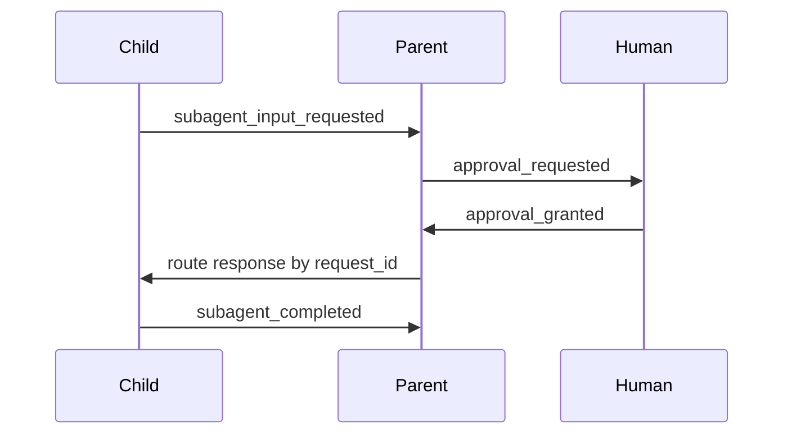

<h1>Root-Mediated Subagent Approvals </h1>

## Overview

The Root-Mediated Subagent Approvals pattern proxies child Approval and ask-user waits through the **parent (root) Session**: the child parks, the parent emits the human-facing request on its channel, and the answer is routed back by `request_id` to the child’s continuation—so background threads without a human channel never own HITL directly.
Primitives used: Subagent Toolset, Approval-Gated Tools, Ask-User Wait, Session Signals/Updates, Persistent Subagent Threads (contrast).

## Problem

One-shot children often need Approval for a Tool, but the human is attached to the parent chat—not the child Workflow Id.
Persistent background threads have no user channel; exposing HITL Tools there strands waits.
If each child talks to the user independently, you lose a single audit trail and confuse delivery routing.

## Solution

1. Child Step needs Approval / ask-user → emit `subagent_input_requested` upward with `request_id`, tool, and args.
2. Parent Turn parks (conversation mode) and surfaces `approval_requested` / `input_requested` on the root stream.
3. Human answers on the root channel with the same `request_id`.
4. Parent routes the response to the child Workflow (Signal/Update); child resumes and continues.

Persistent threads: **do not** expose HITL Tools; use one-shot delegation when a child must ask a human.



The following describes each step in the diagram:

1. The child hits a gated Tool and notifies the parent.
2. The parent shows the Approval on the human channel.
3. The human decides on the parent Session.
4. The parent forwards the decision; the child finishes and reports completion.

```python
from dataclasses import dataclass
from datetime import timedelta

from temporalio import workflow

@dataclass
class ProxyRequest:
    request_id: str
    child_id: str
    tool_name: str

@workflow.defn
class ParentSessionWorkflow:
    def __init__(self) -> None:
        self._pending: dict[str, ProxyRequest] = {}
        self._decisions: dict[str, str] = {}

    @workflow.signal
    def child_needs_approval(self, req: ProxyRequest) -> None:
        self._pending[req.request_id] = req

    @workflow.signal
    def human_decision(self, request_id: str, status: str) -> None:
        self._decisions[request_id] = status

    @workflow.run
    async def run(self, session_id: str) -> str:
        child = await workflow.start_child_workflow(
            ChildTurnWorkflow.run,
            args=[session_id],
            id=f"{session_id}-child",
        )
        await workflow.wait_condition(lambda: bool(self._pending) or child.done())
        if self._pending:
            req = next(iter(self._pending.values()))
            await workflow.wait_condition(lambda: req.request_id in self._decisions)
            handle = workflow.get_external_workflow_handle(req.child_id)
            await handle.signal("approval_result", self._decisions[req.request_id])
        return await child
```

## Implementation

<DaytonaRunner pattern="root-mediated-subagent-approvals" />

### One-shot vs persistent

| Child shape | HITL |
| :--- | :--- |
| One-shot subagent Tool | Proxy through parent Turn |
| Persistent thread | No in-thread HITL; human follow-ups after idle |

### Task-mode parents

If the parent is [Task-Mode Session](/task-mode-session), do not emit a waiting epilogue that pretends a human will answer—fail or choose Tools that need no Approval.

### Routing

Keep a Session map `request_id → child Workflow Id` (and delivery ids).
Carry it across Continue-As-New.
Do not coalesce Approval responses into ordinary chat bursts ([Mid-Turn Delivery Coalescing](/mid-turn-delivery-coalescing)).

## When to use

Use whenever children can select gated Tools but only the root has a user channel.
Skip for fully autonomous trees with no human Approvals.

## Benefits and trade-offs

You keep one human channel and a clear parent audit trail.
You must implement proxy maps, routing, and different rules for persistent threads.

## Comparison with alternatives

| Approach | Human channel | Fit |
| :--- | :--- | :--- |
| Root-Mediated Subagent Approvals | Parent only | Chat + one-shot children |
| HITL inside each child | Per child | Rare; ops-heavy |
| No child Approvals | N/A | Low-risk Tools only |

## Best practices

- **Proxy one-shot HITL; block HITL on persistent threads.**
- **Key everything by `request_id`.**
- **Preserve the proxy map** on Continue-As-New.
- **Treat delegation as not an Approval boundary**—child Tools still need policy.

## Common pitfalls

- Expecting Approvals inside persistent background threads.
- Losing `request_id` routing when chat messages coalesce.
- Assuming child Tool results appear as parent `action.result` (they arrive as subagent completion).
- Task-mode parents waiting forever for a human.

## Related patterns

- [Approval-Gated Tools](/approval-gated-tools)
- [Ask-User Wait](/ask-user-wait)
- [Session-Scoped Approvals](/session-scoped-approvals)
- [Subagent Toolset](/subagent-toolset)
- [Persistent Subagent Threads](/persistent-subagent-threads)
- [Fan-Out Subagents](/fanout-subagents)
- [Task-Mode Session](/task-mode-session)
- [Mid-Turn Delivery Coalescing](/mid-turn-delivery-coalescing)

## Sample code

- [`sandbox-runner/patterns/root-mediated-subagent-approvals/python/`](https://github.com/temporal-sa/temporal-agentic-patterns/tree/main/sandbox-runner/patterns/root-mediated-subagent-approvals/python)

## References

- [Temporal Docs: Child Workflows](https://docs.temporal.io/child-workflows)
- [Temporal Docs: Signals](https://docs.temporal.io/encyclopedia/workflow-message-passing)
