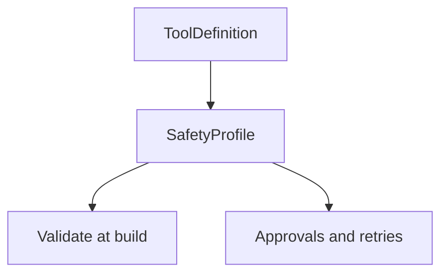

<h1>Safety-Profiled Tools </h1>

## Overview

The Safety-Profiled Tools pattern labels each tool with a safety profile (`inherently_safe`, `idempotent_side_effect`, `non_idempotent`) and enforces matching policies.
The runtime blocks or gates calls that do not match their expected profile and environment.
Primitives used: SafetyProfile on ToolDefinition, build/startup validation, ApprovalPolicy defaults.

## Problem

Without labels, every tool looks the same to retries and approvals, so policy engines guess wrong.

## Solution

Require a SafetyProfile on every ToolDefinition.
At build or worker start, fail if a mutating tool lacks a profile or if profile and retry settings contradict.
At runtime, ApprovalPolicy and StepPolicy read the label.



The following describes each step in the diagram:

1. Authors declare a safety profile next to each tool.
2. Startup validation rejects missing or contradictory configs.
3. Runtime policies use the label to gate or retry.
4. Events can include the profile for audits.

```python
TOOLS = {
    "search": {"safety": "inherently_safe"},
    "charge": {"safety": "non_idempotent", "idempotency_key_field": "key"},
}

def assert_profiles(tools: dict) -> None:
    for name, meta in tools.items():
        if "safety" not in meta:
            raise ValueError(f"{name} missing safety profile")
```

## Implementation

### Defaults

Prefer safe-by-default: unknown tools are treated as non_idempotent and gated.

### Documentation

Pattern pages and tool READMEs should state the profile next to the schema.

## When to use

Use for every multi-tool agent.
Skip only for prototypes with a single read-only tool.

## Benefits and trade-offs

You make policy mechanical instead of prompt-based.
Authors must classify tools honestly.

## Comparison with alternatives

| Profile | Meaning |
| :--- | :--- |
| inherently_safe | Read-only / pure |
| idempotent_side_effect | Safe to retry with key |
| non_idempotent | Do not auto-retry |

## Best practices

- **Fail build on missing labels.**
- **Pair non_idempotent with approvals or keys.**
- **Re-review profiles when tool behavior changes.**

## Common pitfalls

- **`non_idempotent` tool still gets Activity retries.** Duplicate side effects on every attempt.
- **Profile not consulted before `execute_activity`.** Unsafe tools run with default retry policies.

## Related patterns

- [Command Safety Classification](/command-safety-classification)
- [Effect-Classified Tools](/effect-classified-tools)
- [Tool Retry Profiles](/tool-retry-profiles)
- [Guardrail Steps](/guardrail-steps)
- [Approval-Gated Tools](/approval-gated-tools)
- [Security Profiles per Agent](/security-profiles-per-agent)

## Sample code

See related runnable samples under `sandbox-runner/patterns/` when this pattern builds on Session Workflow, Activity Tool, or Code Mode.

## References

- [Temporal Docs: Retry policies](https://docs.temporal.io/encyclopedia/retry-policies)
