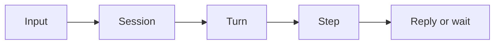

<h1>Safety-Profiled Tools </h1>

## Overview

Declare inherently safe, idempotent, or non-idempotent tools.
You use Temporal Workflows and Activities under the hood so the agent can pause, retry, and resume without losing session state.

## Problem

Without this pattern, you risk losing mid-turn progress on worker restarts, double-executing side effects, or scattering session state across ad-hoc stores that are hard to audit.

## Solution

Structure the agent so the durable boundary matches the pattern:



The following describes each step in the diagram:

1. An input arrives for a Session (message, channel event, or schedule).
2. The Session starts or continues a Turn.
3. The Turn runs Steps (model calls, tools, approvals) as durable units.
4. The Turn ends with a reply, an error, or a wait for an external decision.

```python
# agent/agent.py — structural sketch
from temporalio import workflow

@workflow.defn
class AgentSessionWorkflow:
    @workflow.run
    async def run(self, session_id: str) -> None:
        # Own cross-turn state, approvals, and the event stream.
        ...
```

## Implementation


A runnable sample may be added later; the Python sketches below show the structure.

### Session ownership

Keep memory, approval overrides, and the ordered event stream on the Session Workflow so every Turn shares one durable context.

### Step boundaries

Run non-deterministic or side-effecting work in Activities so completed Steps replay from recorded results after a restart.

## When to use

This pattern fits when you need the behavior described in Overview and Problem.
It is not a good fit when a short-lived script without durability is enough.

## Benefits and trade-offs

You gain crash safety, clear observability, and a place to hang approvals.
You accept Workflow history growth and the need to Continue-As-New on long sessions.

## Comparison with alternatives

| Approach | Durability | Isolation |
| :--- | :--- | :--- |
| This pattern | High | Clear Session/Turn/Step boundaries |
| In-memory agent loop | None | Lost on restart |

## Best practices

- **Emit events at boundaries.** Record turn and step start/end so UIs can reconstruct the run.
- **Keep Workflows deterministic.** Put model and IO calls in Activities.
- **Name Sessions stably.** Use a Session ID that external channels can address.

## Common pitfalls

- **Doing IO in the Workflow.** Non-deterministic calls break replay.
- **Unbounded history.** Long sessions must Continue-As-New with a state snapshot.
- **Silent retries on non-idempotent tools.** Gate or key those tools before automatic retry.

## Related patterns

- [Session Workflow](/session-workflow)
- [Activity Tool](/activity-tool)
- [Standardized Event Stream](/standardized-event-stream)

## Sample code

See `sandbox-runner/patterns/safety-profiled-tools/python/` when a live sample exists for this pattern.

## References

- [Temporal Docs: Workflows](https://docs.temporal.io/workflows)
- [Temporal Docs: Activities](https://docs.temporal.io/activities)
- [Temporal Docs: Continue-As-New](https://docs.temporal.io/workflow-execution/continue-as-new)
