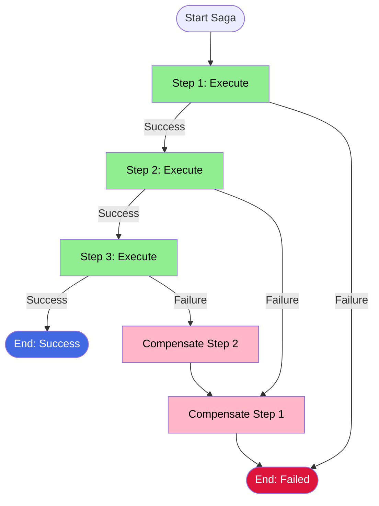

# Saga Pattern

[Go Sample](https://github.com/temporalio/samples-go/tree/main/saga) | [Java Sample](https://github.com/temporalio/samples-java/tree/main/core/src/main/java/io/temporal/samples/hello/HelloSaga.java) | [TypeScript Sample](https://github.com/temporalio/samples-typescript/tree/main/saga) | [Python Sample](https://github.com/temporalio/samples-python)

## Intent
Manage distributed transactions across multiple services by coordinating a sequence of local transactions, each with a compensating action that can undo its effects if subsequent steps fail.

## Problem
In distributed systems, you need to maintain data consistency across multiple services or databases without using traditional ACID transactions. When a multi-step business process fails partway through, you must undo the effects of completed steps to maintain system consistency. Traditional two-phase commit doesn't scale well and creates tight coupling between services.

## Solution
Implement each step as a local transaction with a corresponding compensation transaction. If any step fails, execute compensation transactions in reverse order to undo the effects of all completed steps. Use Go's `defer` mechanism to automatically trigger compensations when errors occur, ensuring cleanup happens even if the workflow logic panics or returns early.



## Structure

::: code-group
```go [Go]
func TransferMoney(ctx workflow.Context, details TransferDetails) error {
    // Step 1: Withdraw from source account
    err := workflow.ExecuteActivity(ctx, Withdraw, details).Get(ctx, nil)
    if err != nil {
        return err
    }
    
    // Register compensation for Step 1
    defer func() {
        if err != nil {
            _ = workflow.ExecuteActivity(ctx, WithdrawCompensation, details).Get(ctx, nil)
        }
    }()
    
    // Step 2: Deposit to target account
    err = workflow.ExecuteActivity(ctx, Deposit, details).Get(ctx, nil)
    if err != nil {
        return err // Triggers defer, which runs WithdrawCompensation
    }
    
    // Register compensation for Step 2
    defer func() {
        if err != nil {
            _ = workflow.ExecuteActivity(ctx, DepositCompensation, details).Get(ctx, nil)
        }
    }()
    
    // Step 3: Additional operation
    err = workflow.ExecuteActivity(ctx, StepWithError, details).Get(ctx, nil)
    return err // If error, both compensations run in reverse order
}
```

```typescript [TypeScript]
export async function openAccount(params: OpenAccount): Promise<void> {
  const compensations: Compensation[] = [];

  try {
    // Step 1: Create account (fatal if fails)
    await createAccount({ accountId: params.accountId });
  } catch (err) {
    throw err; // No compensations needed for first step
  }

  try {
    // Step 2: Add address and register compensation
    await addAddress({
      accountId: params.accountId,
      address: params.address,
    });
    compensations.unshift({
      fn: () => clearPostalAddresses({ accountId: params.accountId }),
    });

    // Step 3: Add client and register compensation
    await addClient({
      accountId: params.accountId,
      clientEmail: params.clientEmail,
    });
    compensations.unshift({
      fn: () => removeClient({ accountId: params.accountId }),
    });

    // Step 4: Add bank account and register compensation
    await addBankAccount({
      accountId: params.accountId,
      details: params.bankDetails,
    });
    compensations.unshift({
      fn: () => disconnectBankAccounts({ accountId: params.accountId }),
    });
  } catch (err) {
    // On error, run all compensations in reverse order
    for (const comp of compensations) {
      await comp.fn();
    }
    throw err;
  }
}
```

```python [Python]
from temporalio import workflow

@workflow.defn
class TransferMoneyWorkflow:
    @workflow.run
    async def run(self, details: TransferDetails) -> None:
        compensations = []
        
        try:
            # Step 1: Withdraw from source account
            await workflow.execute_activity(
                withdraw,
                details,
                start_to_close_timeout=timedelta(seconds=10),
            )
            compensations.append(
                lambda: workflow.execute_activity(
                    withdraw_compensation,
                    details,
                    start_to_close_timeout=timedelta(seconds=10),
                )
            )
            
            # Step 2: Deposit to target account
            await workflow.execute_activity(
                deposit,
                details,
                start_to_close_timeout=timedelta(seconds=10),
            )
            compensations.append(
                lambda: workflow.execute_activity(
                    deposit_compensation,
                    details,
                    start_to_close_timeout=timedelta(seconds=10),
                )
            )
            
            # Step 3: Additional operation
            await workflow.execute_activity(
                step_with_error,
                details,
                start_to_close_timeout=timedelta(seconds=10),
            )
        except Exception as e:
            # On error, run compensations in reverse order
            for compensation in reversed(compensations):
                await compensation()
            raise
```

```java [Java]
public class HelloSaga {
    @WorkflowInterface
    public interface GreetingWorkflow {
        @WorkflowMethod
        String getGreeting(String name);
    }

    public static class GreetingWorkflowImpl implements GreetingWorkflow {
        @Override
        public String getGreeting(String name) {
            // Create a Saga instance with compensation options
            Saga saga = new Saga(new Saga.Options.Builder()
                .setParallelCompensation(false) // Run compensations sequentially
                .build());
            
            try {
                // Step 1: Execute activity and register compensation
                String hello = Workflow.executeActivity(
                    activities::hello, 
                    String.class, 
                    name
                ).get();
                saga.addCompensation(activities::cleanupHello, name);
                
                // Step 2: Execute activity and register compensation
                String bye = Workflow.executeActivity(
                    activities::bye, 
                    String.class, 
                    name
                ).get();
                saga.addCompensation(activities::cleanupBye, name);
                
                // Step 3: This might fail
                Workflow.executeActivity(
                    activities::processFile, 
                    Void.class, 
                    name
                ).get();
                saga.addCompensation(activities::cleanupFile, name);
                
                return hello + "; " + bye;
                
            } catch (Exception e) {
                // On any error, run all registered compensations in reverse order
                saga.compensate();
                throw e;
            }
        }
    }
}
```
:::

**Key Differences:**
- **Go**: Uses `defer` statements that execute in LIFO order when function returns
- **Python**: Uses list with `reversed()` to iterate compensations in LIFO order on error
- **TypeScript**: Uses array with `unshift()` to maintain LIFO order, manually iterates on error
- **Java**: Uses explicit `Saga` object to track and trigger compensations
- **All**: Compensations run in reverse order of registration
- **All**: Compensations are idempotent and can handle partial failures

## Applicability
Use the Saga pattern when:
- You need to maintain consistency across multiple services or databases
- Traditional distributed transactions (2PC) are too slow or unavailable
- You can define compensating actions for each step in your business process
- Eventual consistency is acceptable for your use case
- You need to handle long-running transactions that may span hours or days

## Pros
- ✅ Maintains eventual consistency without distributed locks
- ✅ Each service can use its own database and transaction model
- ✅ Automatic compensation execution via `defer` ensures cleanup
- ✅ Scales better than two-phase commit protocols
- ✅ Temporal's durability guarantees compensations will execute even after worker failures

## Cons
- ❌ Eventual consistency only - intermediate states are visible to other processes
- ❌ Requires careful design of idempotent compensation activities
- ❌ More complex than simple ACID transactions
- ❌ Compensation logic must be maintained alongside forward logic
- ❌ Some operations may not have meaningful compensations

## Relations with Other Patterns
- Often combined with **Retry Policies** to handle transient failures before compensating
- Can use **Child Workflows** to organize complex sagas with multiple sub-sagas
- May leverage **Async Activity Completion** when compensations require external approval
- Works well with **Heartbeats** for long-running compensation activities
