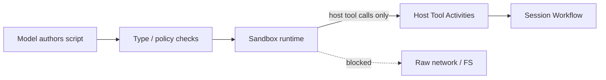

# Sandbox and Code Mode

## Overview

A Sandbox is the constrained execution environment where model-authored code may run.
Code Mode is the pattern of giving the model one "run script" capability that calls host Tools instead of selecting every Tool call directly.

## Problem

Long tool chains are slow and brittle when the model must emit one tool call at a time.
If scripts run with open network and filesystem access, a single bad generation can exfiltrate data or destroy state.
You need shared terms for the safety boundary between generated code and host capabilities.

## Solution

Keep generated code inside a Sandbox; expose only host Tools the Session allows:

The following describes each step in the diagram:

1. The model produces a script (Code Mode) that orchestrates multiple host Tool calls.
2. Optional type-checks and policy gates reject ill-typed or disallowed scripts before execution.
3. The Sandbox runs the script with no direct network or ambient filesystem—only mediated host Tool APIs.
4. Host Tools execute as Activities under the Session Workflow so retries, approvals, and events stay durable.

The safety boundary is the host Tool surface: anything the script cannot call through that surface cannot happen.

## When to use

Use Code Mode when fan-out, loops, or branching over many Tools is clearer as a script than as a multi-step tool loop.
Use a tools-only Sandbox whenever generated code runs in production Sessions.

## Benefits and trade-offs

Scripts reduce round-trips and express control flow clearly; the Sandbox contains blast radius.
The trade-off is sandbox infrastructure and stricter tool API design.

## Comparison with alternatives

| Approach | Expressiveness | Safety |
| :--- | :--- | :--- |
| Code Mode + tools-only Sandbox | High | Bounded by host Tools |
| Pure tool loop | Medium | Per-tool policy |
| Unsandboxed `eval` of model code | High | Unsafe |

## Best practices

- **Tools-only by default.** Deny raw sockets, shell, and ambient credentials inside the Sandbox.
- **Reuse Activity Tool policies.** Approvals and retries apply to host Tools the script calls.
- **Type-check when schemas are stable.** Catch argument errors before side effects.
- **Bound CPU, memory, and wall time** in the Sandbox independently of Activity timeouts.

## Common pitfalls

- **Letting the Sandbox call the public internet.** That bypasses host Tool audits.
- **Treating the Sandbox as the Session.** Durability and approvals still belong in the Workflow.
- **One unrestricted "run shell" host Tool.** That collapses the safety boundary.

## Related patterns

- [Code Mode Orchestrator](/code-mode-orchestrator)
- [Tools-Only Sandbox](/tools-only-sandbox)
- [Type-Checked Scripts](/type-checked-scripts)
- [Script Fan-Out](/script-fan-out)
- [Network & Resource Sandboxing](/network-resource-sandboxing)
- [Safety-Profiled Tools](/safety-profiled-tools)

## Sample code

See [Code Mode Orchestrator](/code-mode-orchestrator) and [Tools-Only Sandbox](/tools-only-sandbox).

## References

- [Temporal Docs: Activities](https://docs.temporal.io/activities)
- [Temporal Docs: Workers](https://docs.temporal.io/workers)
