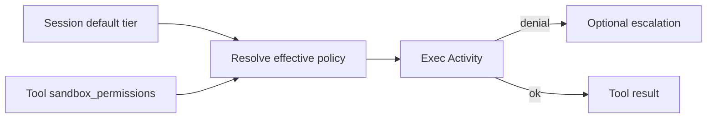

<h1>Sandbox Profile Tiers </h1>

## Overview

The Sandbox Profile Tiers pattern pins each Session (or Tool call) to a named isolation tier—read-only, workspace-write, or full-access—so filesystem and network rights are explicit, auditable, and combinable with Approvals.
Primitives used: Sandbox policy on Activities, Session config, optional per-call override, Failure-Triggered Approval.

## Problem

Binary “sandboxed or not” hides whether the agent may write the workspace, reach the network, or touch the host.
Without named tiers, Operators cannot reason about what a grant escalates to.

## Solution

1. Session config sets a default tier and writable roots.
2. Before shell exec, resolve effective policy (default ∩ Tool args ∩ Approval grants).
3. The Activity applies the platform Sandbox transform for that tier.
4. Denials may escalate via [Failure-Triggered Approval](/failure-triggered-approval).
5. Events record `sandbox_mode` for audit.



The following describes each step in the diagram:

1. The Session carries a default SandboxMode.
2. Each shell Tool resolves an effective policy.
3. The Activity enforces the tier.
4. Audit events include the mode that ran.

```python
from datetime import timedelta
from temporalio import workflow

@workflow.defn
class AgentTurnWorkflow:
    @workflow.run
    async def run(self, command: str, mode: str) -> str:
        return await workflow.execute_activity(
            exec_in_sandbox,
            args=[command, mode],
            start_to_close_timeout=timedelta(seconds=30),
        )
```

## Implementation

<DaytonaRunner pattern="sandbox-profile-tiers" />

### Tier meanings

| Tier | Typical rights |
| :--- | :--- |
| `read-only` | Read workspace; no writes; network usually off |
| `workspace-write` | Write under declared roots; network optional |
| `full-access` | Host-equivalent; treat as Approval-gated |


### Overrides

Allow Tool args to request a *narrower* tier than the Session default.
Widening requires Approval or Failure-Triggered escalation.

## When to use

Use this for coding agents and Code Mode Sessions where shell Tools dominate.
Pair with [Network & Resource Sandboxing](/network-resource-sandboxing) for egress controls.

## Benefits and trade-offs

Operators get a shared vocabulary for isolation.
Platform Sandbox fidelity varies; tiers are a policy contract, not a guarantee of every OS.

## Comparison with alternatives

| Approach | Focus |
| :--- | :--- |
| Profile tiers | Named FS/network postures |
| Tools-only Sandbox | Restrict callable surface |
| Network sandboxing | Egress / resource caps |

## Best practices

- **Pin the default tier** in the agent definition snapshot.
- **Never widen silently** from Tool arguments alone.
- **Log writable roots** alongside mode.

## Common pitfalls

- **Calling workspace-write “safe”.** Writes can still destroy the project.
- **Full-access as Session default** for interactive agents.
- **Ignoring denial classification** when escalating.

## Related patterns

- [Tools-Only Sandbox](/tools-only-sandbox)
- [Network & Resource Sandboxing](/network-resource-sandboxing)
- [Failure-Triggered Approval](/failure-triggered-approval)
- [Command Safety Classification](/command-safety-classification)
- [Sticky Sandbox Task Queues](/sticky-sandbox-task-queues)

## Sample code

- [Python sample](https://github.com/temporal-sa/temporal-agentic-patterns/tree/main/sandbox-runner/patterns/sandbox-profile-tiers/python)
- [Temporal Activities](https://docs.temporal.io/activities)

## References

- [Temporal Python SDK](https://docs.temporal.io/develop/python)
- [Workflows](https://docs.temporal.io/workflows)
