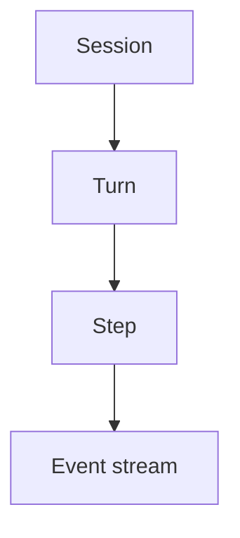

# Sandbox and Code Mode

## Overview

Running model-authored scripts over host tools.
This page defines the term as used across the catalog so pattern pages can stay concise.

## Problem

Without shared names for agent work units, teams invent conflicting models for conversations, tool calls, and approvals.
You then cannot compare designs or reconstruct what an agent did from a single record.

## Solution

Use a small vernacular that maps cleanly onto Temporal durability:

The following describes each step in the diagram:

1. A Session is the long-lived unit that owns cross-turn state and the ordered event stream.
2. A Turn is one input and the agent work that follows until a reply, error, or cancel.
3. A Step is the smallest durable unit inside a turn (model call, tool call, approval wait, and similar).
4. Events record session, turn, and step lifecycle so observers can reconstruct the run.

## When to use

Read this page when you adopt a new pattern and need the definition of a term used in Overview or Solution.

## Benefits and trade-offs

Shared vernacular keeps pattern pages consistent.
The trade-off is that you must learn a small vocabulary before the catalog reads fluently.

## Comparison with alternatives

| Approach | Consistency | Cost |
| :--- | :--- | :--- |
| Shared vernacular | High | Learn a few terms |
| Ad-hoc per team | Low | Rework and confusion |

## Best practices

- **Reuse catalog terms.** Prefer Session, Turn, and Step over inventing synonyms.
- **Map to Temporal clearly.** Document which Workflow or Activity backs each term when durability matters.

## Common pitfalls

- **Treating turns as free-floating processes.** Turns belong to a Session so memory and approvals stay coherent.
- **Skipping events.** Without an event stream, UIs and audits cannot reconstruct the agent lifecycle.

## Related patterns

See the Agent & Session and Observability pattern sections.

## Sample code

See pattern pages that apply this vernacular, such as [Session Workflow](/session-workflow).

## References

- [Temporal Docs: Workflows](https://docs.temporal.io/workflows)
- [Temporal Docs: Activities](https://docs.temporal.io/activities)
