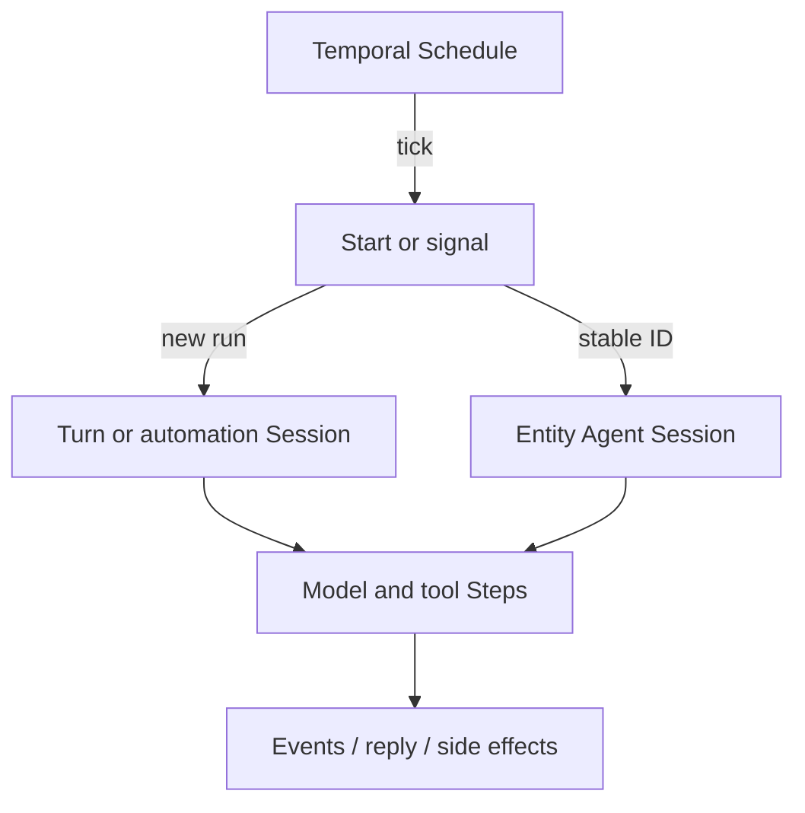

<h1>Scheduled Agent Turns </h1>

## Overview

The Scheduled Agent Turns pattern uses Temporal Schedules to start or wake agent work on a cron, interval, or calendar without a human message.
Each Schedule action starts a Turn Workflow, signals an Entity Agent Session, or runs a short automation Session that owns one proactive cycle.
Primitives used: Temporal Schedule, Schedule Overlap Policy, Session / Turn Workflow, Entity Agent, optional Continue-As-New Session.

## Problem

Chat entrypoints (Signal-with-Start, HTTP Channel Agent) assume a user message.
Proactive agents—nightly digests, continuous monitors, periodic research—need reliable wakes after Worker restarts, deploys, and downtime.
Ad-hoc cron on a single host loses overlap control, catch-up, and pause semantics that Temporal Schedules already provide.

## Solution

Create a Temporal Schedule whose action starts agent Workflows (or signals a long-lived Entity Agent) with a typed payload: goal, tenant, fairness key, and `schedule_id`.
Choose an Overlap Policy so a slow Turn does not spawn unbounded concurrent runs.
Record `turn_started` / schedule metadata on the Session event stream so operators can tell scheduled work from interactive Turns.



The following describes each step in the diagram:

1. The Schedule fires according to its calendar or interval spec.
2. The action starts a Turn/automation Workflow, or signals an Entity Agent with a scheduled goal.
3. The agent runs model and tool Steps under the same policies as interactive Turns.
4. Overlap Policy decides what happens if the previous run is still open.
5. Results land in events, outbound channels, or entity memory.

```python
from datetime import timedelta

from temporalio.client import (
    Client,
    Schedule,
    ScheduleActionStartWorkflow,
    ScheduleIntervalSpec,
    ScheduleOverlapPolicy,
    SchedulePolicy,
    ScheduleSpec,
)

async def create_nightly_digest_schedule(client: Client, account_id: str) -> None:
    await client.create_schedule(
        f"digest-{account_id}",
        Schedule(
            action=ScheduleActionStartWorkflow(
                AgentTurnWorkflow.run,
                args=[
                    account_id,
                    {
                        "goal": "nightly_digest",
                        "source": "schedule",
                    },
                ],
                id=f"digest-run-{account_id}",
                task_queue="agentic-patterns",
            ),
            spec=ScheduleSpec(
                intervals=[ScheduleIntervalSpec(every=timedelta(hours=24))],
            ),
            policy=SchedulePolicy(
                overlap=ScheduleOverlapPolicy.SKIP,
                pause_on_failure=True,
            ),
        ),
    )
```

## Implementation

### Start a Turn vs signal an Entity Agent

**Start Workflow per tick** when each cycle is independent (report generation, batch research). Use a Workflow ID strategy that Overlap Policy can reason about (fixed ID with Skip/Buffer, or unique IDs with AllowAll).

**Signal or Update a long-lived Entity Agent** when the entity must retain memory, approvals, and in-flight state across ticks. The Schedule action can start a tiny starter Workflow that signals the entity, or use client APIs from an ops Activity—prefer keeping the durable address on the Entity Agent itself.

### Overlap Policy for agents

| Policy | Typical agent use |
| :--- | :--- |
| `SKIP` | Default for monitors; miss a tick rather than pile up |
| `BUFFER_ONE` | Digests that should run once after a slow prior Turn |
| `ALLOW_ALL` | Fan-out research with unique Workflow IDs per tick |
| `CANCEL_OTHER` / `TERMINATE_OTHER` | Replace stale runs; cancel is safer for tool side effects |

Avoid `TERMINATE_OTHER` when Activities may leave external writes half-done; prefer cancel plus idempotent tools.

### Catch-up and pause

Configure catch-up windows so downtime does not replay days of agent Turns by surprise.
Use `pause_on_failure` when a broken prompt or tool should stop the Schedule until an operator fixes it.
Pause Schedules during dangerous deploys the same way you pause interactive traffic.

### Fairness and priority

Pass fairness keys and priority on scheduled Workflow starts when multi-tenant agents share Worker pools.
Scheduled batch work should not starve interactive Sessions—see Fairness and Priority Task Queues.

## When to use

Use Scheduled Agent Turns for proactive or recurring agent cycles without a human trigger.
Prefer Session with Signal-and-Start for inbox and chat.
Prefer Entity Agent when the Schedule only wakes an already-addressable long-lived Session.

## Benefits and trade-offs

You get durable wakes, overlap control, pause/backfill, and visibility next to interactive Sessions.
You must design ID and overlap rules carefully so schedules do not amplify spend or tool side effects.

## Comparison with alternatives

| Approach | Wake source | Overlap control |
| :--- | :--- | :--- |
| Scheduled Agent Turns | Temporal Schedule | Native policies |
| Entity Agent + external cron | Host cron | App-built |
| Always-running poll loop in Workflow | Timers in-Session | Manual |
| One-shot `start_delay` | Single future start | N/A |

## Best practices

- **Tag scheduled Turns** with `source=schedule` and the Schedule ID in search attributes or events.
- **Default to Skip or BufferOne** until you prove AllowAll will not explode cost.
- **Reuse interactive safety profiles.** Approvals and tool retries still apply to proactive Turns.
- **Cap catch-up.** Prefer explicit backfill over unbounded replay after outages.

## Common pitfalls

- **AllowAll with a fixed Workflow ID.** Starts collide; use unique IDs or a stricter overlap policy.
- **Signaling a completed Entity Agent.** Idle entities must park on Signals, not complete between ticks.
- **Treating Schedule ticks as free.** Each tick can burn model tokens; meter Cost & Token Accounting per Schedule.
- **No pause on repeated failure.** Broken tools keep starting Turns until spend or rate limits hit.
- **Overlapping writes without idempotency keys.** Buffer or AllowAll plus non-idempotent tools double-applies side effects.

## Related patterns

- [Entity Agent](/entity-agent)
- [Turn Workflow](/turn-workflow)
- [Session Workflow](/session-workflow)
- [Fairness](/fairness)
- [Priority Task Queues](/priority-task-queues)
- [Cost & Token Accounting](/cost-token-accounting)

## Sample code

Compose with the [Session Workflow](/session-workflow) or [Turn Workflow](/turn-workflow) samples: create a Schedule whose action starts the same Workflow type your interactive path uses, with a scheduled goal payload.

## References

- [Temporal Docs: Schedules](https://docs.temporal.io/schedule)
- [Temporal Docs: Schedules — Python](https://docs.temporal.io/develop/python/workflows/schedules)
- [Temporal Docs: Schedule overlap policy](https://docs.temporal.io/schedule#overlap-policy)
