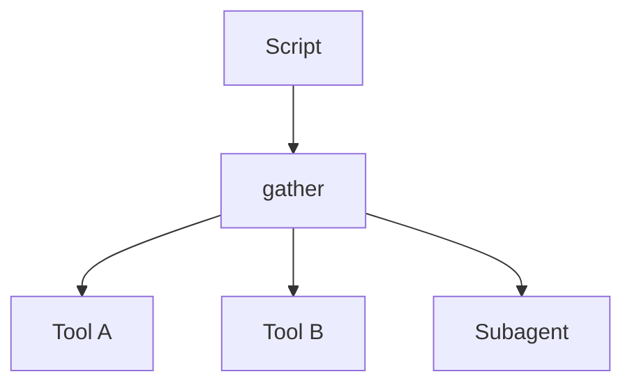

<h1>Script Fan-Out </h1>

## Overview

The Script Fan-Out pattern lets a single script coordinate subagents and tools concurrently, turning many one-by-one calls into a tree of concurrent invocations.
Temporal still governs each call’s retries, approvals, and observability.
Primitives used: SandboxScriptStep, concurrent host ToolCalls, optional subagent tools.

## Problem

Sequential tool loops make multi-item work slow and token-heavy even when items are independent.

## Solution

In Code Mode, allow `asyncio.gather` (or equivalent) over host tool calls and subagent operations.
Each concurrent call remains its own durable Step.



The following describes each step in the diagram:

1. The model writes a script that fans out independent calls.
2. The sandbox schedules host calls concurrently.
3. Each call is an Activity/subagent Step with its own policy.
4. The script joins results and optionally continues.

```python
# Model-authored script shape
async def main():
    a, b = await asyncio.gather(
        search({"q": "alpha"}),
        search({"q": "beta"}),
    )
    return {"a": a, "b": b}
```

## Implementation

### Limits

Enforce max concurrent host calls per script and per session.

### Ordering

Do not assume completion order; join explicitly in the script.

## When to use

Use when items are independent and latency matters.
Stay sequential when later calls need earlier results.

## Benefits and trade-offs

You cut wall-clock time for embarrassingly parallel tool work.
You increase burst load on downstream systems.

## Comparison with alternatives

| Approach | Parallelism | Control flow |
| :--- | :--- | :--- |
| Script Fan-Out | High | In script |
| Sequential tool loop | Low | Model turns |
| Fan-Out Subagents | High | Child sessions |

## Best practices

- **Cap concurrency.** Protect dependencies.
- **Keep gather sets independent.** Avoid hidden shared mutable state.
- **Surface partial failures.** Decide all-or-nothing vs best-effort.

## Common pitfalls

- **Fan-out of non-idempotent tools without keys.**
- **Unbounded gather over huge lists.** Exhausts worker slots.
- **Script timeout while child host Activities are still running.** Orphaned Activities keep running after the sandbox fails.

## Related patterns

- [Code Mode Orchestrator](/code-mode-orchestrator)
- [Fan-Out Subagents](/fanout-subagents)
- [Tools-Only Sandbox](/tools-only-sandbox)

## Sample code

See related runnable samples under `sandbox-runner/patterns/` when this pattern builds on Session Workflow, Activity Tool, or Code Mode.

## References

- [Temporal Docs: Activity concurrent execution](https://docs.temporal.io/activities)
