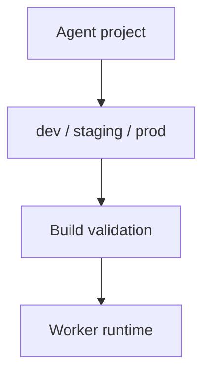

<h1>Security Profiles per Agent </h1>

## Overview

The Security Profiles per Agent pattern defines security profiles (development, staging, production) that control which tools, sandboxes, and networks are available to an agent.
Profiles are declared alongside the agent and validated at build time.
Primitives used: SecurityProfile, tool allow/deny lists, SandboxProfile binding.

## Problem

The same agent code often runs in dev with loose tools and in prod with strict ones.
If the difference is only environment folklore, production can accidentally enable dangerous tools.

## Solution

Declare a SecurityProfile next to the agent (for example allow lists, sandbox profile, channel auth requirements).
Select the active profile via deployment config and validate that every enabled tool is permitted.



The following describes each step in the diagram:

1. Authors maintain named security profiles with the agent.
2. Deployment selects prod/staging/dev.
3. Build or startup validates tool and sandbox permissions.
4. Runtime refuses tools outside the active profile.

```python
PROFILES = {
    "prod": {"tools": ["search"], "sandbox": "tools_only"},
    "dev": {"tools": ["search", "shell"], "sandbox": "tools_only"},
}

active = PROFILES[os.environ["AGENT_SECURITY_PROFILE"]]
assert set(registered_tools) <= set(active["tools"])
```

## Implementation

### Separation from SafetyProfile

SafetyProfile is per tool; SecurityProfile is per agent/environment.
Both must pass before a call runs.

## When to use

Use whenever an agent has more than one deployment environment.
A single locked profile is enough for a prod-only private agent.

## Benefits and trade-offs

You prevent environment drift with validation.
You maintain profile matrices as tools grow.

## Comparison with alternatives

| Control | Scope |
| :--- | :--- |
| SafetyProfile | Per tool |
| SecurityProfile | Per agent/env |
| ApprovalPolicy | Per session/runtime |

## Best practices

- **Fail closed in prod.** Missing profile aborts startup.
- **Diff profiles in CI.** Catch accidental widenings.
- **Require auth on prod channels.**

## Common pitfalls

- **Workers on the same task queue register different tool sets.** Causes nondeterminism across Workers.
- **Prod profile only in app config, not enforced at Activity dispatch.** Workers still run tools the profile forbids.

## Related patterns

- [Safety-Profiled Tools](/safety-profiled-tools)
- [Network & Resource Sandboxing](/network-resource-sandboxing)
- [Filesystem Authoring](/filesystem-authoring)

## Sample code

See related runnable samples under `sandbox-runner/patterns/` when this pattern builds on Session Workflow, Activity Tool, or Code Mode.

## References

- [Temporal Docs: Workers](https://docs.temporal.io/workers)
