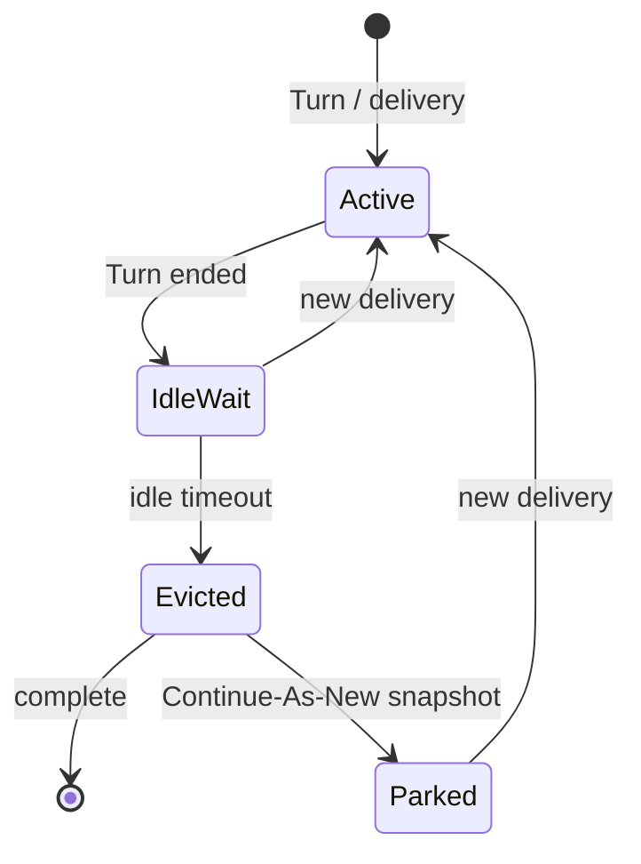

<h1>Session Idle Eviction </h1>

## Overview

The Session Idle Eviction pattern closes or parks a Session after a durable idle timeout so sticky sandboxes, Worker slots, and operational noise do not accumulate forever—while still defining how Signal-with-Start behaves if the user returns.
Primitives used: durable timers / `wait_condition` timeouts, Session complete vs Continue-As-New park, Session with Signal-and-Start, optional Schedule wake, Session Visibility Attributes.

## Problem

Entity Agents and chat Sessions often wait "forever" for the next message.
Idle Workflows still occupy sticky sandbox hosts, confuse "is it alive?" checks, and leave Visibility full of dormant runs.
Completing on every pause breaks stable `session_id` addressing unless you document recreate-on-next-message.

## Solution

After each Turn (or approval/ask-user resume), start an idle timer.
On timeout, choose a policy:

1. **Complete** the Session (Signal-with-Start creates a new run on next message with the same Workflow Id if ID reuse allows).
2. **Park via Continue-As-New** with a minimal snapshot and `turnStatus=idle` / `evicted` Visibility tag, still addressable.
3. **Entity forever-park** — reset the idle timer only; never auto-complete (document why).

Emit `session_idle_evicted` (or equivalent) and tear down sticky sandboxes on eviction.



The following describes each step in the diagram:

1. After work finishes, the Session enters an idle wait with a durable timeout.
2. A new delivery resets the timer and runs another Turn.
3. On timeout, the Session completes or Continue-As-News into a parked snapshot per policy.
4. Channels that Signal-with-Start the same `session_id` either attach to the parked run or start a fresh execution after complete.

```python
import asyncio
from datetime import timedelta

from temporalio import workflow

@workflow.defn
class AgentSessionWorkflow:
    def __init__(self) -> None:
        self._pending: str | None = None

    @workflow.signal
    def user_message(self, text: str) -> None:
        self._pending = text

    @workflow.run
    async def run(self, session_id: str, idle_seconds: int = 30) -> str:
        while True:
            try:
                await workflow.wait_condition(
                    lambda: self._pending is not None,
                    timeout=timedelta(seconds=idle_seconds),
                )
            except asyncio.TimeoutError:
                return "evicted"
            text = self._pending or ""
            self._pending = None
            # run turn with text ...
            _ = text
```

## Implementation

<DaytonaRunner pattern="session-idle-eviction" />

### Policy matrix

| Policy | Keeps Workflow Id hot | Sticky sandbox | Next message |
| :--- | :--- | :--- | :--- |
| Complete on idle | No (new run) | Released | Signal-with-Start / Update-With-Start |
| Continue-As-New park | Yes | Released then reacquire | Signal/Update existing |
| Never evict (Entity) | Yes | Must manage separately | Signal/Update |

### Reset rules

Reset the idle timer only when a delivery is *accepted* (not on duplicate [Idempotent Delivery](/idempotent-delivery) acks), and pause eviction while approval or ask-user waits are open unless you intentionally time those out separately ([Updatable Approval Timer](/updatable-approval-timer)).

### Sticky resources

On eviction, destroy sandbox workspaces ([Sticky Sandbox Task Queues](/sticky-sandbox-task-queues)) and clear Worker-local caches.
Do not leave disks pinned to a completed Session.

### Visibility

Upsert `AgentTurnStatus=evicted` or `idle` via [Session Visibility Attributes](/session-visibility-attributes) before complete/Continue-As-New.

## When to use

Use for interactive chat Sessions and ephemeral sandboxes.
Prefer never-auto-complete (with Continue-As-New) for true Entity Agents that must stay addressable for months—still set an *ops* idle label.

## Benefits and trade-offs

You bound resource leak and dormant Visibility clutter.
You must pick complete-vs-park semantics and align channels with Signal-with-Start / ID reuse.

## Comparison with alternatives

| Approach | Resource bound | Stable address |
| :--- | :--- | :--- |
| Session Idle Eviction (complete) | Strong | Recreate on next message |
| Session Idle Eviction (CAN park) | Strong | Stable |
| Never timeout | Weak | Stable |
| Cron delete externally | Medium | Risky races |

## Best practices

- **Document the eviction policy** next to the Session ID scheme.
- **Do not evict mid-Turn** or while HITL waits unless that wait has its own SLA.
- **Pair with Continue-As-New** so long-lived Entities still compact history without fake "idle forever" busy waits.
- **Tear down sticky sandboxes on eviction.**

## Common pitfalls

- **Completing while an approval is open**—user cannot resume.
- **Evicting on duplicate deliveries**—timer thrash.
- **Assuming clients cache Run Ids** across complete + new start.
- **Leaving sticky Task Queue Workers** holding files after complete.
- **Silent forever wait** with no Visibility idle/evicted signal.

## Related patterns

- [Entity Agent](/entity-agent)
- [Session with Signal-and-Start](/session-signal-and-start)
- [Continue-As-New Session](/continue-as-new-session)
- [Sticky Sandbox Task Queues](/sticky-sandbox-task-queues)
- [Session Visibility Attributes](/session-visibility-attributes)
- [Idempotent Delivery](/idempotent-delivery)
- [Updatable Approval Timer](/updatable-approval-timer)
- [Scheduled Agent Turns](/scheduled-agent-turns)

## Sample code

- [`sandbox-runner/patterns/session-idle-eviction/python/`](https://github.com/temporal-sa/temporal-agentic-patterns/tree/main/sandbox-runner/patterns/session-idle-eviction/python)

## References

- [Temporal Docs: Timers](https://docs.temporal.io/encyclopedia/sleeping-and-timers)
- [Temporal Docs: Conditions](https://docs.temporal.io/develop/python/message-passing#wait-for-a-condition)
- [Temporal Docs: Continue-As-New](https://docs.temporal.io/workflow-execution/continue-as-new)
