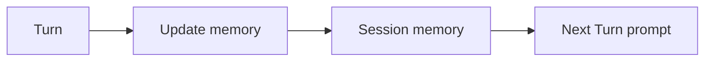

<h1>Session Memory </h1>

## Overview

The Session Memory pattern stores summary or vectorized memory in session state, updated at safe points between turns.
The agent reads this durable memory before each new turn to preserve context across long conversations or jobs.
Primitives used: Session state, Turn boundaries, Continue-As-New snapshots.

## Problem

Relying only on the raw event transcript makes prompts huge and history heavy.
Process memory disappears on worker restart.

## Solution

Keep a compact memory document on the Session Workflow.
Update it after turns complete (or via a memory tool Activity), and pass it into the next Durable Model Call.
Include memory in Continue-As-New snapshots.



The following describes each step in the diagram:

1. A Turn completes with new facts.
2. The Session updates a summary memory structure.
3. The next Turn reads memory before calling the model.
4. Continue-As-New carries memory forward.

```python
self._memory = {"summary": "...", "facts": []}

# after turn
self._memory = await workflow.execute_activity(
    compact_memory,
    args=[self._memory, turn_transcript],
    start_to_close_timeout=timedelta(seconds=60),
)
```

## Implementation

### Safe points

Prefer updating memory between turns, not mid-tool, so partial failures do not corrupt it.

### Size

If memory grows large, externalize blobs and keep pointers in Session state (see Externalized Memory).

## When to use

Use for multi-turn agents that must remember decisions.
Skip for single-turn request/response agents.

## Benefits and trade-offs

You preserve context without replaying entire histories into the model.
Summaries can drop detail—design refresh paths.

## Comparison with alternatives

| Store | Durability | Size |
| :--- | :--- | :--- |
| Session memory | High | Bounded |
| Full transcript only | High | Grows fast |
| Process RAM | None | Fast |

## Best practices

- **Version memory schemas.**
- **Record memory updates as events when material.**
- **Do not put secrets in memory summaries.**

## Common pitfalls

- **Unbounded append-only notes in Workflow state.**
- **Updating memory inside failed turns without rollback rules.**
- **Session memory omitted from the Continue-As-New snapshot.** Notes and summaries disappear on the new run.

## Related patterns

- [Cross-Session Memory](/cross-session-memory)
- [Externalized Memory](/externalized-memory)
- [Context Compaction](/context-compaction)
- [Continue-As-New Session](/continue-as-new-session)

## Sample code

See related runnable samples under `sandbox-runner/patterns/` when this pattern builds on Session Workflow, Activity Tool, or Code Mode.

## References

- [Temporal Docs: Continue-As-New](https://docs.temporal.io/workflow-execution/continue-as-new)
