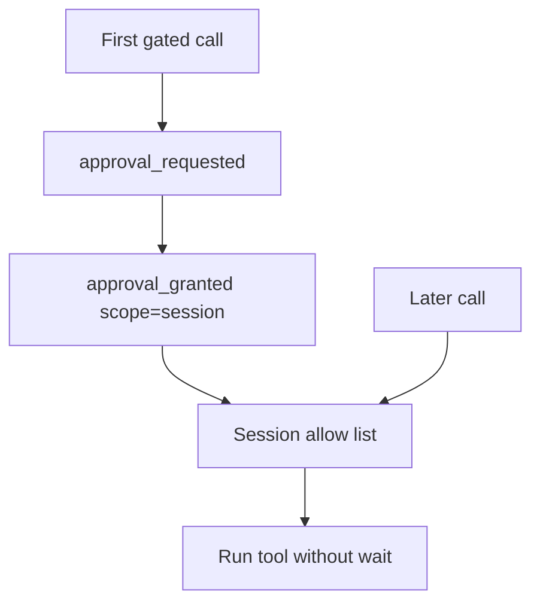

<h1>Session-Scoped Approvals </h1>

## Overview

The Session-Scoped Approvals pattern lets operators approve a tool for the rest of a session (“approve and stop asking”).
The first call is gated; subsequent calls in the same session proceed automatically, with the decision recorded in session state.
Primitives used: ApprovalDecision(scope=session), Session state, approval events.

## Problem

Requiring approval on every repeated call to the same tool fatigues operators and slows the agent without adding new information.

## Solution

On grant, record `{tool_id: granted}` in Session state for the session lifetime (or until revoked).
Emit `approval_granted` with scope `session`.
Later Turns skip the wait for that tool while the override remains.



The following describes each step in the diagram:

1. The first gated tool call parks for approval.
2. The operator grants with session scope (or uses a slash command allow-list).
3. The Session stores the override durably.
4. Later calls to that tool proceed until stop, revoke, or Continue-As-New snapshot drops it.

```python
# Session Workflow fields
self._session_allow: set[str] = set()

@workflow.signal
def approve_session_tool(self, tool_id: str) -> None:
    self._session_allow.add(tool_id)

def requires_approval(self, tool_id: str) -> bool:
    return tool_id not in self._session_allow and tool_id in self._gated
```

## Implementation

### Slash command integration

Commands such as `/allow-tools charge_card` should update the same Session allow list and emit `slash_command_invoked` plus approval events.

### Continue-As-New

Include the allow list in the session snapshot so overrides survive history reset.

## When to use

Use session scope for repeated trusted actions inside one conversation.
Keep one-off approvals for rare high-risk operations.

## Benefits and trade-offs

You reduce approval fatigue while keeping an audit trail.
A stolen session Signal path becomes more powerful—authorize operators carefully.

## Comparison with alternatives

| Scope | Asks again | Best for |
| :--- | :--- | :--- |
| Single call | Yes | Rare risky ops |
| Session | No until revoke | Repeated tools |
| Global policy change | No | Fleet-wide |

## Best practices

- **Name the tool in the event.** Audits must see which tool was unlocked.
- **Support revoke.** Operators need `/deny-tools` or equivalent.
- **Do not widen scope silently.** Session grant must be explicit.

## Common pitfalls

- **Persisting session grants into global config.** Leaks trust across sessions.
- **Allow list omitted from Continue-As-New args.** Grants disappear on the new run.
- **Evaluating the allow list only in an Activity.** Replay-unsafe; grant checks belong in Workflow state.

## Related patterns

- [Approval-Gated Tools](/approval-gated-tools)
- [Operator Slash Commands](/operator-slash-commands)
- [Continue-As-New Session](/continue-as-new-session)

## Sample code

See related runnable samples under `sandbox-runner/patterns/` when this pattern builds on Session Workflow, Activity Tool, or Code Mode.

## References

- [Temporal Docs: Signals](https://docs.temporal.io/encyclopedia/workflow-message-passing#sending-signals)
