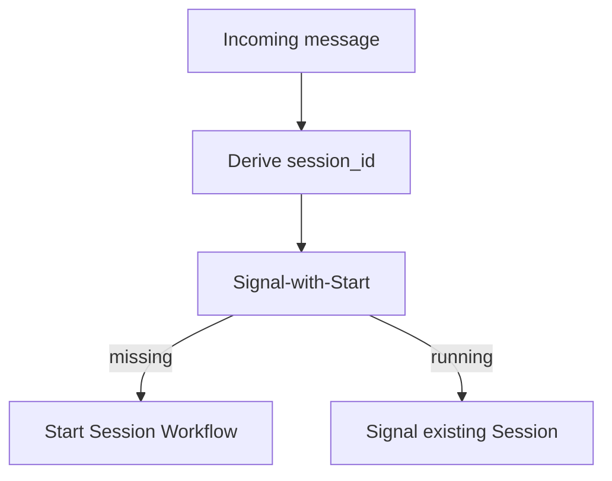

<h1>Session with Signal-and-Start </h1>

## Overview

The Session with Signal-and-Start pattern combines the Session Workflow with a signal-with-start entrypoint.
The first user message creates the session; subsequent messages signal the existing Workflow.
When the client needs a validated, typed reply on create-or-attach, use Update-With-Start instead (same stable `session_id`).
Primitives used: Session, Signal-with-Start, Update-With-Start, stable `session_id`.

## Problem

Channels deliver messages without knowing whether a session already exists.
If you always start a new Workflow, you fork history.
If you always signal, the first message fails when no execution exists.

## Solution

Derive a deterministic `session_id` (for example per user and channel thread).
Use signal-with-start so Temporal starts the Session Workflow if needed, or signals the running one.



The following describes each step in the diagram:

1. The channel maps the conversation to a stable `session_id`.
2. The client calls signal-with-start with the message payload.
3. Temporal creates the Session or delivers the Signal to the open execution.

```python
# starter-shaped client call
await client.start_workflow(
    AgentSessionWorkflow.run,
    args=[session_id],
    id=session_id,
    task_queue=TASK_QUEUE,
    start_signal="user_message",
    start_signal_args=[text],
)
```

## Implementation

<DaytonaRunner pattern="session-signal-and-start" />


Handle `user_message` as a Signal that enqueues a Turn.
The Workflow `run` method waits while turns execute or until `/stop`.

### Idempotent session IDs

Choose IDs that collide intentionally for the same conversation and never collide across tenants.

### Update-With-Start when you need a validated reply

Prefer **Update-With-Start** when the first interaction must return a typed result (cart total, accepted command) and arguments need validator rejection before work runs.
Use Signal-with-Start when fire-and-forget enqueue is enough and the channel does not wait on acceptance.

```python
from temporalio import common
from temporalio.client import WithStartWorkflowOperation

start_op = WithStartWorkflowOperation(
    AgentSessionWorkflow.run,
    args=[session_id],
    id=session_id,
    id_conflict_policy=common.WorkflowIDConflictPolicy.USE_EXISTING,
    task_queue=TASK_QUEUE,
)
reply = await client.execute_update_with_start_workflow(
    AgentSessionWorkflow.enqueue_turn,
    text,
    start_workflow_operation=start_op,
)
```

Set `WorkflowIDConflictPolicy.USE_EXISTING` so later messages Update the open Session instead of failing on ID conflict.

## When to use

Use this pattern for chat channels and inbox-style agents.
Prefer Update-With-Start when the client needs acceptance and a return value on create-or-attach.
Prefer explicit start when a batch job creates sessions ahead of time.
Prefer [Scheduled Agent Turns](/scheduled-agent-turns) when there is no human message.

## Benefits and trade-offs

You get on-demand creation with stable identity.
You must design Signal or Update handlers that queue work safely under Continue-As-New.

## Comparison with alternatives

| Approach | First message | Later messages | Client waits |
| :--- | :--- | :--- | :--- |
| Signal-with-Start | Creates | Signals | No (async) |
| Update-With-Start | Creates | Updates | Yes (result / reject) |
| Start then Signal | Race on create | Signals | Varies |
| New ID each message | Always creates | Loses session | — |

## Best practices

- **Use Workflow ID = session_id.** Omit Run ID when signaling so Continue-As-New stays addressable.
- **Queue messages.** Do not assume one Signal equals one finished Turn if bursts arrive.
- **Authorize the starter.** Signal-with-Start and Update-With-Start are public entrypoints.
- **Validate on Update paths.** Reject bad payloads before a Turn starts.

## Common pitfalls

- **Random session IDs per message.** Destroys continuity.
- **Signaling with a stale Run ID.** Fails after Continue-As-New.
- **Ignoring WorkflowIdReusePolicy.** Closed sessions may reject or unexpectedly reuse IDs when a new conversation starts.
- **Assuming one Signal equals one finished Turn under bursts.** Queue messages; overlapping Signals need ordered Turn scheduling.
- **Using Signal-with-Start when the client needs a typed failure.** Prefer Update-With-Start so validators can reject before work.

## Related patterns

- [Validated Session Ingress](/validated-session-ingress)
- [Eager Interactive Session Start](/eager-interactive-session-start)
- [Session Workflow](/session-workflow)
- [Continue-As-New Session](/continue-as-new-session)
- [HTTP Channel Agent](/http-channel-agent)
- [Messaging Channel Agent](/messaging-channel-agent)
- [Typed Agent Operations](/typed-agent-operations)
- [Scheduled Agent Turns](/scheduled-agent-turns)

## Sample code

- [`sandbox-runner/patterns/session-signal-and-start/python/`](https://github.com/temporal-sa/temporal-agentic-patterns/tree/main/sandbox-runner/patterns/session-signal-and-start/python)

## References

- [Temporal Docs: Signal-With-Start](https://docs.temporal.io/encyclopedia/workflow-message-passing#signal-with-start)
- [Temporal Docs: Update-With-Start](https://docs.temporal.io/sending-messages#update-with-start)
- [Temporal Docs: Message passing — Python](https://docs.temporal.io/develop/python/workflows/message-passing)
