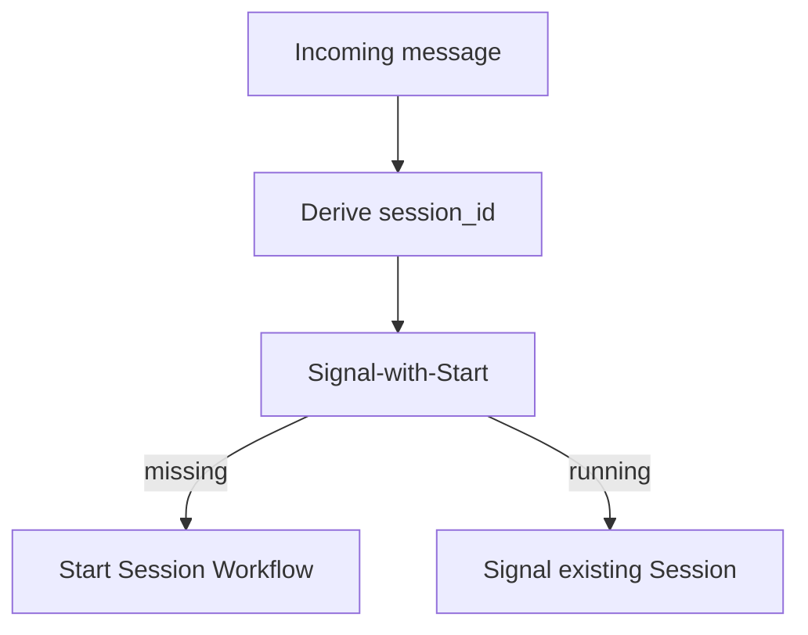

<h1>Session with Signal-and-Start </h1>

## Overview

The Session with Signal-and-Start pattern combines the Session Workflow with a signal-with-start entrypoint.
The first user message creates the session; subsequent messages signal the existing Workflow.
This keeps session identity stable while allowing on-demand creation.
Primitives used: Session, Signal-with-Start, stable `session_id`.

## Problem

Channels deliver messages without knowing whether a session already exists.
If you always start a new Workflow, you fork history.
If you always signal, the first message fails when no execution exists.

## Solution

Derive a deterministic `session_id` (for example per user and channel thread).
Use signal-with-start so Temporal starts the Session Workflow if needed, or signals the running one.



The following describes each step in the diagram:

1. The channel maps the conversation to a stable `session_id`.
2. The client calls signal-with-start with the message payload.
3. Temporal creates the Session or delivers the Signal to the open execution.

```python
# starter-shaped client call
await client.start_workflow(
    AgentSessionWorkflow.run,
    args=[session_id],
    id=session_id,
    task_queue=TASK_QUEUE,
    start_signal="user_message",
    start_signal_args=[text],
)
```

## Implementation

Handle `user_message` as a Signal that enqueues a Turn.
The Workflow `run` method waits while turns execute or until `/stop`.

### Idempotent session IDs

Choose IDs that collide intentionally for the same conversation and never collide across tenants.

## When to use

Use this pattern for chat channels and inbox-style agents.
Prefer explicit start when a batch job creates sessions ahead of time.

## Benefits and trade-offs

You get on-demand creation with stable identity.
You must design Signal handlers that queue work safely under Continue-As-New.

## Comparison with alternatives

| Approach | First message | Later messages |
| :--- | :--- | :--- |
| Signal-with-Start | Creates | Signals |
| Start then Signal | Race on create | Signals |
| New ID each message | Always creates | Loses session |

## Best practices

- **Use Workflow ID = session_id.** Omit Run ID when signaling so Continue-As-New stays addressable.
- **Queue messages.** Do not assume one Signal equals one finished Turn if bursts arrive.
- **Authorize the starter.** Signal-with-Start is a public entrypoint.

## Common pitfalls

- **Random session IDs per message.** Destroys continuity.
- **Signaling with a stale Run ID.** Fails after Continue-As-New.
- **Ignoring WorkflowIdReusePolicy.** Closed sessions may reject or unexpectedly reuse IDs when a new conversation starts.
- **Assuming one Signal equals one finished Turn under bursts.** Queue messages; overlapping Signals need ordered Turn scheduling.

## Related patterns

- [Session Workflow](/session-workflow)
- [Continue-As-New Session](/continue-as-new-session)
- [HTTP Channel Agent](/http-channel-agent)
- [Messaging Channel Agent](/messaging-channel-agent)

## Sample code

Compose with the [Session Workflow](/session-workflow) sample by switching the starter to signal-with-start.

## References

- [Temporal Docs: Signal-With-Start](https://docs.temporal.io/encyclopedia/workflow-message-passing#signal-with-start)
