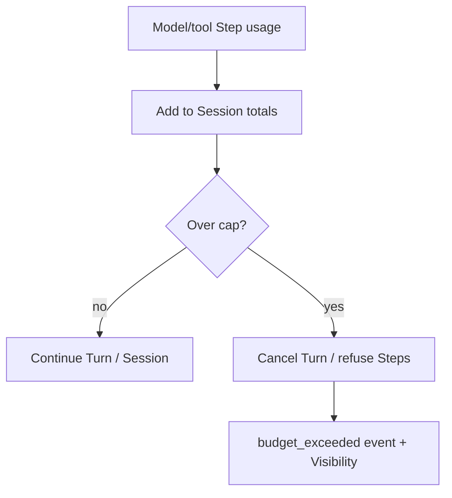

<h1>Session Spend Caps </h1>

## Overview

The Session Spend Caps pattern enforces hard Workflow-side ceilings on tokens, estimated cost, or tool-call counts so a Session aborts or parks Turns *before* invoices blow up—not only after Cost & Token Accounting alerts fire.
Primitives used: Session counters from Durable Model Call / tool usage, Update/Signal for budget overrides, Cancel In-Flight Turn, Session Visibility Attributes, Cost & Token Accounting events.

## Problem

[Cost & Token Accounting](/cost-token-accounting) tells you what happened.
Without an in-Workflow cap, a runaway tool loop or retry storm finishes spending first; pages and dashboards arrive too late.
Soft alerts without enforcement are not a budget.

## Solution

Keep running totals on the Session (and optionally per Turn).
Before starting a model/tool Step—or when a Step returns usage—compare against caps (`max_tokens`, `max_cost_usd`, `max_tool_calls`).
On exceed:

1. Refuse new Steps / cancel the open Turn ([Cancel In-Flight Turn](/cancel-in-flight-turn)).
2. Emit `budget_exceeded` and upsert Visibility (`AgentTurnStatus=budget_exceeded`).
3. Optionally park for operator override via Update (raise cap) or end the Turn with a typed error.



The following describes each step in the diagram:

1. Each Durable Model Call (and billable tool) returns usage into Session counters.
2. The Session checks caps before the next Step or immediately when usage arrives.
3. Over-cap paths cancel in-flight work and surface a durable budget error—not a silent continue.

```python
from dataclasses import dataclass
from datetime import timedelta

from temporalio import workflow

@dataclass
class Budget:
    max_tokens: int
    used_tokens: int = 0

@workflow.defn
class AgentSessionWorkflow:
    def __init__(self) -> None:
        self._budget = Budget(max_tokens=100)

    @workflow.update
    async def raise_cap(self, max_tokens: int) -> int:
        self._budget.max_tokens = max_tokens
        return self._budget.max_tokens

    @workflow.run
    async def run(self, session_id: str, user_message: str) -> str:
        usage = await workflow.execute_activity(
            call_model,
            user_message,
            start_to_close_timeout=timedelta(seconds=60),
        )
        self._budget.used_tokens += usage["total_tokens"]
        if self._budget.used_tokens > self._budget.max_tokens:
            return "budget_exceeded"
        return usage["text"]
```

## Implementation

<DaytonaRunner pattern="session-spend-caps" />

### What to count

- Prompt + completion tokens from [Durable Model Call](/durable-model-call) (including failed attempts that still billed).
- Billable tool invocations and external API units.
- Compaction / guardrail model calls ([Context Compaction](/context-compaction), [Guardrail Steps](/guardrail-steps)).

### Soft vs hard

- **Soft:** emit warning events at 80%—still allow Steps.
- **Hard:** refuse or cancel at 100%.
Never rely on soft-only in production.

### Overrides

Authorized Updates can raise caps for a Session (support "please continue").
Record `actor_id` on overrides ([Identity](/identity)).

### Interaction with retries

Caps must include retried attempts that incurred provider cost ([Agent Step Retry Alerting](/agent-step-retry-alerting)).
A fast/slow retry profile that burns tokens still hits the Session ceiling.

## When to use

Use for every production multi-tenant agent Session.
Demo stubs may use tiny numeric caps without real prices.

## Benefits and trade-offs

You stop spend inside the durable control plane.
You must keep usage payloads honest and price/token math consistent with accounting.

## Comparison with alternatives

| Approach | Stops spend | When |
| :--- | :--- | :--- |
| Session Spend Caps | Yes | In-Workflow |
| Cost alerts only | No | After the fact |
| Provider account limits | Coarse | Whole key |
| Client-side token estimate | Weak | Easy to bypass |

## Best practices

- **Check before expensive Steps** when estimates exist; always reconcile after real usage returns.
- **Cancel in-flight Turns** on hard exceed—do not let the current model call finish if heartbeats allow.
- **Mirror status to Visibility** for ops (`budget_exceeded`).
- **Carry budget totals across Continue-As-New** in the snapshot.

## Common pitfalls

- **Counting only successful calls.**
- **Resetting counters on Continue-As-New** accidentally.
- **Caps in the HTTP tier only**—lost on worker path / schedules.
- **Alerting without refuse/cancel.**
- **Ignoring compaction/guardrail model spend.**

## Related patterns

- [Cost & Token Accounting](/cost-token-accounting)
- [Cancel In-Flight Turn](/cancel-in-flight-turn)
- [Durable Model Call](/durable-model-call)
- [Agent Step Retry Alerting](/agent-step-retry-alerting)
- [Session Visibility Attributes](/session-visibility-attributes)
- [Guardrail Steps](/guardrail-steps)
- [Context Compaction](/context-compaction)
- [Fairness](/fairness)

## Sample code

- [`sandbox-runner/patterns/session-spend-caps/python/`](https://github.com/temporal-sa/temporal-agentic-patterns/tree/main/sandbox-runner/patterns/session-spend-caps/python)

## References

- [Temporal Docs: Workflow state](https://docs.temporal.io/workflows)
- [Temporal Docs: Updates](https://docs.temporal.io/encyclopedia/workflow-message-passing#sending-updates)
