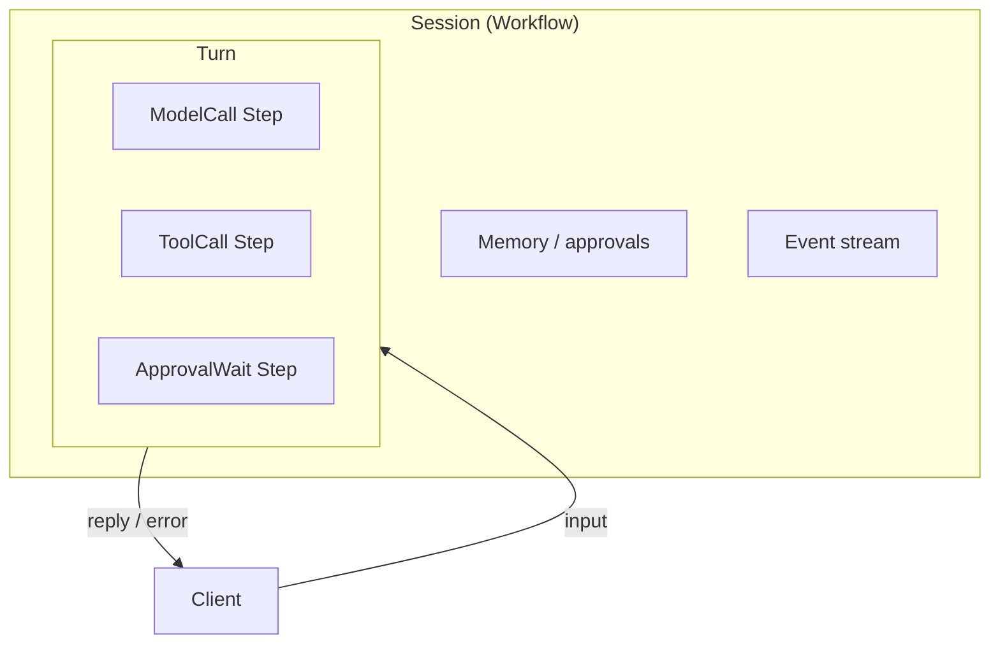

# Session, Turn, and Step

## Overview

Session, Turn, and Step are the nested units of durable agent work in this catalog.
A Session owns cross-turn state; a Turn handles one input; a Step is the smallest durable unit inside that Turn.

## Problem

Agent loops often blur "conversation," "message," and "API call" into one process.
Without nesting, you cannot pause for approval mid-turn, resume after a worker restart, or bound history growth while keeping the same conversation identity.
You need shared terms that map onto Temporal Workflows and Activities.

## Solution

Nest work so each layer has a clear durability role:

The following describes each step in the diagram:

1. A Session is the long-lived unit—typically one Temporal Workflow—that owns memory, approval grants, and the ordered event stream.
2. A Turn is one inbound message (or system trigger) and the agent work that follows until a reply, error, or cancel.
3. A Step is a durable unit inside the Turn: model call, tool call, approval wait, or similar. Side-effecting Steps run as Activities; wait Steps park in Workflow code.
4. Temporal history records Workflow and Activity events; your app event stream records Session/Turn/Step lifecycle for UIs and evals.

Turns may be child Workflows or phases inside the Session Workflow. Steps should still be identifiable so retries and events stay coherent either way.

## When to use

Use these terms whenever a pattern describes conversation structure, tool loops, Continue-As-New, or human waits.
Skip inventing synonyms such as "thread," "round," or "task" unless you map them explicitly to Session, Turn, or Step.

## Benefits and trade-offs

Clear nesting makes pause/resume, memory scope, and history management predictable.
The trade-off is an extra layer of IDs and events to emit and store.

## Comparison with alternatives

| Approach | Pause mid-tool | History control |
| :--- | :--- | :--- |
| Session → Turn → Step | Supported | Continue-As-New at Session boundary |
| Flat request/response process | Weak | Process death loses state |
| One Activity per conversation | Poor | Activity timeouts fight long chats |

## Best practices

- **Scope memory to the Session.** Turns read and write Session state; they do not own the conversation.
- **Make Steps retry-safe.** Model and tool Activities need timeouts, heartbeats, and idempotency where side effects matter.
- **End Turns explicitly.** Emit `turn_ended` (or failure) so observers know when a reply is final.
- **Document the Temporal mapping.** Say whether Turns are child Workflows or in-Session state.

## Common pitfalls

- **Starting a new Session per message.** You lose memory and approval grants across turns.
- **Treating every model token as a Step.** Steps are durable units, not streaming chunks.
- **Letting Turns outlive the Session identity.** After Continue-As-New, keep the same `session_id`.

## Related patterns

- [Session Workflow](/session-workflow)
- [Turn Workflow](/turn-workflow)
- [Continue-As-New Session](/continue-as-new-session)
- [Agent Tool Loop](/agent-tool-loop)
- [Durable Model Call](/durable-model-call)

## Sample code

See [Session Workflow](/session-workflow) and [Turn Workflow](/turn-workflow) for nesting examples.

## References

- [Temporal Docs: Workflows](https://docs.temporal.io/workflows)
- [Temporal Docs: Activities](https://docs.temporal.io/activities)
- [Temporal Docs: Continue-As-New](https://docs.temporal.io/workflows#continue-as-new)
